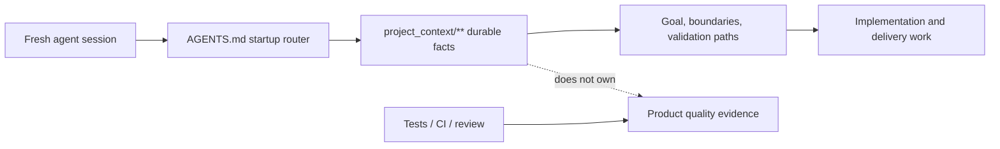

# Project Tiny Context Harness

[](https://www.npmjs.com/package/project-tiny-context-harness)
[](https://github.com/Seven128/project-tiny-context-harness/actions/workflows/package.yml)
[](https://securityscorecards.dev/viewer/?uri=github.com/Seven128/project-tiny-context-harness)
[](LICENSE)
[](https://codespaces.new/Seven128/project-tiny-context-harness)

Translations: [Chinese (Simplified)](README.zh-CN.md)

Project Tiny Context Harness is repo-native project memory for AI coding agents, plus a narrow delivery harness with an automatic lightweight route and an explicit machine-assurance route. The product principle is: keep the memory, drop the ceremony. It adds durable project memory behind `AGENTS.md` without becoming an agent scheduler or Git orchestrator.

Public launch surfaces are English-first; localized documents are secondary entry points.

Best for:

- repositories where coding agents repeatedly rediscover project intent;
- teams using multiple agents or frequent fresh chats;
- maintainers who want durable Context and, when needed, explicit machine-traceable delivery evidence.

Not for:

- replacing project tests, review, CI or human acceptance;
- autonomous Tiny Context execution;
- codebase semantic indexing or external docs retrieval.

Concrete shift:

```text
Before: ask a fresh agent to read the repo and tell you what matters.
After: ask it to read AGENTS.md and project_context/** first, then summarize goal, non-goals, architecture boundaries and validation paths before proposing code.
```

What gets added:




The demo shows the core loop: initialize `AGENTS.md` and `project_context/**`, run `validate-context`, then ask a fresh agent to recover intent before proposing code. Use the npm install path below, or inspect the no-install previews first.

Install:

```sh
npm install -D project-tiny-context-harness@latest
npx --yes --package project-tiny-context-harness@latest ty-context init
```

No-install preview:

- Read the [fresh-agent recovery walkthrough](docs/examples/fresh-agent-recovery.md).
- Inspect the [Minimal Context sample guide](docs/examples/minimal-context-sample.md).
- Browse the tiny generated repository at [examples/minimal-context-sample/](examples/minimal-context-sample/).

## Why It Exists

Coding agents need two different kinds of help:

- durable facts that survive sessions without loading the whole repository;
- trustworthy machine completion, recovery or audit when a delivery requires it.

Tiny Context keeps those concerns narrow. `project_context/**` records durable ownership, architecture, contracts and repeatable verification. Both implementation routes share one visible, risk-proportional Architecture Deliberation with applicable-quality routing before implementation, Goal-owned boundary-preserving implementation guardrails, and one current-candidate Engineering Quality Conformance that includes Architecture Conformance after project verification. The default Workflow Contract combines manifest routing with one bounded Context search before `Context Delta`; the explicit Long-Task Workflow adds one machine-checked Delivery Contract, an unconditional one-time post-Authority-Lock host model-change checkpoint, rolling repair verification, a same-snapshot Final Gate and Stop freshness.

It does not launch or switch models, spawn agent sessions, create branches or worktrees, merge, push, open pull requests, deploy, or claim to replace project tests and human acceptance.

## Capability Model

| Capability | When and how to use it | What it owns |
|---|---|---|
| **Minimal Context** | Installed by default. Agents read and update `project_context/**` on every delivery route. | Durable goals, ownership, architecture/interface/state boundaries and repeatable verification/deployment facts. It never claims that implementation or tests passed. |
| **Workflow Contract** | The prompt-level default after `init`, for implementation work of any complexity whenever Long-Task is not explicitly selected or already bound. There is no Skill command or `delivery-contract.yaml`. | The model-led lightweight loop: Context discovery, risk-proportional requirement/architecture judgment, one `Context Delta`, Goal-owned implementation, current-candidate project checks, failure repair, evidence-bounded Contract Conformance and Context drift. It creates no exact Fact ledger, validator result, Receipt, persisted workflow state or machine completion. |
| **Long-Task Workflow** | Enable the `long-task` profile once, then explicitly select `long-task-workflow`, or resume an existing valid binding, when machine completion authority, recoverability or auditability is required. Task size alone never activates it. | One Source-bound Delivery Contract, Authority Lock, recoverable scoped progress, protected revision, exact declared-obligation evidence and one current-snapshot Live Final Gate. |

The relationship is deliberately one-of-two at execution time: every delivery consumes Minimal Context, then the default Workflow Contract applies unless `long-task-workflow` is explicitly selected or validly bound. Complexity determines execution and verification depth; required completion authority and recoverability determine the workflow route; Long-Task-internal risk determines proof strength. Long-Task Final Gate carries Engineering Quality/Architecture Conformance and selected-design closure instead of duplicating the default Contract Conformance closure.

| Task shape | Model-led, evidence-bounded handoff is sufficient | Machine-traceable complete closure is required |
|---|---|---|
| Local or small | Default Workflow Contract | Explicit Long-Task is available |
| Cross-module or complex | Default Workflow Contract remains valid | Explicit Long-Task |

The base managed set also provides two explicitly triggered Open Design adapters: `design-system-authoring` generates/selects/adopts project Design Authority at cold start, while `design-resource-authoring` commissions task-local resources. They are optional upstream Skills, not a fourth mechanism and not stages inside Long-Task. Their selected outputs may feed either execution route, and `long-task-workflow` is the only active long-task execution Skill. Retired standalone authoring pointers are not installed; Long-Task inputs enter one Source-bound Contract Draft loop directly and pre-existing planning documents remain ordinary Source.

Skill names in this README are host-neutral. In Codex, explicitly select one with `$skill-name` (for example `$long-task-workflow`) or use `/skills`; other hosts use their own Skill selector.

Default profiles are `core-portable` and `workflow-default`. Enable the opt-in profile with:

```powershell
ty-context enable long-task
```

This additionally installs `long-task-workflow`, package-owned lifecycle Hooks and, only when the resolved harness root is exactly `.codex`, one optional project-scoped Codex custom agent named `long_task_implementation`. The fixed, stateless package-owned profile has disabled child-agent tools and is usable only for bounded rolling implementation/repair after the first-Authority-Lock terminal-turn checkpoint. A supported Codex host must explicitly select that exact custom agent; a generic/built-in worker, task name, prompt imitation or model-only choice is not the profile. If exact selection is unavailable, or the host rejects the profile's required leaf-agent configuration, do not remove that boundary or spawn a generic substitute: the parent Goal implements the packet. Static installation alone proves neither host discovery nor use. The profile is not a Skill, runtime, model router, scheduler, Authority or proof carrier; absence, invalidity or a preserved same-path user file leaves Long-Task acceptance unchanged. `design-system-authoring` and `design-resource-authoring` are already in the base managed set. Tiny Context does not install Open Design, an agent runtime, scheduler, Git orchestration assets or another design-generation runtime.

When sync first installs or updates the Tiny Context entries in `.codex/hooks.json`, it reports: `Codex Hook review required: open /hooks and trust the current Tiny Context project Hook before relying on PreToolUse, SubagentStart, SessionStart or Stop behavior. Tiny Context cannot observe or persist Codex Hook trust.` Review the current project Hook in `/hooks`; the host and user own trust, and a Hook change can require review again. Installation is not evidence of trust or runtime enforcement, and trust-bypass flags are not the normal path.

## Recommended Usage

Start from the delivery request: either concise product intent or a detailed initial proposal authored elsewhere, including Web GPT. That input does not imply design authoring or Long-Task; choose the execution route independently of whether design resources are involved:

### Design-First Machine-Assurance Workflow

Use this route when an implementation delivery both genuinely needs new style-bearing design resources and requires Long-Task's machine-assurance/recovery/audit boundary. It composes existing capabilities; it is not a prerequisite for every Long-Task:

1. **Enable Long-Task once.** Run `ty-context enable long-task` before selecting the workflow Skill.
2. **Establish Design Authority only when needed.** If the project has no adopted Design Authority and the work is style-bearing, explicitly select `$design-system-authoring` to generate, select and adopt the canonical `DESIGN.md`, token source and provider binding. Skip this step when the project already has a configured Design Authority.
3. **Prepare a writable initial proposal.** Put the project-native product/technical proposal at a concrete path such as `docs/initial-proposal.md`. It may be authored by the user, an external service or an explicitly requested applicable proposal capability. `design-resource-authoring` does not author the initial proposal, and no standalone intermediary authoring stage is required.
4. **Generate and select design resources.** Select `$design-resource-authoring` with the proposal path plus the exact development scope and targets. It returns one reconciled proposal, the selected immutable canonical resources with their manifest and dependencies, and a validated residual `design-resource-handoff-v1`.
5. **Start the Single-Goal delivery.** Select `$long-task-workflow` and give it the exact paths to the reconciled proposal, validated handoff and selected canonical resource set. The Skill authors the Source-bound Contract Draft. Its first Compile/Authority Lock always ends the current turn before implementation and says `After handling the model change, send [continue].`; earlier model wording cannot skip this boundary and Harness cannot observe whether the host model changed. After the user resumes, the parent evaluates delegation suitability and delegates independent bounded work only when the host explicitly selects exact `long_task_implementation`; otherwise it executes in the parent without a generic substitute. The parent still owns authority, architecture, Context, integration, current-candidate checks and formal verification.

One concrete invocation sequence is:

```text
$design-system-authoring Generate, select and adopt the project design system for this style-bearing scope. Skip this request when DESIGN.md is already configured.

Prepare a writable project-native initial proposal at docs/initial-proposal.md for <delivery scope>.

$design-resource-authoring Use docs/initial-proposal.md for <exact development scope and targets>. Return the reconciled proposal path, validated design-resource-handoff-v1 path, and selected immutable canonical resource, manifest and dependency paths.

$long-task-workflow Use docs/initial-proposal.md, <handoff.md>, and the selected canonical resources, manifest and dependencies as Source for one complete implementation delivery.
```

The paths are illustrative, not prescribed. Candidate images or editable explorations alone do not authorize fidelity; downstream implementation uses the selected immutable canonical resources and their validated handoff.

Other valid routes remain available:

- **Default model-led delivery, no new design resources:** ask the current coding Goal to implement the request. The default Workflow Contract applies automatically at any complexity; no workflow Skill or Contract file is needed.
- **Machine-assurance/recoverable delivery, no new design resources:** enable the profile once, explicitly select `long-task-workflow` with the request or proposal, and let that Skill author the Source-bound Contract Draft. Design authoring is not a prerequisite.
- **Delivery that first needs design resources:** follow the design-first sequence above, then feed the revised proposal plus selected immutable resources and the validated handoff to either the default Workflow Contract or `long-task-workflow`, based on recovery and completion-authority needs.
- **Design-resource-only request:** stop after `design-resource-authoring`; do not create a Long-Task Contract unless implementation delivery was also explicitly selected.

The design-system step is user-selected, normally at project cold start; no command or downstream Skill runs it automatically. `design-resource-authoring` gates only style-bearing work when Design Authority is unconfigured. Low-fidelity structure, IA/flow and semantics-only state studies remain available without that gate. A pre-existing planning or proposal document remains ordinary Source, not a recommended intermediate service.

## Try It In 60 Seconds

```sh
mkdir project-tiny-context-harness-demo
cd project-tiny-context-harness-demo
git init
npm init -y
npm install -D project-tiny-context-harness@latest
npx --yes --package project-tiny-context-harness@latest ty-context init
make validate-context
```

Then open `AGENTS.md`, `project_context/global.md` and `project_context/architecture.md`.

Expected result:

```text
AGENTS.md
project_context/
  context.toml
  global.md
  architecture.md
  areas/main.md
  areas/main/verification.md
```

Fresh-agent test prompt:

```text
Read AGENTS.md and project_context/** first. Summarize the project goal, non-goals, architecture boundaries, validation entry points and next safe action before proposing code changes.
```

For an existing repository, use `npx --yes --package project-tiny-context-harness@latest ty-context init --adopt`.

### Source checkout preview:

Open <https://codespaces.new/Seven128/project-tiny-context-harness>, or run locally:

```sh
git clone https://github.com/Seven128/project-tiny-context-harness.git
cd project-tiny-context-harness
npm ci
npm run smoke:quickstart
npm run preview:pack
```

The smoke packs the local workspace, installs it into a disposable repo and validates the generated Minimal Context files. Use this path for package development, source-preview testing or private review.

```sh
cd /path/to/your/test-repo
npm install -D /path/to/project-tiny-context-harness/tmp/ty-context/source-preview/package/project-tiny-context-harness-0.8.12.tgz
npx --no-install ty-context init --adopt
make validate-context
```

If it fails, open a [Source preview report](https://github.com/Seven128/project-tiny-context-harness/issues/new?template=source_preview_report.yml).

## Positioning

| Adjacent tool type | Use it for | Harness stance |
|---|---|---|
| Spec-first kits | Turning a feature idea into structured specs and plans. | Complementary; Harness keeps durable repo facts beyond one feature spec. |
| BMAD-style workflows and full Tiny Context processes | Role/process ceremony for selected work. | Lighter automatic route; explicit machine assurance stays opt-in. |
| Task Master-style planners | Backlog decomposition and task state. | Complementary; Harness does not own backlog state. |
| Context7/Serena-style retrieval | External docs, symbols or repository retrieval. | Complementary; Harness owns local intended boundaries. |

## Minimal Context

The default read path is:

```text
project_context/global.md
project_context/architecture.md
project_context/context.toml
minimum graph-relevant area/role Context
```

Only near-universal recovery facts should use `read_policy = "default"`; specialized architecture, contract, deployment and historical detail should be task-triggered `on-demand` Context. Before deciding `Context Delta`, the Agent also runs one bounded text search over `project_context/**` using a small set of high-signal task terms such as explicit area/module names and API/schema/state/security/verification/deployment language. Matching files are merged with manifest candidates and filtered by semantic relevance. This is not a vector or persistent retrieval system and creates no index, cache, registry, search state or authority.

`ty-context doctor` reports the deterministic default read footprint, per-file/total soft-budget overages, byte-identical default files and `DESIGN.md` authority status. These are advisory maintenance signals, not a new validation gate or workflow state. If genuine near-universal recovery facts exceed a byte heuristic, preserve the facts and accept the warning; never omit, obscure or misclassify required Context merely to fit the budget.

Typical roles are area/domain, contract, foundation, decision-rationale, implementation-index, verification and deployment. Context owns durable intended boundaries; code owns current implementation; tests, CI, browser/runtime evidence and people own behavior and product acceptance.

### Sparse Context Workspaces And Monorepo Repositories

Monorepos may keep Context centralized while mirroring only the implementation workspaces that actually own durable non-code facts:

```text
project_context/
  areas/                              # cross-workspace/repository/shared owners
  workspaces/
    mobile/areas/...
    wechat-miniapp/areas/...
    api/areas/...
```

Each represented `project_context/workspaces/<workspace-id>/**` maps to exactly one repository-relative code root through existing `[[areas]].root` and `context`; it may contain several workspace-local Area/role owners. The mapping is sparse in the other direction: package-manager workspaces with no durable Context get no empty directory. Cross-workspace, repository-wide, shared and governance Areas stay under top-level `project_context/areas/**`. Package-manager/build files remain the complete code-workspace inventory. Single-workspace and non-monorepo projects keep the existing top-level Area layout, initialization and validation.

For a monorepo, prefer a small top-level repository-common default Area; keep workspace-local Context `on-demand` unless it is genuinely near-universal. The core/default set, manifest candidates and bounded search remain an expandable starting set, not a read ACL, a maximum or an instruction to read an entire target workspace. Read any additional sibling Area, shared backend, cross-client contract, root `DESIGN.md`, selected resource or code needed to understand dependencies. Root `DESIGN.md` remains the current shared project Design Authority; Context workspace placement does not create independent design systems.

Before product edits, resolve task-local intended workspace(s) from explicit user/product/path/repository facts. If materially different siblings remain plausible, ask one concise target question rather than choosing the default Area, recent client or a generic keyword match. Intentional multi-workspace work names every target and any supporting/shared scope. After implementation, run the repository's changed-path/target-scope verifier on exact task-attributable paths when available, or review the final diff against durable owners during Conformance. Tiny Context adds no `[[workspaces]]` schema, automatic package-manager topology scan, forced migration, persistent target state, generic import/path/runtime scanner or duplicate Long-Task scope classifier.

Every engineering handoff reports one Context result:

```text
Context: updated <files/reason>
# or
Context: no durable fact change
```

## Default Workflow Contract

The default model-led route stays lightweight at any complexity:

1. read core/default Context and collect manifest candidates;
2. run one bounded Context search over `project_context/**`, read relevant matches and widen when dependencies require more Context;
3. in a multi-target repository, resolve task-local intended workspace(s) without turning Context workspace or Area selection into read/edit permission;
4. identify material requirements, conditions, owners, failure boundaries and acceptance entries at risk-proportional depth without building an exact Fact/Obligation ledger;
5. surface one concise, repository-bound Architecture Deliberation with triggered quality attributes or a concrete preservation basis;
6. decide `Context Delta: none|required` and update the owning Context first when durable semantics change;
7. use the platform's internal plan and implement under Goal-owned boundary-preserving quality guardrails;
8. run project-owned current-candidate verification, including an available changed-path/target-scope check; localize and repair failures, then rerun every check affected by later changes;
9. perform evidence-bounded Contract Conformance, including Engineering Quality Conformance and its Architecture Conformance subset, then the separate Context drift check;
10. hand off `Implemented`, `Verified`, `Unverified`, `Blocked / decision required` and Context status separately.

The default workflow creates no required `plan.md`, target declaration, matrix, verdict, evidence ledger, persistent Context-search index or second execution plan. Missing, stale, unreadable or conflicting controlling Source, unsupported observation or stale/failed evidence blocks an unqualified claim for the affected scope. Task length, file count and complexity never auto-enable Long-Task.

Plan Validator commands no longer exist; existing plan, matrix or verdict files remain ordinary user files.

### Engineering Quality And Modularity Guidance

Shared Engineering Quality extends the architecture obligation without adding a workflow. Every implementation delivery visibly completes `Architecture Deliberation` before its first implementation edit. Risk changes depth, not occurrence. A small change names the concrete owner/current extension point, confirms durable boundaries and applicable quality attributes remain preserved, and explains why it adds or worsens no debt. Material work additionally covers the unique source of truth, dependency and interface/state/resource lifecycle boundaries, selected and rejected alternatives, one plausible future change and its extension point, touched technical debt, forbidden shortcuts, project-owned executable checks and triggered failure/load/threat scenarios. Correctness/invariants and maintainability/changeability always receive at least preservation; reliability/resource lifecycle, concurrency/consistency, performance/capacity/cost, security/privacy/safety, compatibility/migration/rollout and operability/observability/testability activate only when material. `Architecture Context Hit`, `Decision Rationale Hit: existing|required|none` and `Modularity Check: none|required|exception` remain internal routing questions; no Task Contract or fixed `plan.md` is required.

When foundational machinery, a mature protocol/security boundary, a dependency/shared abstraction or a nearby extension point makes sourcing material, the deliberation adds a risk-triggered Build / Reuse / Buy judgment. It records an allowed solution set, prohibited failure modes and required rationale/evidence rather than one mandatory library or abstraction. Existing owners, standard capabilities, installed dependencies, mature compatible libraries, bounded self-implementation and intentional non-abstraction may all be valid; duplicate owner rules, extension-point bypass, unjustified heavy dependencies, incomplete security reinvention, license/platform incompatibility, forced abstraction and a second source of truth are not. This adds no mandatory open-source/DRY rule, generic score, stage or Gate.

Implementation order, methods and feedback cadence remain Goal-owned. The thin discipline is to reuse the owning service/facade/adapter and one source of truth, make the smallest complete change, preserve explicit failure/resource semantics and add abstraction only for a stable concept or evidenced change axis. Exact product/technical predicates remain owned by Semantic Facts and selected UI/UX values by selected-design closure.

After implementation and project verification, `Engineering Quality Conformance` includes `Architecture Conformance` and checks the current candidate for scope/path escape, owner/dependency violations, owner bypass, duplicate truth, undeclared boundary/lifecycle change, silent failure, applicable resource/concurrency/security/compatibility/operability defects, unsupported performance claims, missing declared checks and new or worsened debt. A performance claim requires workload, metric, baseline or budget, environment, comparator/tolerance and a project-owned benchmark/probe; static shape is not runtime proof. Any candidate or controlling-input change invalidates the result. Default work embeds this closure in Contract Conformance; Long-Task maps every material independently falsifiable invariant into existing Source-backed obligations/constraints/forbidden shortcuts, owners/paths/Bindings, executable Checks and separate Assertions where functional behavior could pass independently. Final Gate is the sole Long-Task carrier and proves only that declared project-check-bound set—not overall code quality. The two carriers never both run for one candidate.

Contract Conformance asks whether current Source and Context reached implementation and verification; the separately named Context drift check asks whether implementation or a new decision made durable Context stale. New or worsened debt blocks handoff unless the project has an explicit bounded exception with owner, rationale, tracking and a removal condition. Unrelated legacy debt does not automatically expand task scope, but debt touched, relied on or worsened by the change cannot remain hidden.

The visible checkpoint proves only that the reviewable deliberation occurred; it does not expose private chain-of-thought, guarantee the best design or anticipate every unknowable future request. Store stable reasons, rejected alternatives or tradeoffs only in the smallest durable Context surface. The obligation creates no quality plan, stage, matrix, second Authority, Contract field/aspect/Claim/risk type, Gate, state or Receipt. Harness routes repository-native type/compiler/lint/AST/dependency/contract/behavior/benchmark/probe checks rather than becoming a language-generic architecture, quality or performance analyzer.

`ty-context check-modularity` is a capability-aware portable risk signal. All selected handwritten source/config formats receive physical-line analysis; JS/TS-family files additionally receive lexical per-function statement/branch, export, state-transition and responsibility heuristics; Python receives a dedicated lexical per-function statement/branch heuristic; every other included format, including Vue without an SFC parser, is line-only. Output names `analysis=js-ts-heuristic|python-heuristic|line-only`; unsupported metrics are `null` internally and `n/a` in CLI output, never zero, and cannot affect risk or regression. This is not complete static analysis, architecture proof or runtime-performance evidence. `validate-code-modularity` and `validate-harness` enforce the supported signals separately from `validate-context`.

#### Modularity Policy

Newly generated Harness configs default to `strict_except_generated`. Generated/build files remain excluded; `strict_except_generated` rejects configured `modularity.waivers`. Projects with bounded legacy exceptions may opt into `scoped_waivers`, whose entries require `path`, `category`, `owner`, `introduced_at`, `reason`, `tracking_issue` and `expiry_condition`. An explicit `ty-context upgrade` removes only waivers that existed solely for unsupported metrics from the retired cross-language JS heuristic and whose targets have no current supported risk; ordinary `sync` never performs that migration, and every other stale or invalid waiver remains fail-closed.

### Product Surface Contract

`context_surface_contract` compiles durable screen/page/CLI responsibility using existing `contract`, area/subdomain and verification roles. `product-surface-contract.md` owns cross-surface/main-versus-drilldown responsibility; optional on-demand `screen-contract.md` goes deeper for one screen's entry/exit/shared state, information hierarchy, semantic regions, navigation/variants, material controls and target/verification references. This workflow must not add a new Context role or claim product-quality proof, and local style fixes do not require a Screen Contract.

For material UI, **UI Authority Closure** reconciles each stable surface/control/target key as covered by existing Context, requiring a Context update, task-local, explicitly out of scope or genuinely decision-required. Design Source Projection sends durable cross-surface and Screen/Control/state meaning to existing Product Surface or Screen/interaction Context, durable visual-system/token/motion-policy/rationale meaning to `DESIGN.md`, exact composition/value/condition/asset facts to versioned targets, repeatable proof routes to verification Context and delivery-local coverage/provenance/blockers to task or Contract Source. Conflicts fail closed; current code, timestamps, YAML or implementation screenshots do not silently win.

### Non-UI Semantic Completeness

Both development paths preserve all expressed, logically entailed, explicitly delegated or evidence-backed non-UI authority. This covers product and business meaning as well as technical, backend and architecture meaning; current code cannot silently redefine it. The routes differ in proof level: default work understands material requirements and conditions at risk-proportional depth and reports its evidence boundary, while Long-Task turns the complete declared scope into exact machine obligations.

Long-Task Source authoring inventories every material request fragment, attachment, controlling Context unit, canonical specification, external constraint, repository-preservation source and delegated instruction. Its standard catalog is a mandatory floor: goals/scope/glossary; actors/roles/tenants/entitlements; business rules/calculations; entities/fields/relations; commands/queries/workflows/state/time; validation/output/error/API/protocol/event/job; persistence/cache/search/transactions/consistency/concurrency/idempotency; faults/retry/degradation/recovery/backup; configuration/flags/secrets; compatibility/migration/rollout; performance/capacity/cost/reliability/SLO; security/privacy/safety/compliance; observability/deployment/operations; integrations/notification/file/media/localization/commercial; hardware; AI/ML; architecture ownership/boundaries/debt. Domain-specific families, properties, condition axes and proof methods extend this floor.

In Long-Task, every applicable subject, typed relation and static/dynamic population receives a stable identity. Applicable actor/role/tenant/version/environment/state/input/boundary/locale/time/concurrency/dependency/failure/migration/rollout/threat/custom conditions are first-class atomic values and exact combinations. Every atomic property is specified or carries an exact basis-backed N/A/exclusion; unresolved, unavailable, conflicting or unreadable meaning blocks. Aggregate strings such as `all-states`, default paths, representative/pairwise samples and ungrounded N/A cannot stand for atomic cells.

One Long-Task semantic Fact binds `Outcome × subject/relation/population × exact condition × atomic property × typed expected predicate`, together with owner, Source locator/digest, provenance, quantifier, observation boundary and sensitivity. Fact identity is separate from proof obligation: every Fact expands to all required methods and the furthest independently failing boundary, with frozen comparator/parameters/tolerance/mask, Oracle capability/identity, environment and protected-value policy. Exact values remain in Source or owning Context; downstream carriers retain identities and comparison authority rather than becoming a second semantic value source.

Default work does not create an Expected Fact Universe, stable Fact/Obligation keys, exact set equality, complete Cartesian expansion, frozen Oracle graph or per-Fact result ledger. It identifies material requirements, conditions, owners, failure boundaries and acceptance entries; runs attributable project-native checks after the last relevant change; repairs failures; and reports `Implemented`, `Verified`, `Unverified` and `Blocked / decision required` separately. Explicit Long-Task persists one Source `semantic-fact-manifest-v1`, requires `Expected = Source Indexed = Contract Indexed Facts`, maps every machine obligation to one single-Fact Assertion and typed `semantic_fact` result (or to a named External Confirmation), and enforces exact expectation/result equality in its existing Final Gate. Missing, extra, duplicate, unresolved, unmapped, unimplemented, unexecuted, stale, failed, proxy-only, reused or indistinguishable Long-Task rows block machine acceptance.

This mechanism cannot discover intent the user never expressed or prove an arbitrary Inspector/Oracle semantically sound. It may complete only necessary derivations and explicitly delegated defensible choices; real product, legal, security, commercial, safety or externally owned decisions remain blocking. Durable meaning still goes to its existing Context owner, code remains current implementation truth, and no second plan, registry, Authority, Gate or prescribed implementation sequence is introduced.

### Visual Delivery Guidance

Both development paths preserve selected design Source authority within its declared scope and conditions, but they do not share a formal proof level. A formal handoff still requires complete machine-readable input and exact preflight integrity; default work then opens affected targets/conditions, routes them to production owners and project-native final-candidate checks, and reports conditions not established. Long-Task additionally provides exact per-Fact/Rule machine closure. Neither route infers unexpressed behavior or proves that the user supplied every desired requirement. Open Design can produce implementation-rich HTML/CSS/JS, specifications, tokens and assets, but capability is not a per-run guarantee: for a selected Web/App implementation handoff, `design-resource-authoring` must explicitly commission and completely retrieve one machine-readable canonical entry plus its exact dependency closure, freeze every file with a digest and expose stable typed locators. Before `ready`, it exercises every declared verification method on those immutable bytes and blocks unresolved conflicts among code, specs, tokens and assets. That is source QA, not production acceptance. PNG may be a visual baseline, never the sole implementation source.

The provider-neutral handoff is a residual semantic and binding layer, not a textual copy of CSS, another value authority or another complete Fact index. Before formal Web/App generation, `design-resource-authoring` derives an Expected Fact Universe from scope, adopted Design Authority and a frozen Inspector/Census obligation. The atomic unit is an applicable `subject × selected target × condition combination × variation combination × property` Fact Cell. Subjects include surfaces, regions, overlays, component families/instances, controls, every anatomy part/slot/primitive, text, icons, media, assets and relations. Conditions are first-class across 33 standard condition axes (platform/runtime/device/viewport/density/safe area/window/fold/display/color/localization/content/data/text scale/input/assistive and accessibility preferences/system UI/IME/permission/capability/connectivity/lifecycle); variation is first-class across five variation axes: `variant`, `state`, `interaction_phase`, `presence_phase` and `instance_case`. Properties use 217 standard atomic keys across geometry, layout, scroll, typography, color, decoration, content, icon, media, interaction/navigation, motion/feedback, responsive, accessibility, asset, system and relation families, plus explicitly defined custom properties.

The generated canonical implementation source remains the sole owner of exact values. Its dependency closure contains a `design-resource-observable-fact-manifest-v1` with stable subject/property/Fact IDs, typed locators, located-value digests, units/rounding/pixel-snapping rules, token/effective-value lineage, dynamic population/relations/assets, required proof methods, comparator parameters/tolerance/mask, Oracle identity/capability and render environment. A frozen Inspector enumerates the complete resource/node/declaration/token/asset/relation/custom-property/variant/state/interaction/dynamic-population Census; complete-generation counts and digests prove that no sampling or truncation occurred. Each applicable Fact Cell is either covered by one atomic Fact or carries an explicit blocking/non-applicable disposition with Source/basis/rationale. Aggregate labels such as “all states” cannot stand for atomic values, and a default page/shared style cannot be used to infer another applicable combination.

Ready handoff requires exact set equality: `Expected Fact Universe = Canonical Resource Facts = Handoff Indexed Facts`, together with complete material-with-facts or honestly supporting-only resource closure. The canonical per-target manifest is the sole complete Fact/Census/proof index. New authoring keeps the shipped `design-resource-handoff-v1` marker and adds `representation: manifest_backed`; YAML carries only residual Source/scope/resource/target/closure/coverage/proposal binding, and preflight hydrates the same complete V1 object from the frozen manifest. Older embedded V1 remains read-compatible. UI symbolic V2 is explicit opt-in; V1 remains the default. An opted-in target uses `design-resource-handoff-v2`, `representation: symbolic_rules_v2` and `design-resource-observable-rule-manifest-v2`; constant located expected values and mutually exclusive canonical regions preserve exact point meaning. Applicability either keeps legacy exact remainder rows or uses package-owned property profiles, frozen Inspector custom-property closure and explicit unique instance exceptions, while every logical subject-property point retains one disposition. Fact Rule, required-method semantic obligation and set-valued non-interference certificate identities remain separate. `ready` is emitted only after unresolved dispositions and blockers are absent, V1 proof policies pass, and an `exact_target`'s full-target layout and pixel region unions each cover the complete reachable domain. Omitted axes require both Source-side and production-side proof through frozen closed-world static dependency closure, restricted-IR exact equivalence or finite complete-domain exhaustive equivalence; dynamic/reflected/unfrozen/external or sampled dependencies block. Preflight resolves immutable resources and exact locators, recomputes canonical DAG/region/certificate identity and rejects missing, overlapping, gapped, unresolved, unsupported, stale or value-conflicting input. Exploration remains schema-free.

Every non-interference method requires a digest-identified frozen executable Oracle with the exact `symbolic_noninterference.<side>.<method>` capability. On the Source side, the complete Inspector input set contains exactly one canonical, non-executable `design-resource-symbolic-source-ir-v1` resource for each admitted scope. The package binds that IR to the current target, certificate and Rule scope, reparses its current bytes and derives the dependency DAG, canonical predicate or complete finite-domain evaluation itself. Submitted graph nodes, Rule roots, side/axis-erased predicates, evaluation claims and passed verdicts are only Oracle-output caches; preflight requires `current recomputation = artifact bytes = proof binding/cache`, and the artifact is not part of the semantic input closure. Static non-interference therefore cannot be accepted from an axis list or manufactured from Rule references. JavaScript, CSS cascade or implicit DOM semantics, executable templates, dynamic loading/fetch/import, reflection, computed access, unfrozen extensions and external runtime/device dependencies block until a package-owned complete extractor exists. The production side retains its conservative package-parsed static HTML plus inert JSON subset. Both sides bind Oracle implementation closure/version/capability, environment, every input path and declared/current digest, current Source-manifest or production-target snapshot, exact Rule/certificate scope, omitted axes, derived method result, artifact path/digest and attributable failure witness. Source and production proof digests enter certificate identity and the existing current Final-Gate certificate expectation/result; extraction outside the admitted representations remains an explicit TCB boundary.

Capacity changes representation, never the information universe. The canonical per-target observable-Fact manifest is the sole complete Fact/Census/proof index. New DSA authoring keeps the shipped `design-resource-handoff-v1` marker and adds `representation: manifest_backed`; one small target file contains only readable target-attributed Source plus residual scope/provenance, resource identities, one target/profile, resource closure, coverage and proposal binding. Before generation DSA freezes the explicit manifest path set, target/scope identities, file SHA-256 and exact collection counts/identity digests, then calls `ty-context design-resource bundle` with an actual UTF-8 ceiling. Bundle rejects full-array or multi-target drafts, over-budget descriptors, missing/extra/duplicate targets and any manifest/preflight drift; validates one target at a time from one resource snapshot; and atomically publishes the complete set through a same-volume temporary directory. It never splits an existing or newly generated target. Preflight hydrates all omitted collections from the canonical manifest and runs the same complete V1 validator. V1 admission first uses file stat plus a bounded prefix capacity header and rejects over-budget input before full parse/hydration; it never truncates rows or expands and later deduplicates them. The diagnostic may recommend explicit V2 authoring but cannot flip a target automatically.

For V2, equivalence means equal denotation at every `subject/relation × target × reachable condition/variation × applicable atomic property × population/quantifier` point: disposition, located expected semantics and complete proof-obligation meaning must match V1, while physical V1 ground-row identity need not. One manifest compilation session shares axis partitions, predicate/Boolean memoization and DAG hash-consing; tuple/profile/Rule indexes avoid per-point full-array scans. Set-valued certificates carry exact Rule and omitted-axis sets without physical Rule × axis edges, and no representation or runtime path may scale with theoretical ground cardinality. The deterministic package fixture covers 639 subjects, 217 properties, 53 axes and 5,245 variations while preserving all 138,663 logical subject-property dispositions without 137,385 N/A rows. A single Long-Task Contract may mix V1 and V2 targets and the existing current-snapshot Final Gate evaluates each under its declared representation. Purpose-fulfillment efficiency non-degradation is a package mechanism-change admission property, not an AcceptedDeliveryTerminal condition. Non-UI symbolic admission remains out of scope; machine-observer and verifier/runner trust-boundary closure is mandatory rather than deferred Provider/P0 work.

Those inputs remain Source. The default Workflow opens affected exact targets or constraints and their declared conditions, routes them through production owners and cold-start journeys, runs applicable project-native visual, interaction, accessibility or runtime checks on the final candidate and reports every condition those checks did not establish. It does not rebuild the complete UI Fact Cell universe or per-Fact-by-method production result ledger. Long-Task projects the exact expected universe into existing Claims/Assertions/Checks/Bindings: every method/condition cell carries exact `fact_refs` and one `fact_expectations` row per Fact/proof obligation. A current `fact_results` row may close that cell only when a package-admitted observer supplies its Actual and Harness comparison; otherwise the cell remains a blocking External Confirmation and Final Gate fabricates no result. The current slice does not admit UI layout/pixel/accessibility/motion, browser/native/device, protected or tolerance/mask observations. These carriers are mutually exclusive. Generation success, screenshots, hashes, Census and handoff preflight prove input completeness or integrity only, never production conformance.

The default Workflow performs UI Authority Closure and a conditional Design Authority Check before a material product, design, implementation or acceptance decision for new/redesigned screens, primary layout/navigation/theme/component-system work, high-fidelity implementation and substantial visual polish. It traverses affected stable keys to exactly one canonical adoption record, then actively opens every selected `exact-target` or `constraint`; a registry or handoff-index mention alone is not consumption. `DESIGN.md` canonically records project/system/component-family targets, while the owning Screen Contract records one-screen/interaction-specific targets. The canonical record owns interpretation, selection basis, readable immutable locator/digest, declared condition coverage and editable upstream owner/locator/update route; other layers keep only the stable key, canonical owner/anchor and local applicability. Missing, unreadable, stale or conflicting resources fail closed. Updates create a new immutable version instead of overwriting the adopted baseline. An unconfigured starter, candidate, style-only prose or inspiration does not authorize invented production layout. Explicit design-system adoption routes to `design-system-authoring`; standalone resource generation routes to `design-resource-authoring`. Implementation with sufficient authority, local style fixes and throwaway prototypes remain lightweight.

For selected implementation handoff files, DSA first publishes the exact target set with `ty-context design-resource bundle`; both development paths rerun `ty-context design-resource preflight <handoff.md>` on every published file. Incomplete acquisition, missing or undeclared dependencies or targets, duplicate targets, unsafe paths, stale manifest/file digests, fictional locators, non-frozen or incomplete Census, sampled/truncated generation, aggregate axis values, mismatched Expected/Canonical/Handoff Fact sets, missing required methods, invalid comparator/Oracle/environment binding, unresolved design-system lineage, uncovered applicable cells, absent exact-target layout/pixel facts, unsupported evidence and unresolved meaning all fail closed. Each workflow must still open the resources and prove the production implementation on the real entry.

For material work, `context_uiux_design` applies the projection above and keeps risk-proportional coverage reasoning task-local. `context_development_engineer` traces every affected selected target and declared condition through stable surface/control keys to the production route/component owner, cold-start real-user journey and applicable rendered/interactive checks. A first useful runnable production slice is a recommended real-entry feedback point when early localization is worth the cost, never an implementation gate; the final candidate always reruns the affected cold-start journey. Source-required combinations cannot be silently pruned, but default work reports conditions it did not establish instead of claiming exact machine closure. Resource hashes, manifests and counts prove integrity only; an implementation screenshot cannot become its own target or implementation-conformance proof.

An explicit Long-Task is the strong authority carrier of the same shared obligation. It resolves missing/conflicting UI authority before Compile, then closes all 22 canonical fields of every real Product Control through `field_coverage`; that semantic Control projection is independent of, and never caps, the finer design Fact universe. Selected targets freeze the canonical manifest identity/digest and project every atomic Fact/required-method pair into a `fact_expectations` row with subject/target/condition/variation/property identity, expected located-value digest, comparator/parameters/tolerance/mask, Oracle identity/capabilities, environment and sensitivity. Only a package-admitted observer may supply the matching `fact_results` Actual/comparison row. In the current slice, project `design_conformance`, `design_method` and `fact_results` records are diagnostic; affected UI/design obligations remain blocking External Confirmations rather than machine proof. Product `surface_bindings`, Control Claims/relations and root-entry journeys continue to carry product semantics, while existing Claim, Assertion, Check, Stage, Binding, revision and Final Gate mechanisms remain the sole Long-Task lifecycle and closure. Every blocker preserves exact Source-item/method/capability lineage and cannot be dismissed in-band; scope removal requires revised Source/Contract authority.

Combined design-and-implementation work may author candidates in ordinary Outcomes/Stages, but a candidate or planned target cannot authorize fidelity implementation. The selection must become real marked Context-reachable Source plus its owning Context/`DESIGN.md` reference and, after Authority Lock, an adopted Authority Revision. Browser visual ACs may use `ui_browser` for diagnostic localization, but current machine closure remains External Confirmation; a browser proxy, detached route or deep link cannot prove a native/root journey that can fail independently. Resource integrity and `visual_render` cannot satisfy selected-target implementation conformance. Frozen baselines are verifier inputs, generated actual renders/diffs are current artifacts, and subjective approval remains external. This adds no `uiux_delivery` block, visual Claim type, resource registry, risk level, lifecycle state, Gate, required design directory, per-Control screenshot matrix or universal pixel threshold.

`ty-context doctor` keeps its compatible `missing | unconfigured | configured` project-level status and adds advisory Design Authority Index, token-source and classified-reference signals. It explicitly does not infer surface implementation readiness; that requires the owning Screen/Control meaning, selected target/constraints and project-owned verification.

Static guidance tests prove distribution, projection and canonical ownership, not Agent performance. The optional delivery-mechanism benchmark provides a fixed fresh-agent UI/UX Context/target-recovery task with routing gold and a hidden production oracle; only independent paired runs may support effectiveness or ROI conclusions.

### Explicit Design System Authoring

Use `design-system-authoring` only when the user explicitly asks to initialize, generate, select, adopt, replace or repair the project design system/design style. Installation makes the cold-start capability available but never runs it automatically. The Skill discovers live Open Design MCP resources/tools, feature-detects design-system lifecycle methods and, when the current MCP exposes design systems only as resources, uses the same installed Open Design daemon's official generation/revision/accept API. It never copies provider prompts or pretends daemon generation is an MCP tool.

Generation produces candidates. Explicit human selection—or explicit delegated selection with known criteria—precedes adoption. The selected system is reconciled into canonical project `DESIGN.md`, exactly one authored exact-value token source/generation direction and only the owning durable surface/interaction Context. Open Design provider ID/revision/digest and project binding are synchronization provenance, not a second authority. Provider success, artifact readiness, selection, authority adoption and `get_project.designSystemId` binding verification are reported separately.

### Optional Design Resource Authoring

Use `design-resource-authoring` only when explicitly asking to generate, iterate or prepare standalone design resources, prepare the design resources for a named development scope, or use Open Design. Inputs may be raw notes or an initial proposal, product/technical plans, a specialized visual brief, screenshots, existing resources or another pre-existing planning document. No standalone intermediary authoring document is a prerequisite or recommended middle stage.

The Skill fixes the requested output or development content as a hard scope ceiling. A partial feature includes only the surrounding context needed to place it; broad background never expands generation to the rest of the page or product. For an implementation handoff, the Skill accounts for material UI/UX meaning from surface/flow structure through relevant regions and controls: visual/content treatment, component anatomy and variants, static/dynamic states, interaction/feedback/recovery/motion, responsive/platform/input behavior, accessibility and necessary assets. It subtracts only coverage explicitly supplied by selected existing Source, then discovers current Open Design agents/models, functional skills, rendering templates, design systems, plugins and export routes and gives every considered resource a reasoned `selected`, `optional`, `not-needed`, `unavailable` or `decision-required` disposition.

Formal generation, a major design revision and critical regeneration use the highest eligible live model and that model's highest supported reasoning effort. Eligibility first preserves required tools, visual/context capability, authentication and data boundaries; provider capability ordering or documented replacement evidence establishes rank. The Skill never guesses from price, model name, release date or list order. An unrankable choice fails closed as `highest_performance_unverified`; an uncontrollable or unobservable provider result is reported with the same qualification and is never described as a confirmed highest-tier run. This policy creates no model registry, scheduler or persistent routing state.

For formal Web/App implementation output, “complete” defaults to the finest applicable observable Fact granularity described above. The Skill builds the Expected Fact Universe and frozen Inspector/Census obligation before commissioning generation, passes that obligation and the adopted design-system identity into Open Design, and requires the returned canonical source/manifest to express every applicable cell. It does not wait for downstream implementation to discover missing states, anatomy-part styling, responsive/platform/text-scale behavior, motion, accessibility or asset facts.

It first classifies the commission. High-fidelity/branded output, visual direction, typography/color/density, component visual treatment and production-style prototypes are style-bearing: if `DESIGN.md` is unconfigured or lacks one authored token source/direction, the Skill stops before provider project/run creation and tells the user to explicitly select `design-system-authoring`; it never initializes authority itself. Low-fidelity structure, IA/flow topology and semantics-only behavior/state studies remain non-fidelity. For style-bearing work, the Open Design MCP project is created or checked with `create_project.designSystem`, and `get_project.designSystemId` must match the adopted provider ID.

It commissions only the smallest sufficient artifact/file set through structured MCP, with bounded CLI/daemon and UI fallback; this minimizes packaging, never information granularity. One canonical HTML/CSS/JS prototype plus manifest, tokens/assets and inspectable state/component workbench may carry thousands of atomic Facts when every condition is addressable. Repeated controls may map to shared variants, while unique or complex uncovered controls may need dedicated state/interaction studies. A static/default frame never silently covers unseen state, interaction, motion, responsiveness or accessibility. A prototype, low/high-fidelity pair, component board, provider-native input, one-file-per-control rule, variant count or directory is never universally required, and Tiny Context never copies Open Design prompts/templates or vendors a provider catalogue. Designs may express user-visible interaction semantics and the presentation of product rules, but business/data/permission/algorithmic rules remain owned by product/technical Source.

For implementation Web/App output, the Skill requires the complete canonical entry/dependency set and addressable declared facts described above. Figma remains useful when an existing design team needs native Components/Variables/Variants, shared libraries, Dev Mode or Code Connect; Penpot when open/self-hosted multi-user design infrastructure is itself required; OpenPencil as a local static-layout sidecar while its prototype/motion model remains incomplete. Default conversion from complete Open Design source to another representation is not required because it adds synchronization and operating cost without closing a new enforcement gap.

Exploration returns the requested visible candidate after minimal sanity review and requires no handoff schema. After explicit or delegated final selection for implementation, the Skill performs one consolidated idempotent proposal reconciliation and writes one provider-neutral marked Markdown Source per target. V1 manifest-backed authoring remains the default; only an explicit per-target symbolic opt-in emits the strict V2 Rule manifest/handoff. Shared preflight normalizes the declared representation and cannot call incomplete, unaddressable, unresolved, unsupported or stale input ready. There is no fixed directory, provider pack or one-file-per-control rule. The adapter is ordinary Source, not Design Authority or acceptance. Outside the one explicitly authorized proposal writeback target, the Skill never edits caller-owned planning/proposal Source, `project_context/**`, `DESIGN.md`, production code or a Delivery Contract.

Material DRA revision loops replay from a raw-digest-bound Base plus complete ordered Delta semantics. Deterministic accepted authority additionally requires a strict `ty-dra-authority-v1` projection inside the same digest-covered marked Source Item: explicit choices bind exact target/kind/origin/meaning digest, while delegation binds only its exact choice scope and never becomes a non-visual meaning Source. Every semantic target has at most one active accepted Delta owner; rejected, unresolved and superseded Deltas form an exact leakage universe. One v3 audit-expectations catalog freezes changed/unchanged/resource-decision/blast-radius/leakage rows plus selected-resource conditions, and current audit rows must be set-equal without duplicate identities. Exact-patch-v2 binds every active non-preserve `Delta × target` once to its Proposal text span and semantic digests; every such binding has exactly one `proposal-written` or structured, repository-readable `resource-owned-exact-visual` owner. A real cross-interruption need may explicitly `create` one ignored, task-local, non-authoritative checkpoint; `update` replaces it only through caller-supplied checkpoint digest CAS, while `inspect` and `preview` rederive current state. `apply` uses pre/post raw-byte CAS and reread reconciliation, reporting applied, idempotent, blocked or external-resource revalidation pending—not handoff readiness. `remove` fully deletes only after inventory proves the directory contains the digest-matched helper checkpoint; otherwise it returns `partial` and preserves unowned content. A simple preview creates no checkpoint, persisted bytes, pause, Provider run, formal handoff, Proposal write or helper transaction. The checkpoint and reconciliation are upstream recovery/diagnostic data, never Design Authority, Long-Task Source/Evidence or completion proof.

Actual generation remains with configured Open Design/Product Design, Figma, image-generation, prototype or human systems. Their outputs enter the default Workflow or Long-Task as ordinary external Source. Candidates and inspiration authorize no fidelity. An adopted exact target/constraint becomes Context-reachable Source: owning Context/`DESIGN.md` maps its stable key to declared conditions, a stable immutable identity/digest and an editable upstream owner/locator/update route. `context_uiux_design` performs downstream UI Authority Closure and adopts only durable facts into Context/`DESIGN.md`; implementation renders and diffs remain evidence artifacts rather than self-authorizing targets.

Maintainers may set `TY_CONTEXT_OPEN_DESIGN_MCP_COMMAND` plus optional `TY_CONTEXT_OPEN_DESIGN_MCP_ARGS_JSON` and run `npm run smoke:open-design` for an opt-in, read-only discovery smoke. Normal tests use a local mock MCP and never require Open Design, login, paid access or nondeterministic design output.

### Retired Standalone Authoring Compatibility

Retired standalone authoring pointers are no longer installed or package-managed. Upgrade removes only byte-exact former package content; modified same-name content is preserved for manual review, and ordinary sync keeps no tombstone or blind deletion rule. `long-task-workflow` opens the non-authoritative Contract Draft immediately and converges complete input inventory, mixed-input synthesis/refinement, stable-key and Product Control-level meaning, preference/research/delegation traceability, Source markers/provenance and Contract mapping in that same loop. This semantic Control projection does not cap the separate complete-observable-design-fact inventory for selected resources. A pre-existing planning document remains valid ordinary Source, but no separate or internal Source-authoring stage, handoff, schema, gate, state or second plan is created.

## Single-Goal Rolling Delivery

Use `long-task-workflow` only when explicitly selected or when the current worktree already has an active long task. It uses:

- one currently selected platform-native execution Goal; compaction may continue inside it, while a later Goal/session restores semantic state rather than the previous physical Turn;
- one user-selected repository/worktree;
- one complete selected delivery, one Contract and one Final Gate;
- Outcome dependencies as acceptance/intermediate-proof readiness, not worker scheduling or implementation permission;
- one unconditional terminal-turn host model-change checkpoint after first Authority Lock and before implementation;
- an advisory rolling acceptance/verification Frontier that never gates edits;
- optional targeted feedback/repair checks that never accept or gate Final Gate;
- stateless scope-only revision diagnosis, automatic bounded repair and at most one exact user decision for a stable decision-relevant candidate;
- a complete Final Gate on one current snapshot;
- a Stop Hook that rejects stale completion.

Its proof claim is conditional and precise: if Source is complete and accurate at the declared observable granularity, projection preserves that meaning and every actual applicability cell is expanded, then `AcceptedDeliveryTerminal`—exactly a fresh `machine_accepted` result with no pending External Confirmation—implies no declared machine-observable drift remains only because every machine obligation has frozen Expected authority, package-admitted current Actual, Harness-computed comparison/verdict, attributable static-production or direct-process observation, causal Counterfactual evidence and current Final-Gate snapshot proof. `machine_accepted_external_pending` proves only the admitted machine scope; full delivery remains qualified and the native Goal is untouched. The workflow cannot discover undeclared requirements or prove arbitrary physical/external observation sound.

Compile derives an internal `CompiledObservationAuthority` projection for every machine Claim or Fact × required-method obligation; it is not a new Contract Authority, state or registry. The first admitted slice has only two machine paths. `package_static_json_exact` reads plain exact implementation/configuration content from a UTF-8 JSON production carrier that already exists in the pre-run snapshot, retains the same no-follow file identity/digest after the runner, matches the Binding and is not Source/Context/Contract/expected material or evidence/report/status/verifier output; Harness selects the fixed RFC 6901 `/observations/<stable Fact-or-obligation identity>` locator and applies package duplicate-key/UTF-8/size/depth/pointer limits. Prepare-all mutation observation plus per-file pre/post identity/hash rejects transient and persistent runner swaps; it proves static content, not runtime consumption. `package_process_json_exact` applies only to a Source-backed `runtime_family: process`, `role: product` target and a direct root `project_binary` whose target and complete argv match that authority. Each required target has one canonical Source technical-obligation target covering key, role, family, root, complete argv and capabilities. Compile derives one declaration-stable process-runtime closure containing only exact root/argv repository files covered by production Bindings and exact Claim/Counterfactual production carriers. `input_paths` and manifest/glob siblings are not copied. Exact planned members may be absent through Compile but must materialize at Final Gate; an unbound missing repository-file argv token fails Compile. Every closure member must be disjoint from Source/Context/Contract/canonical expected authority, verification inputs, expected outputs/artifacts, evidence/status/report/comparison/Receipt/Long-Task workdir and historical sessions/evidence. Harness copies only that closure into an OS-temporary snapshot and binds its identity into host attestation. The child receives the minimal runner environment with no observation-path, challenge or protocol variable and emits exactly one bounded `ty-context-product-observation-v1` envelope on stdout; compatible Cross-Check and implicit-preserved Facts share that Raw Execution/envelope while retaining independent result identities. This proves only exact values emitted by the Source-backed product root on the declared JSON output surface. An embedded dependency that cannot be explicitly production-bound or a Claim that cannot bind to that surface requires External Confirmation. The public project payload remains v3; no v4, general UI/native observer or language dependency parser is introduced.

Project-submitted v3 actual/value digest, comparison, `passed`, verdict and capability records are compatibility diagnostics only; they never supply Actual or completion authority. The current package-derived capability slice is exact/presence plus host-derived `target_runtime`. `interaction_trace`, `state_delta`, `design_conformance` and every other capability without a package-derived implementation require blocking External Confirmation even when a project record is present. Custom/`named_external_tcb` Oracles, wrappers, browser/native/device sessions, layout/pixel/accessibility/motion, protected observation, tolerance/mask and custom locators likewise cannot machine-close an obligation. Every machine Counterfactual needs package-admitted baseline and mutated observations on the same compiled process-closure identity, a mutation target in its production-carrier set, exact affected/preserved/allowed-fan-out accounting, equal obligation universes and host-derived process liveness; no-observation never skips validation. Existing Contracts are not silently rewritten, and target/closure TCB changes invalidate prior Active Authority, Progress, Evidence and Receipts for acceptance.

An honestly unsupported Contract does not need a dummy verifier. Existing External Confirmations may cover exact ordinary/global and Semantic Fact Claim identities through `impact_claims`, while each Semantic Fact proof keeps its explicit `confirmation_ref`. An external-only Outcome sets `success_path_required: false`; a Stage Gate may omit its machine Check only when a `blocks_target: true` confirmation impacts that gate's result Claim. Missing result lineage, a non-blocking confirmation or a declared machine success path without a real success Check fails Preflight/Compile. A valid external-only route ends as `blocked_external`, never machine accepted.

Direct-process observation is bounded containment, not an absolute hostile-code sandbox. Its TCB includes the host OS/filesystem/process APIs, Node runtime, snapshot-copy and no-follow/digest checks, stdout capture/decoder, timeout, process-tree inspection and cleanup. Frozen subtraction controls reopen transient/persistent carrier swaps or descendant/timeout leaks if the corresponding watcher/pre-post or containment/cleanup responsibility is removed, so those existing mechanisms remain; no additional edge mechanism is claimed. It does not claim to stop an intentionally malicious executable from escaping the copied closure, accessing ambient machine/network resources or evading every OS process-tree mechanism; workloads needing that adversary boundary require an external sandbox or External Confirmation.

Raw/revised proposals, selected design resources and mixed attachments enter one Source-bound Contract Draft loop immediately. Complete input inventory, stable keys, Product Control-level meaning, selected-resource design facts, acceptance/risk coverage, direct/derived/delegated/evidence-backed provenance, Source ownership and Contract mapping converge together. Every non-empty line in declared Markdown Source must belong to one Material `ty-source-item` block, one validated `design-resource-handoff-v1` or `design-resource-handoff-v2` formal block, or a closed-grammar background block: `markdown-structure` permits only text-free anchors/horizontal rules and `provenance` permits only `ty-source-provenance` comments with fixed `input`, `mode`, conditional `source` and optional `sha256` fields. A text-bearing heading or free-form provenance field can express authority and is therefore rejected as background. Arbitrary background prose and all other unclassified text fail closed. At least one marked technical obligation carries `aspect=architecture` and maps to an independently provable architecture obligation. If an unknown preference could materially change comparative research or selection, the workflow asks before Preflight/Compile can succeed. Once criteria are clear, a defensible recommendation is written into real Source with its delegation, preference/evidence basis and exact meaning; it is never hidden only in YAML. High-risk action remains an external confirmation. A pre-existing planning document's structure never blocks authoring.

Before the first successful formal Compile, `delivery-contract.yaml` is one non-authoritative Contract Draft. `long-task-workflow` opens it at entry and keeps revising that same Draft across Source refinement, repository/Context reads, mapping and Preflight repair rounds; it does not require one response to produce a complete Contract. Source completeness is a convergence condition for Preflight/Compile, not a prior phase. No standalone Contract Draft Skill, Draft Receipt or Authoring State exists.

The first successful Compile creates Authority Lock and always returns `execution_model_checkpoint.required: true` with `action: change_model_in_host_then_continue`, `resume_token: continue`, `turn_boundary: end_current_turn`, the blocked implementation actions, `model_change_owner: host_or_user` and `model_change_observable_by_harness: false`. The Agent performs no product implementation, file edit, build or test after that result, says `After handling the model change, send [continue].` and ends the turn. A prior textual model strategy never skips this boundary; any later user `continue` resumes it, while Harness neither observes nor verifies a model change. Later Compile revisions return `required: false`; Harness does not switch models, persist acknowledgement/model-route state or repeat the pause.

Later revisions separate authority change from user decision. Formally monotonic strengthening; raw Source/Context snapshot changes with unchanged locked Claims/targets/proof obligations; operational Runner/input repair; repository-bound scope expansion; risk strengthening; and equivalent Counterfactual coverage with the same carrier, mutation and Check and no lost Claim/assertion-failure coverage auto-adopt. Product/Source Claim/target/external-confirmation changes, lost scenario/Claim/Evidence Capability/failure interception, forbidden or owner-Context removal, runner type/effect changes, verifier-kernel changes and unknown reasons are preview-only and require the exact revision identity; risk downgrade is rejected. `diagnose-revision` remains side-effect-free and can exercise eligible scope candidates, so withdrawn/replaced candidates coalesce in the same `delivery-contract.yaml` and never ask. The final pending decision begins with a plain-language Authority Revision introduction and separates `user_decision_reasons` from mechanically bounded changes. Present it first. An explicit current-task instruction that exactly covers every listed decision reason may be mechanically relayed without a second question; generic continue, blanket approval, recommendation or Agent inference does not count. Exact identity, previous-Authority continuity, evidence invalidation and the complete Final Gate apply to every adoption, which never means delivery completion.

The package-managed Long-Task Skill uses progressive disclosure: its main `SKILL.md` keeps the objective, boundaries and activity routing; one-level references are read for Source-bound Draft input/Contract mapping, evidence design or authority lifecycle as applicable. Draft input repair and Contract mapping are concurrent activities, not serial phases. This reduces routine instruction load without moving any rule into a second authority. It performs the shared Architecture Deliberation and applicable-quality routing during Draft authoring. When Source or controlling Context declares an independently falsifiable architecture or engineering-quality invariant, the Contract uses existing technical obligations/global constraints/forbidden shortcuts, owner/path/Binding boundaries, a project-owned executable Check and a separate Assertion when functional behavior could pass independently. Final Gate is the sole Long-Task Engineering Quality/Architecture Conformance carrier and proves only that declared project-check-bound set.

A Draft Outcome is simply an Outcome before Authority Lock. Outcomes split independently observable, decidable, vertical and target-verifiable results so the current Goal can project a smaller acceptance/verification-ready working set, localize failures, resume findings and invalidate stale local results. `depends_on` expresses acceptance and intermediate-proof readiness, not implementation permission. Every Outcome belongs to one ordered Stage; its Stage gate transitively depends on the other Outcomes in that Stage, and later Stages depend on earlier gates. The Rolling Frontier and Stage status are derived from ordinary Outcome Progress and are temporary advisory projections. The Goal may implement, inspect or repair any in-scope Outcome in the order current code favors and may optionally use one or multiple platform-native agents/subagents. Harness allocates and records none of them, agent reports are not Progress or proof, and all outputs converge into the selected verification workspace. An Outcome is not a Worker, scheduler task, queue or parallelism unit, and a Stage owns no Receipt or second Gate. Outcome decomposes diagnosis and proof ownership, not completion authority: targeted passes never replace the one complete Final Gate on the current final snapshot.

The Contract declares one bounded target profile, its non-empty required product target refs and each target's runtime family, root entrypoint, complete root argv and explicit capabilities. Each required target maps through Source Claim disposition to one canonical Source technical obligation with the same target identity; the process root/argv files additionally belong to the production owner and exact production Binding. Compile derives one declaration-stable runtime closure from exact root/argv/carrier paths rather than copying all `input_paths` or manifest/glob siblings. Those exact paths may be `planned` and absent during Preflight/Compile, but Final Gate requires them in the current candidate; materialization alone keeps Authority identity stable, while an unbound missing repository-file argv token fails Compile. A Web/process proxy cannot satisfy an independently required Native/desktop target. Current machine target-runtime proof exists only when Harness directly spawns that Source-backed process product root; browser/native/desktop/device requirements remain target-blocking External Confirmations. Every `critical_user_path` Outcome and Stage gate accounts for every required target through admitted root proof or that External Confirmation.

When a declared result can pass on a proxy surface while failing in its target runtime, the earliest owning Outcome carries either an admitted direct-process root Check or a blocking External Confirmation. A project payload, tracked report, screenshot, binary, log, historical run, new session id or proxy cannot be runtime authority. Checks still declare keyed Given/When scenarios and exact applicability; every Claim-bearing Assertion remains independently attributable without sampling. Project capability records are diagnostic compatibility data; only currently admitted exact/presence and host `target_runtime` results can satisfy their matching all-of cells, while every unsupported capability remains external. Static structure cannot prove behavior. Every behavioral machine Assertion uses a same-Check Counterfactual whose admitted affected Facts change, preserved Facts/liveness do not, other changes are explicit fan-out and baseline/mutated obligation universes and compiled process-closure identities are equal. A Binding or path is not reachability proof: static mutation proves only that structure, while runtime reachability requires Harness mutation of a compiled production carrier → direct Source-backed product-root execution → package-observed Actual change. Pure Authority/verification/evidence/status/report/Receipt/verifier input cannot enter that closure. The remaining runner identity, minimal invalidation-envelope, targeted-feedback and current Final-Gate rules are unchanged; this adds no generic reachability scanner, implementation gate, scheduler or state.

Long-Task Anti-Degradation Assurance protects current causal-chain truth, cross-version interception strength and the adjacent `F = Implementation Freedom Boundary`. Context statements about the current implementation must match the indexed code/runtime; that implementation must still realize the meaning-capture/architecture and fail-closed observation/repair/final-snapshot responsibilities which, under the explicit Source/semantic/TCB boundary, imply the controlling no-false-completion purpose. `F` is an efficiency/anti-process-bloat invariant rather than a third responsibility or theorem premise: inside Source/Contract, architecture, safety, forbidden-shortcut and irreversible/external-action boundaries, implementation order, methods, local feedback cadence and optional one-agent or multi-agent/subagent execution remain Goal-owned. Harness adds no development phase/method Gate, per-edit mandate, agent scheduler/state or delegation proof. Weakening the purpose, key logic, either responsibility, theorem boundary or `F` requires an explicit project-owner design-purpose decision and replacement proof, not Agent inference, coordinated prose/code/test edits or cost alone. A new development-stage constraint must additionally close a distinct path that final proof or a lighter project-owned check cannot cover and have positive net ROI. This assurance uses existing Context, indexes, tests, critical sentinels, routing and parity gates; it adds no second Authority, Gate or state and cannot recover omitted/unobservable requirements or make itself immutable against deliberate fully authorized joint weakening.

Mechanism and release wording therefore has four evidence levels: designed, implemented, protected against the declared known counterexamples, and high-quality realization within an explicit TCB. The current Level 3 black-box set has 21 cases: 18 wrong candidates are rejected, admitted static/process controls reach `machine_accepted`, and the unsupported target-blocking control reaches `blocked_external`; R9–R11b reuse the existing sentinel registry and Compile-time cases pair owner diagnostics with legal-neighbor Final-Gate rejection. This observer revision remains Level 3 until an independent capability audit confirms no open critical false-acceptance path and a paired real Long-Task process workload demonstrates positive total ROI. Only then may Level 4 be restored. Prose review, test counts, fresh-Agent pairs and sanitized fixtures cannot promote the level or prove real-incident representativeness; Agent pairs measure adoption and cost only.

The real-process ROI owner is `examples/delivery-benchmark/real-process-workload/**` plus `tools/long_task_real_process_roi_{policy,runner,scoring}.mjs` and `tools/verify_long_task_real_process_roi.mjs`. It freezes eight Facts, normal/degraded modes, two Counterfactuals, independent semantic gold and A/B/C comparison roles. Authentic collection is still pending a clean committed final C. Authoring tokens require an invocation-bound host/provider usage event; without one the metric is `required-unverified`, no surrogate tokenizer is accepted, and no positive ROI or Level 4 claim is available.

The mechanism's own Final-Gate Oracle reads fixed-test-ID machine reports and compares complete wrong-candidate versus correct-control workflow statuses. A runtime capability requires `wrong candidate != machine_accepted` and `correct candidate == machine_accepted` through the real lifecycle; command exit plus token/string presence proves documentation consistency only. ROI is computed by a separate verifier and never enters a safety Fact verdict.

Workflow mechanism admission is lexicographic: Safety/Coverage → Semantic Granularity → Proof Strength/TCB plus non-bypassable Authority/fail-closed/current-final-snapshot proof → Structural Closure Cost Non-Degradation → Total-cost ROI. The efficiency objective is **Fine-Grained Semantic Purpose-Fulfillment Efficiency**: fully attain the declared fine-grained semantic and proof effect while removing cost unrelated to an independent semantic unit, necessary proof, trust boundary or adapter. Logical Fact/obligation granularity may be finer than persistence; unrelated Cartesian axes, derivable repetition and copied shared metadata are not valid long-term cost drivers. For equivalent-effect workloads, Source/Contract/evidence bytes, DAG work, Compile/Preflight/Final Gate, peak RSS, default Context reads and one-Fact revision blast radius cannot grow for those structural reasons. Cost never compensates for weaker granularity, proof or drift detection, and positive ROI permits consideration rather than automatic adoption.

The package-owned non-UI Compact Carrier realizes that separation without another Authority, state or Gate. Shared catalogs, selectors, Fact sets, proof templates, projections and explicit exceptions materialize into the existing validators and single Final Gate. Facts and obligations remain independently exact; typed results bind stable `obligation_key + obligation_revision_digest` before projecting to stable `fact_key + fact_revision_digest`. Fact revisions include normalized meaning plus explicitly linked current input revisions, while obligation revisions include normalized proof meaning plus the current Fact revision. Bounded arrays and `Map` indexes may materialize measured sets, never the theoretical ground universe. Expanded input remains readable for compatibility, but one adopted Source or Contract persists exactly one representation and migration removes the equivalent mechanical expansion.

A separate read-only Global Product Conformance Check is required only for weak-observability work that also has multiple Stages or multiple required product runtime families. It starts at a required root product target, has independent Raw Execution and runs within the existing Final Gate. Single-Stage, single-family work retains the existing same-Check sensitivity path and pays no extra conformance run.

The platform owns physical Goal/session lifecycle. A later session runs `resume` to reconstruct semantic state; Tiny Context does not recreate the prior physical Turn. Machine acceptance covers only `declared_machine_authority` and reports `native_goal_effect: none`. Before completing the platform-native Goal, the Agent performs a veto-only comparison of current Goal/user meaning against accepted marked Source and checks for pending revisions, unresolved blockers or omissions; this guard may block and repair, but it never supplies acceptance proof.

### CLI

```text
ty-context long-task init <workdir>
ty-context long-task preflight <workdir>
ty-context long-task compile <workdir>
ty-context long-task compile <workdir> --revise
ty-context long-task diagnose-revision <workdir> [--outcome <key>] [--check <key>]
ty-context long-task approve-authority-revision <workdir> --revision <sha>
ty-context long-task explain <workdir>
ty-context long-task verify <workdir> [--outcome <key>] [--check <key>] [--explain]
ty-context long-task status <workdir>
ty-context long-task resume <workdir>
ty-context long-task doctor <workdir>
ty-context long-task final-gate <workdir>
ty-context long-task stop-check <workdir> [--message <text>]
ty-context long-task close <workdir>
ty-context long-task abandon <workdir> [--force-corrupt-state]
```

- `init` creates one Compact inline-Outcome Contract template.
- `preflight` applies Compact defaults and reports all discoverable closed-grammar Source/background ownership, architecture Source obligation, REQ/CTRL field-and-relation closure, OBL/AC, atomic applicability dimensions, Population universe binding, Stage closure, required-target/root/capability/runner, scenario/journey, Evidence Capability, per-method selected-design artifacts, external impact, Product Conformance, full Context, risk, path/binding, recursively frozen runner/input dependency, narrow semantic witness/liveness, proof and workspace-scope diagnostics. Before first Authority Lock, it classifies every current HEAD-relative changed path as protected, expected change, allowed support, forbidden or unclassified; forbidden and unclassified paths block. It is read-only: no Authority Lock, marker, cache, progress, Receipt, pending revision, state lock or project Check.
- `compile` repeats the same fail-closed workspace classification and activation validator, so direct Compile cannot bypass Preflight, then generates Global plus Outcome Result/Requirement/Control-field/Control-relation/Non-completing/Technical Claims at exact applicability, rejects uncovered cells, preserves an immutable first baseline and makes the first successful formal Compile the Authority Lock. During first enable, only exact current package-asset files for configured managed destinations plus exact config/hook files are temporarily protected; managed directory roots and broad `.codex/**` are never exempt. Every result includes a lifecycle event, `delivery_completed_by_this_event: false`, `native_goal_effect: none` and a next action. The first result also includes the unconditional `execution_model_checkpoint.required: true` terminal-turn contract; later Compile results return `required: false`. Every revision compares against active authority regardless of progress, Receipt/cache deletion or implementation restoration. Source/Context/Product/Acceptance/Global/verifier materials, owner/binding authority, resolved runners and verification inputs are frozen in the common-dir Active Authority V3 snapshot; no checkpoint acknowledgement or model route is stored as Authority state.
- `diagnose-revision` performs a side-effect-free candidate Compile. Only a scope-only candidate may run existing active Check identities with unchanged runner/verifier authority. Other mechanically bounded repairs return an automatic-revision preview without runner execution; decision-relevant Product/Claim/target/acceptance/forbidden-boundary/runner-type-or-effect/verifier-kernel changes return a user-decision preview, while risk downgrade is rejected. Output always has `acceptance_authorized: false`, `progress_written: false` and `pending_revision_written: false`.
- `compile --revise` auto-adopts monotonic or mechanically bounded revisions. Decision-relevant revisions return `authority_revision_pending` plus the exact id, deterministic material summary, `user_decision_reasons` and a self-contained `decision_brief`, then fail closed until that exact id carries the user's decision. Present the brief first; mechanically relay an already explicit task-specific decision only when it covers every reason. Candidate edits produce a new id and invalidate old approval. Adoption emits `authority_revision_adopted`, invalidates affected evidence and returns to rolling execution; it never means delivery completion.
- `verify` writes scoped per-Check Progress Records only after rechecking active task/revision/compiled/worktree identity and applying the same workspace categories against the immutable baseline. A concurrent revision returns `active_authority_changed_during_verify` and writes no stale progress. `verify --explain` is read-only: it groups selected Main Raw Executions, lists applicable Counterfactual invocations and declared retry-attempt bounds, executes nothing and writes no Progress.
- `status` reports each Outcome as `unverified`, `progress_passing`, `progress_failing`, `progress_stale` or `blocked_external`. It derives `stages`, `ready_stages` and an advisory acceptance/verification Outcome frontier from current Progress without persisting Stage completion. The legacy `ready_for_implementation` field is a compatibility alias for that projection, not an implementation gate. Status also reports the fresh Final Receipt as `final_workflow_status` (or `null` after drift), target profile/state, the active Contract's complete `external_confirmations` and the single `pending_authority_revision` decision when present. `progress_passing` is targeted repair evidence rather than “Outcome complete”; `progress_stale` is a freshness fact rather than a current pass or immediate rerun command, and `final_workflow_status: null` means unfinished. It reads the common-dir authority snapshot and reports a missing or mismatched workdir cache as a repairable diagnostic.
- `resume` is read-only and reports task identity, risk, relevant Context, Git state, the same Final/target/Stage/external/pending decision surfaces, ready Outcomes, findings and an advisory verification/repair next action from the common-dir authority snapshot. That action never restricts implementation order.
- `final-gate` requires a clean candidate commit, first rejects stale accepted authority inputs, recompiles Source authority and captures semantic plus raw protected-input identity for the Contract/fragments, Source, full Controlling Context, verifier/runner, recursively frozen local verifier dependencies, verification inputs and workdir inputs. It reruns every required Check on one Git-tree snapshot, then recompiles and re-hashes the full protected set; any race fails closed before acceptance. Its Receipt derives each Stage as `passed`, `failed`, `blocked_external` or `blocked_dependency`, and derives `target_state` as `not_accepted`, `blocked_external` or the Contract's exact `implementation_complete`, `target_profile_usable` or `production_release_ready` qualification.
- `stop-check` and `close` run that Live Final Gate themselves. They never trust status, progress, a Receipt or compiled cache for acceptance; success clears only the accepted identity through CAS. Every accepted Stop emits one non-blocking terminal-scope `systemMessage`; external-pending results additionally name all confirmations. Final/Stop/close report `acceptance_scope: declared_machine_authority` and `native_goal_effect: none`; close also reports `closed_scope: machine_authority`. `status: closed` means only that machine Authority was cleared, not that the native Goal or complete external delivery finished.
- `abandon` is explicit non-success cleanup. `--force-corrupt-state` is reserved for invalid/mismatched/legacy-unrecoverable state or a stale active lock and removes only deterministic local active state plus `<workdir>/.ty-context/**`; Contract, Source, Context and Git content are preserved.

### Delivery Contract

`long-task-delivery-v2` keeps Product Authority, Technical Boundary Authority and Acceptance Authority as logical sections of one file. Compact YAML omits only deterministic defaults; the normalized Contract and all hashes are identical to the expanded form. The compiler derives machine Claims for observable results, atomic Requirements, control fields including location, non-completing outcomes, technical obligations and forbidden shortcuts:

<!-- long-task-public-contract-example:start -->
```yaml
schema_version: long-task-delivery-v2
semantic_fact_manifest: {key: example-semantic-facts, source_path: plans/example.md, sha256: "1111111111111111111111111111111111111111111111111111111111111111"}
task:
  id: example-task
  title: Example task
  goal: Complete observable delivery goal
  target_profile:
    key: personal-trial
    description: The example is usable from its declared runtime root.
    required_state: target_profile_usable
    required_target_refs: [example-runtime]
  execution_targets:
    - key: example-runtime
      description: Example product runtime
      role: product
      runtime_family: process
      root_entrypoint: bin/example-runtime.exe
      root_argv: [tests/runtime.mjs]
      capabilities: [process-runtime, cold-start, production-root]
  source_paths: [plans/example.md]
  context_refs: [project_context/areas/main.md]
  context_snapshot_mode: full
source_claims:
  - key: observable-requirement
    source_ref: plans/example.md#observable-requirement
    statement: The outcome is observable.
    disposition:
      type: claim
      refs: [observable-outcome.requirement.observable]
  - key: architecture-owner
    source_ref: plans/example.md#architecture-owner
    statement: Preserve the observable module as the single state owner.
    disposition:
      type: claim
      refs: [observable-outcome.obligation.preserve-observable-owner]
  - key: example-execution-target
    source_ref: plans/example.md#example-runtime-target
    statement: 'Execution target authority: {"capabilities":["cold-start","process-runtime","production-root"],"key":"example-runtime","role":"product","root_argv":["tests/runtime.mjs"],"root_entrypoint":"bin/example-runtime.exe","runtime_family":"process"}.'
    disposition:
      type: claim
      refs: [execution_target.example-runtime]
stages:
  - key: delivery
    title: Delivery
    depends_on: []
    gate_outcome: observable-outcome
risk:
  facts: {}
global: {}
outcomes:
  - key: observable-outcome
    title: Observable outcome
    stage: delivery
    applicability:
      - key: runtime-root-success
        target_ref: example-runtime
        journey_role: success
        dimensions: [{key: runtime-state, value: ready}]
        given_refs: [source-ready]
        when_refs: [inspect-result]
    semantic_fact_bindings:
      manifest_ref: example-semantic-facts
      facts:
        - fact_ref: example.result.observable
          claim_ref: semantic_fact.example.result.observable
          applicability_ref: runtime-root-success
      proofs:
        - proof_ref: example.result.observable.runtime
          fact_ref: example.result.observable
          method: exact_value
          proof_surface: runtime_behavior
          evidence_capabilities: [semantic_fact]
          authority: machine
          check_ref: runtime
          assertion_ref: semantic-fact-ac
    product:
      observable_result: What a user or system can observe
      result_applicability_refs: [runtime-root-success]
      success_path_required: true
      degradation_path_required: false
      owner:
        label: Owning product or module boundary
        context_refs: [project_context/areas/main.md]
        path_globs: ["src/**", bin/example-runtime.exe, tests/runtime.mjs, tests/verify-runtime.mjs]
      requirements:
        - key: observable
          statement: The outcome is observable.
          required_proof_surfaces: [runtime_behavior]
          applicability_refs: [runtime-root-success]
      control_relation_closure:
        state: not_applicable
        statement: This Outcome declares no user-visible Controls.
        applicability_refs: [runtime-root-success]
    technical:
      obligations:
        - key: preserve-observable-owner
          statement: Preserve the observable module as the single state owner.
          required_proof_surfaces: [runtime_behavior]
          applicability_refs: [runtime-root-success]
      expected_change_paths: ["src/**"]
      allowed_support_paths: [bin/example-runtime.exe, tests/runtime.mjs]
      bindings:
        - key: runtime-root
          kind: file
          target: bin/example-runtime.exe
          carrier_paths: [bin/example-runtime.exe]
          existence: existing
        - key: runtime-module
          kind: file
          target: tests/runtime.mjs
          carrier_paths: [tests/runtime.mjs]
          existence: existing
        - key: observable-carrier
          kind: file
          target: src/observable.ts
          carrier_paths: [src/observable.ts]
          existence: planned
    acceptance:
      checks:
        - key: runtime
          journey_roles: [success, stage_gate]
          execution_target: {target_ref: example-runtime, entrypoint: root}
          scenario:
            given: [{key: source-ready, statement: The planned source carrier is available.}]
            when: [{key: inspect-result, statement: Inspect the result through the declared runtime.}]
          proof_surface: runtime_behavior
          runner:
            type: project_binary
            target: bin/example-runtime.exe
            argv: [tests/runtime.mjs]
            effect: read_only
          verification_inputs: [tests/verify-runtime.mjs]
          input_paths: [src/observable.ts]
          expected_output_paths: []
          artifact_globs: [artifacts/proof.json]
          positive_assertions:
            - key: result-ac
              criterion: The declared overall result is observable.
              claims: [result]
              applicability_ref: runtime-root-success
              observation: result
              evidence_capabilities: [target_runtime]
              operator: equals
              expected: true
            - key: observable-ac
              criterion: The declared requirement is observable.
              claims: [requirement.observable]
              applicability_ref: runtime-root-success
              observation: requirement_result
              evidence_capabilities: [target_runtime]
              operator: equals
              expected: true
            - key: semantic-fact-ac
              criterion: The exact Source-indexed semantic Fact passes its frozen comparison.
              claims: [semantic_fact.example.result.observable]
              applicability_ref: runtime-root-success
              observation: semantic_fact_result
              evidence_capabilities: [semantic_fact]
              operator: equals
              expected: true
            - key: architecture-ac
              criterion: Preserve the observable module as the single state owner.
              claims: [obligation.preserve-observable-owner]
              applicability_ref: runtime-root-success
              observation: architecture_result
              evidence_capabilities: [target_runtime]
              operator: equals
              expected: true
            - key: runtime-liveness
              criterion: The declared runtime remains live under semantic mutation.
              claims: []
              observation: target_live
              evidence_capabilities: [target_runtime]
              operator: equals
              expected: true
          negative_assertions:
            - key: relations-na-ac
              criterion: No cross-Control relation applies to this non-UI Outcome.
              claims: [control_relation_closure]
              applicability_ref: runtime-root-success
              observation: relations_applicable
              evidence_capabilities: [target_runtime]
              operator: equals
              expected: false
      counterfactual_controls:
        - key: replace-observable-semantics
          binding_key: observable-carrier
          claims: [result, requirement.observable, obligation.preserve-observable-owner, semantic_fact.example.result.observable]
          check_key: runtime
          mutation:
            type: replace_text
            path: src/observable.ts
            match: "observable = true"
            replacement: "observable = false"
          expected_assertion_failures: [result-ac, observable-ac, architecture-ac, semantic-fact-ac]
          preserved_assertions: [runtime-liveness]
        - key: make-relations-applicable
          binding_key: observable-carrier
          claims: [control_relation_closure]
          check_key: runtime
          mutation:
            type: replace_text
            path: src/observable.ts
            match: "relationsApplicable = false"
            replacement: "relationsApplicable = true"
          expected_assertion_failures: [relations-na-ac]
          preserved_assertions: [runtime-liveness]
```
<!-- long-task-public-contract-example:end -->

In this example `bin/example-runtime` is the product root, not a verifier wrapper. It emits one stdout JSON object shaped as `{"schema_version":"ty-context-product-observation-v1","observations":{"<compiled-observation-identity>":<actual>}}` with exactly the identities compiled for the shared Raw Execution. Harness supplies no output path, challenge or protocol environment variable; a v3 verifier payload cannot substitute for this product envelope.

Authors provide task, Outcome, control and Check keys. The compiler generates `OUT.<outcome-key>` and `CHECK.<outcome-key>.<check-key>` identities. It rejects unknown/duplicate keys, YAML aliases/tags/merges, dependency cycles, unsafe paths, missing Context/source/runner files, missing package scripts, unverifiable Outcomes, and machine obligations without an admitted observer or blocking External Confirmation.

Global non-goals, constraints and forbidden shortcuts generate `GLOBAL.non_goal.<key>`, `GLOBAL.constraint.<key>` and `GLOBAL.forbidden_shortcut.<key>`. They must be covered by Global Check Assertions using local refs. Non-goals and forbidden shortcuts require negative proof; constraints accept either polarity. Outcome and Global Checks cannot cross Claim scope. Global forbidden paths do not generate Claims because the changed-path boundary enforces them statically.

Claim-bearing structured Global Checks also declare `global.acceptance.counterfactual_controls`. Each control uses `binding_ref: <outcome-key>.<binding-key>` to reuse an Outcome-owned implementation carrier; no separate Global Binding layer exists. An `existing` mutation target must exist at Preflight/Compile, while a `planned` target may be absent until implementation but must exist at Final Gate and participates in Progress freshness.

Supported runner declarations remain `package_script`, `project_binary`, `node_oracle` and `playwright_test`, and supported proof-surface/target-family names remain unchanged for compatibility. Runner type selects execution/decoding, not observation authority. Current machine admission is limited to pre-run-frozen static JSON exact structure and a Harness-direct `project_binary` process product root; browser/native/desktop/device and project-Oracle observations require blocking External Confirmation.

### One Contract And Source Claims

Every complete delivery selected by the user remains one Contract and one Final Gate, even when Outcomes are weakly related. Outcome boundaries exist only for independently decidable, target-verifiable results and never for output length, YAML/file size, frontend/backend layers, module count, parallelism or Agent capacity. New authoring uses inline Outcomes. Existing `outcome_files` remains parser compatibility for physical file organization only and creates no semantic, state or completion boundary.

V2 authoring requires at least one real `source_path` and one `source_claim`. During authoring, every Material Source Item in the original Markdown is wrapped without rewriting it:

```markdown
<!-- ty-source-item:start key=save-failure kind=requirement -->
Saving failure preserves the user's input and shows the reason.
<!-- ty-source-item:end -->
```

Supported kinds are `outcome_result`, `requirement`, `control`, `acceptance`, `technical_obligation`, `non_completing`, `non_goal`, `forbidden_shortcut`, `risk_fact`, `external_confirmation` and `decision`. A risk marker additionally carries its exact pair, for example `<!-- ty-source-item:start key=permission-risk kind=risk_fact fact=permission_boundary_change outcome=observable-outcome -->`. Every delivery also includes at least one `technical_obligation` marker with `aspect=architecture`. Every declared Source file contains at least one Material Item; other non-empty lines may occur only inside the validated formal handoff or a background block whose content matches the closed `markdown-structure`/`provenance` grammar. Marker keys and Source Claim keys must be set-equal and globally unique across all Source files. Arbitrary background prose, unclassified text and nested, overlapping, unclosed, empty or invalid sections fail Compile. Each `source_claim.statement` must match the marked text after only line-ending, surrounding-blank-line and trailing-space normalization.

Typed dispositions keep overall results, Requirement/Control/Obligation/Non-completing Claims, one named Acceptance Assertion, Global constraints/non-goals, declared Fact/Affected-Outcome risk pairs, external confirmations and genuine decisions distinct. Risk marker metadata must exactly equal its disposition and declared risk fact, and each Fact/Outcome pair has one Source owner. Long-Task Source and Runtime use the same ten Fact names: data migration is `data_migration`, a weakly observable critical path is two independent `critical_user_path` and `weak_observability` items, and `multi_repository_change` stays in Source until Compiler rejection. Every other non-decision Source item owns exactly one canonical target of the same kind and normalized text, and no target may have two Source owners. An Outcome Source acceptance maps to one `<outcome>.<check>.<assertion>` whose criterion is text-identical and which proves an independently Source-backed non-Result Claim. A Global Source acceptance maps to `GLOBAL.<check>.<assertion>`, is also criterion-identical, proves no Outcome Claim and includes at least one independently Source-backed Global non-goal, constraint or forbidden-shortcut Claim. `out_of_scope` is retired: an explicit Source non-goal needs covered negative proof, while excluding an in-scope item requires `decision_required`. The parser proves complete syntactic ownership and rejects arbitrary prose disguised as background; it cannot prove that the user supplied every real requirement or that marked Source is factually accurate, which remain explicit upstream premises.

Delivery Set orchestration and top-level Contract splitting within one selected delivery are retired. `ty-context delivery-set ...` returns a fixed non-executing tombstone.

Every Contract-authority, Source hash/file-set, selected Context authority structure/file-set/hash, Product/Global semantic or verifier-content change requires `--revise`; ordinary Compile cannot silently refreeze it. Retrieval-only `context.toml` changes do not revise active Authority, while selected ownership, role/dependency and content changes remain protected. After Authority Lock, reductions and Product Claim additions require approval of an exact revision identity. Pure verifier relocation and proven tightening may revise automatically.

Every path-bearing field uses one canonical grammar before hashing and matching. Windows separators and one leading `./` normalize to `/`; runner `cwd` alone may be `.`. Internal `.`/`..`, controls, empty segments, absolute/drive/UNC paths, brackets, braces, parentheses/extglob and non-segment `**` are rejected. Pattern matching, subset and overlap/disjoint use the same AST, and unknown relations fail closed.

### Workflow Route And Long-Task Proof Floor

Workflow selection is not a risk level. The default model-led route remains available at any complexity. Explicitly select Long-Task when stable machine obligations, current-snapshot machine completion authority, cross-session recovery or auditability are required; task duration, file count and complexity never activate it automatically. Long-Task may reduce routine process supervision, but it does not eliminate user-reserved decisions or External Confirmation and is not necessarily faster or cheaper than the default route.

Inside an active Long-Task, the existing `risk.requested_level: auto | standard | strict` proof floor is unchanged. `auto` computes the floor; `standard` requests standard proof; `strict` raises proof on affected public API/schema, persistent data, migration, security/permission, irreversible, full-population or weak-observability critical-path Outcomes. Multi-repository delivery remains unsupported. An explicit user request can raise the level to strict. Explicit `standard` below the computed floor fails with `risk_level_below_required`; applicable strict negative, counterfactual, population, security, environment and rollback/recovery obligations remain compiler-enforced. Changed paths outside the declared envelope return `scope_escape` and require the same Goal to review risk/ownership, revise and recompile the Contract.

### Evidence And Authority

Final acceptance is computed from executable current evidence, not agent prose. Runner kind still selects `playwright_json_v1` or `structured_json_v2` decoding, and project capability payloads remain `long-task-check-result-v3`, but decoding is not Actual authority. Compile must assign every machine obligation to `package_static_json_exact` or `package_process_json_exact`; unsupported obligations remain blocking External Confirmations. The admitted adapter and its expected/actual/comparison identities are part of acceptance, raw-execution, compiled, Progress and Receipt identity.

Every Check declares non-empty keyed `scenario.given` and `scenario.when` steps plus one or more roles from `success`, `degradation`, `recovery`, `stage_gate` and `conformance`. Global/Outcome applicability profiles bind exact target, journey role, atomic dimensions, Given condition/input/state refs and ordered When refs; each Claim-bearing Assertion proves one Claim in one matching profile, and all actual applicable proof-surface cells are mandatory. Assertions retain their all-of capability declarations, but a project-submitted capability record is compatibility data only. Harness currently derives exact/presence observations and, for the admitted direct-process root, host `target_runtime`; omission of a project copy does not weaken those package proofs, while disagreement fails closed. `interaction_trace`, `state_delta`, `design_conformance` and any other capability without package derivation remain blocking External Confirmations rather than fabricated machine rows.

Every Outcome has at least one non-Result atomic Claim, and a Claim is covered only when all `required_proof_surfaces` are covered. Claim-bearing assertions use explicit expected-value comparisons; unary `truthy`/`falsy` are forbidden, and `exists` is limited to admitted static `implementation_structure` obligations. V1 ground, V2 symbolic, non-UI, static and process exact results all use one Harness exact evaluator; actual≠expected fails, tolerance/mask is unsupported, result identity is recomputed and submitted pass/verdict never participates. Playwright cases and aggregate decoder fields remain diagnostic and cannot prove browser/UI Claims in the current slice.

Outcome Counterfactuals bind a local Binding; Global Counterfactuals bind an Outcome-owned `binding_ref`. A Binding/path alone is not production reachability. Static Counterfactuals prove only the frozen structure object; runtime Counterfactuals require Harness mutation of a declared production carrier, direct execution of the same process product root and package-observed Actual change. Every machine witness declares affected, preserved and allowed-fan-out Facts, preserves an equal obligation universe and host-derived liveness, and rejects missing admitted baseline/mutated observations. Source/Context/expected material, status/report/evidence/Receipt/verifier output are never mutation carriers. Playwright/structured project results remain diagnostics; they cannot substitute for package sensitivity.

Raw Execution identity binds frozen runner identity plus canonical declared Environment Requirements, never actual values. Direct-process host attestation additionally binds the raw execution, executable/root/argv equality, PID/times/exit, candidate snapshot digest, an internal execution nonce and the captured stdout-envelope digest inside Harness; none of these host fields is supplied by the child. The nonce is not exposed to the child and does not by itself authenticate product semantics. Every machine Claim-bearing Check needs same-Check package-observed sensitivity; unrelated Artifacts or another Check do not count. Counterfactual Findings remain in their owning Check Result without a new state. Explain traces Source Item → canonical target → Claim/applicability → Assertion → compiled observer authority → package Actual → Harness comparison → Check/Final Gate.

The workdir `.ty-context/compiled-contract.json` is only a rebuildable cache projection. Previous authority, the immutable initial base, risk floor and Final Gate identity come only from the common-dir snapshot. Commit, verifier migration, clear and abandon share one active-state lock; Final/Verify recheck identity and Stop/close use accepted-identity CAS. Observer identity, Compile admission policy and TCB changes invalidate existing Active Authority, Progress and Receipt acceptance; no custom Oracle, wrapper or machine-to-external migration is inferred. Corrupt continuity is recovered explicitly with `abandon --force-corrupt-state`.

Final Gate may run only Contract-declared verification commands and never production mutation/deployment/payment/migration execution. Retry defaults to none and is allowed once only for `transient_once` + idempotent + read-only/test-sandbox runners. Runners receive a minimal environment whitelist plus only declared environment requirements. Protected authority/proof inputs reject symlinks and detectable hardlinks. Network isolation remains external. Receipts are audit-only (`reusable_for_acceptance: false`). Human, CI, deployment and product confirmation live only in `external_confirmations`; a machine pass with pending confirmations reports `machine_accepted_external_pending`, which is outside the complete-delivery accepted-terminal theorem and cannot complete the native Goal.

## Compatibility And Migration

Version 0.6.0 retires the V1 schema/runtime and repo-local Hook. Enable, disable and upgrade remove only exact Tiny Context managed Hook entries. Relocated package-owned absolute commands are recognized only when known managed status and package layout match; similar-name user Hooks remain. Upgrade never imports V1 progress or Receipts into V2 authority. Delivery Set, `composite-campaign` and `composite-long-task` commands are non-executing tombstones.

Version 0.6.0 defined the first public V2 semantics while retaining the `long-task-delivery-v2` schema name and physical `outcome_files` parser form. It introduced the former optional Source Plan helper without adding Schema, CLI, Preflight, Compile, Validator, Receipt, Authority or state. Current releases integrate those Source-authoring semantics into `long-task-workflow` and retain the old Skill only as a compatibility pointer. Preflight and direct Compile use one activation-safety kernel.

The current V2 semantic-assurance closure additionally requires full Context, an architecture-classified Source obligation, atomic applicability dimensions, explicit target and blocker capabilities, applicability-bound Control-relation closure, Population universe carriers, claim-local semantic mutation, per-method/condition authority and the admitted observation chain. An older V2 Contract with custom machine Oracle, unsupported method/family, wrapper root, missing/unbound process argv or missing admitted Counterfactual observation receives precise manual diagnostics; re-author it from Source as static exact, direct-process exact or blocking External Confirmation. Exact planned process root/argv/carrier paths may remain absent until Final Gate, but patterns and undeclared runtime dependencies cannot impersonate them. Relevant diagnostics include `machine_observer_not_admitted`, `unsupported_observer_requires_external_confirmation`, `custom_oracle_machine_completion_forbidden`, `static_observation_not_in_pre_run_snapshot`, `static_observation_changed_by_runner`, `process_observer_direct_root_required`, `process_observer_root_invocation_required`, `process_observer_root_argv_mismatch`, `process_root_production_binding_required`, `process_runtime_carrier_exact_path_required`, `process_runtime_input_missing`, `process_observation_input_changed_by_runner`, `legacy_target_runtime_non_authoritative`, `counterfactual_admitted_observation_required`, `counterfactual_runtime_reachability_unproven` and `project_submitted_verdict_disagrees_with_harness`. Upgrade never chooses among them or imports old Active Authority, Progress or Receipts as passing evidence. Public result payload v3 remains compatible, but its self-reported proof fields are non-authoritative.

### Package update modes

After updating the package, run `ty-context upgrade`. Use `ty-context upgrade --check` first when you need a read-only plan.

Release metadata declares one update mode: `sync-only`, `upgrade-required` or `manual-required`. Upgrade plans report steps as `safe_pending`, `manual_required` or `blocked`. A `sync-only` release may use `sync`; `sync` does not run migrations. An `upgrade-required` release must run upgrade, while `manual-required` includes an explicit operator step.

## Development And Verification

```powershell
npm install
npm run format:check
npm run typecheck --workspace project-tiny-context-harness
npm run build --workspace project-tiny-context-harness
npm run test:affected:list
npm run test:affected
npm run test:long-task:trust
npm run test:long-task-performance --workspace project-tiny-context-harness
npm test
npm run smoke:quickstart
npm run preview:pack
npm run launch:check
node packages/ty-context/dist/cli.js package check-source
make validate-harness
```

`test:affected` is the edit/fix loop. In inferred local discovery it reports and omits only untracked `.work_products/**`; tracked and explicit paths still route fail safe. `test:long-task:trust` is the frozen-candidate high-impact boundary gate used by pull-request CI. Reviewed Trust/focused/hotspot budgets prevent silent feedback-tier growth, while complete discovery remains exhaustive. `npm test` is the complete release regression retained on `main` and publish; do not rerun it after every small repair. Controlled Ubuntu CI uses generous per-suite catastrophic time ceilings, but local timing stays diagnostic. Explicit delivery-contract and complete Long-Task gates remain available as package workspace scripts.

The modularity gate is `ty-context check-modularity`. Scoped waivers require `owner`, `introduced_at`, `reason`, `tracking_issue` and `expiry_condition`.

`npm run preview:pack` produces a local preview named `project-tiny-context-harness-0.8.12.tgz` under the preview output directory.

## Community And Further Reading

Feedback from real repositories is especially useful. Open an [adoption report](https://github.com/Seven128/project-tiny-context-harness/issues/new?template=adoption_report.yml) with the recovery problem and what remained unclear.

Early feedback and starter issues:

- Report a [Context recovery gap](https://github.com/Seven128/project-tiny-context-harness/issues/new?template=context_gap.yml) through `context_gap.yml`.
- Share results in the pinned [adoption reports issue](https://github.com/Seven128/project-tiny-context-harness/issues/4).
- Pick a starter issue: [demo](https://github.com/Seven128/project-tiny-context-harness/issues/5), [sample walkthrough](https://github.com/Seven128/project-tiny-context-harness/issues/6), [benchmark rerun](https://github.com/Seven128/project-tiny-context-harness/issues/7) or [launch FAQ](https://github.com/Seven128/project-tiny-context-harness/issues/8).
- Keep claims narrow: recovery evidence is useful; benchmark speedup claims need fresh Minimal Context benchmark runs.

Read the [roadmap](docs/roadmap.md), [Benchmarking And Evidence](docs/benchmarking.md), [comparison guide](docs/comparison.md), [adoption guide](docs/adopt-existing-repo.md), [agent surface recipes](docs/agent-surface-recipes.md) and [FAQ](docs/faq.md).

For concrete examples, see the [fresh-agent recovery walkthrough](docs/examples/fresh-agent-recovery.md), [Minimal Context sample guide](docs/examples/minimal-context-sample.md) and [browseable sample repository](examples/minimal-context-sample/). The longer argument is [Fresh coding-agent sessions need project memory, not more ceremony](docs/articles/fresh-agent-project-memory.md).

## Honest Limits

- Tiny Context does not create or restore a platform Goal or physical session.
- It cannot prove that a user declared every real requirement.
- The default Workflow provides model-led, evidence-bounded conformance, not exact declared-scope zero-drift proof or machine completion authority; unverified and externally pending scope must remain explicit.
- Bounded Context keyword search can still miss synonyms or indirect dependencies; it supplements rather than replaces semantic judgment.
- Harness cannot switch the host-selected model; it only asks for the one post-Authority-Lock user choice.
- Tiny Context provides no parallel mutation or delegation runtime. The platform Goal may use its own opaque implementation delegation, but Harness does not persist it or accept it as evidence.
- It does not observe platform token counts or model-call counts.
- Network policy is declared to runners and proxy variables are restricted. The admitted direct-process path also runs a frozen runtime-closure copy and monitors/cleans its process tree, but neither mechanism is an OS security sandbox or a proof against malicious escape into ambient filesystem, network or process resources.
- Same-user/admin filesystem tampering and Hook bypass are outside its security boundary.
- Git/PR/CI, deployment and human product confirmation remain external responsibilities.

## License

MIT
