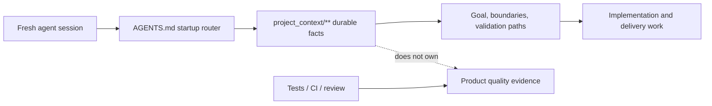

# Project Tiny Context Harness

[](https://www.npmjs.com/package/project-tiny-context-harness)
[](https://github.com/Seven128/project-tiny-context-harness/actions/workflows/package.yml)
[](https://securityscorecards.dev/viewer/?uri=github.com/Seven128/project-tiny-context-harness)
[](LICENSE)
[](https://codespaces.new/Seven128/project-tiny-context-harness)

Translations: [Chinese (Simplified)](README.zh-CN.md)

Project Tiny Context Harness is repo-native project memory for AI coding agents, plus a narrow delivery harness for trustworthy long-task completion. The product principle is: keep the memory, drop the ceremony. It adds durable project memory behind `AGENTS.md` without becoming an agent scheduler or Git orchestrator.

Public launch surfaces are English-first; localized documents are secondary entry points.

Best for:

- repositories where coding agents repeatedly rediscover project intent;
- teams using multiple agents or frequent fresh chats;
- maintainers who want durable Context and explicit long-task evidence.

Not for:

- replacing project tests, review, CI or human acceptance;
- autonomous Tiny Context execution;
- codebase semantic indexing or external docs retrieval.

Concrete shift:

```text
Before: ask a fresh agent to read the repo and tell you what matters.
After: ask it to read AGENTS.md and project_context/** first, then summarize goal, non-goals, architecture boundaries and validation paths before proposing code.
```

What gets added:




The demo shows the core loop: initialize `AGENTS.md` and `project_context/**`, run `validate-context`, then ask a fresh agent to recover intent before proposing code. Use the npm install path below, or inspect the no-install previews first.

Install:

```sh
npm install -D project-tiny-context-harness@latest
npx --yes --package project-tiny-context-harness@latest ty-context init
```

No-install preview:

- Read the [fresh-agent recovery walkthrough](docs/examples/fresh-agent-recovery.md).
- Inspect the [Minimal Context sample guide](docs/examples/minimal-context-sample.md).
- Browse the tiny generated repository at [examples/minimal-context-sample/](examples/minimal-context-sample/).

## Why It Exists

Coding agents need two different kinds of help:

- durable facts that survive sessions without loading the whole repository;
- trustworthy completion checks when a task spans many edits or context compactions.

Tiny Context keeps those concerns narrow. `project_context/**` records durable ownership, architecture, contracts and repeatable verification. Both implementation routes share one visible, risk-proportional Architecture Deliberation before implementation and one current-candidate Architecture Conformance after project verification. The default Workflow Contract combines manifest routing with one bounded Context search before `Context Delta`; the explicit Long-Task Workflow adds one machine-checked Delivery Contract, a one-time post-Authority-Lock model choice, rolling repair verification, a same-snapshot Final Gate and Stop freshness.

It does not launch or switch models, spawn agents, create branches or worktrees, merge, push, open pull requests, deploy, or claim to replace project tests and human acceptance.

## Capability Model

| Capability | When and how to use it | What it owns |
|---|---|---|
| **Minimal Context** | Installed by default. Agents read and update `project_context/**` on every delivery route. | Durable goals, ownership, architecture/interface/state boundaries and repeatable verification/deployment facts. It never claims that implementation or tests passed. |
| **Workflow Contract** | The prompt-level default after `init`. Ask the coding agent to do ordinary work normally; there is no Skill command or `delivery-contract.yaml`. | The lightweight loop: Context discovery, Architecture Deliberation, one `Context Delta`, implementation, project checks, Contract Conformance and Context drift. It creates no validator result, Receipt, persisted workflow state or machine completion. |
| **Long-Task Workflow** | Enable the `long-task` profile once, then explicitly select the `long-task-workflow` Skill, or resume an existing valid binding. Task size alone never activates it. | One Source-bound Delivery Contract, Authority Lock, recoverable scoped progress, protected revision and one current-snapshot Live Final Gate. |

The relationship is deliberately one-of-two at execution time: every delivery consumes Minimal Context, then ordinary work uses the default Workflow Contract while an explicitly selected Long-Task uses `long-task-workflow` as its execution and completion carrier. Long-Task Final Gate carries the final architecture and selected-design closure instead of duplicating the default Contract Conformance closure.

The base managed set also provides two explicitly triggered Open Design adapters: `design-system-authoring` generates/selects/adopts project Design Authority at cold start, while `design-resource-authoring` commissions task-local resources. They are optional upstream Skills, not a fourth mechanism and not stages inside Long-Task. Their selected outputs may feed either execution route, and `long-task-workflow` is the only active long-task execution Skill. `source-plan-authoring` remains only as a retired compatibility pointer because Long-Task inputs now enter one Source-bound Contract Draft loop directly.

Skill names in this README are host-neutral. In Codex, explicitly select one with `$skill-name` (for example `$long-task-workflow`) or use `/skills`; other hosts use their own Skill selector.

Default profiles are `core-portable` and `workflow-default`. Enable the opt-in profile with:

```powershell
ty-context enable long-task
```

This additionally installs `long-task-workflow`, the `source-plan-authoring` compatibility pointer and the completion Hook. `design-system-authoring` and `design-resource-authoring` are already in the base managed set. Tiny Context does not install Open Design, an agent runtime, model worker, scheduler, Git orchestration assets or another design-generation runtime.

## Recommended Usage

Start from the delivery request: either concise product intent or a detailed initial proposal authored elsewhere, including Web GPT. That input does not imply design authoring or Long-Task; choose the execution route independently of whether design resources are involved:

- **Ordinary delivery, no new design resources:** ask the current coding Goal to implement the request. The default Workflow Contract applies automatically; no workflow Skill or Contract file is needed.
- **Long delivery, no new design resources:** enable the profile once, select `long-task-workflow` with the request or proposal, and let that Skill author the Source-bound Contract Draft. Design authoring is not a prerequisite.
- **Delivery that first needs design resources:** explicitly select `design-system-authoring` only if project Design Authority is absent, then use `design-resource-authoring` to generate/select resources, completely freeze an implementation-level source when needed, reconcile accepted decisions once and emit a validated residual `design-resource-handoff-v1`. Feed the revised proposal plus selected immutable resources to either the default Workflow Contract or `long-task-workflow`, based on recovery and completion-authority needs.
- **Design-resource-only request:** stop after `design-resource-authoring`; do not create a Long-Task Contract unless implementation delivery was also explicitly selected.

The design-system step is user-selected, normally at project cold start; no command or downstream Skill runs it automatically. `design-resource-authoring` gates only style-bearing work when Design Authority is unconfigured. Low-fidelity structure, IA/flow and semantics-only state studies remain available without that gate. A legacy Source Plan is accepted as ordinary input, but it is no longer a recommended intermediate service.

## Try It In 60 Seconds

```sh
mkdir project-tiny-context-harness-demo
cd project-tiny-context-harness-demo
git init
npm init -y
npm install -D project-tiny-context-harness@latest
npx --yes --package project-tiny-context-harness@latest ty-context init
make validate-context
```

Then open `AGENTS.md`, `project_context/global.md` and `project_context/architecture.md`.

Expected result:

```text
AGENTS.md
project_context/
  context.toml
  global.md
  architecture.md
  areas/main.md
  areas/main/verification.md
```

Fresh-agent test prompt:

```text
Read AGENTS.md and project_context/** first. Summarize the project goal, non-goals, architecture boundaries, validation entry points and next safe action before proposing code changes.
```

For an existing repository, use `npx --yes --package project-tiny-context-harness@latest ty-context init --adopt`.

### Source checkout preview:

Open <https://codespaces.new/Seven128/project-tiny-context-harness>, or run locally:

```sh
git clone https://github.com/Seven128/project-tiny-context-harness.git
cd project-tiny-context-harness
npm ci
npm run smoke:quickstart
npm run preview:pack
```

The smoke packs the local workspace, installs it into a disposable repo and validates the generated Minimal Context files. Use this path for package development, source-preview testing or private review.

```sh
cd /path/to/your/test-repo
npm install -D /path/to/project-tiny-context-harness/tmp/ty-context/source-preview/package/project-tiny-context-harness-0.8.7.tgz
npx --no-install ty-context init --adopt
make validate-context
```

If it fails, open a [Source preview report](https://github.com/Seven128/project-tiny-context-harness/issues/new?template=source_preview_report.yml).

## Positioning

| Adjacent tool type | Use it for | Harness stance |
|---|---|---|
| Spec-first kits | Turning a feature idea into structured specs and plans. | Complementary; Harness keeps durable repo facts beyond one feature spec. |
| BMAD-style workflows and full Tiny Context processes | Role/process ceremony for selected work. | Lighter default; ordinary work stays Context-first. |
| Task Master-style planners | Backlog decomposition and task state. | Complementary; Harness does not own backlog state. |
| Context7/Serena-style retrieval | External docs, symbols or repository retrieval. | Complementary; Harness owns local intended boundaries. |

## Minimal Context

The default read path is:

```text
project_context/global.md
project_context/architecture.md
project_context/context.toml
minimum graph-relevant area/role Context
```

Only near-universal recovery facts should use `read_policy = "default"`; specialized architecture, contract, deployment and historical detail should be task-triggered `on-demand` Context. Before deciding `Context Delta`, the Agent also runs one bounded text search over `project_context/**` using a small set of high-signal task terms such as explicit area/module names and API/schema/state/security/verification/deployment language. Matching files are merged with manifest candidates and filtered by semantic relevance. This is not a vector or persistent retrieval system and creates no index, cache, registry, search state or authority.

`ty-context doctor` reports the deterministic default read footprint, per-file/total soft-budget overages, byte-identical default files and `DESIGN.md` authority status. These are advisory maintenance signals, not a new validation gate or workflow state. If genuine near-universal recovery facts exceed a byte heuristic, preserve the facts and accept the warning; never omit, obscure or misclassify required Context merely to fit the budget.

Typical roles are area/domain, contract, foundation, decision-rationale, implementation-index, verification and deployment. Context owns durable intended boundaries; code owns current implementation; tests, CI, browser/runtime evidence and people own behavior and product acceptance.

### Sparse Context Workspaces And Monorepo Repositories

Monorepos may keep Context centralized while mirroring only the implementation workspaces that actually own durable non-code facts:

```text
project_context/
  areas/                              # cross-workspace/repository/shared owners
  workspaces/
    mobile/areas/...
    wechat-miniapp/areas/...
    api/areas/...
```

Each represented `project_context/workspaces/<workspace-id>/**` maps to exactly one repository-relative code root through existing `[[areas]].root` and `context`; it may contain several workspace-local Area/role owners. The mapping is sparse in the other direction: package-manager workspaces with no durable Context get no empty directory. Cross-workspace, repository-wide, shared and governance Areas stay under top-level `project_context/areas/**`. Package-manager/build files remain the complete code-workspace inventory. Single-workspace and non-monorepo projects keep the existing top-level Area layout, initialization and validation.

For a monorepo, prefer a small top-level repository-common default Area; keep workspace-local Context `on-demand` unless it is genuinely near-universal. The core/default set, manifest candidates and bounded search remain an expandable starting set, not a read ACL, a maximum or an instruction to read an entire target workspace. Read any additional sibling Area, shared backend, cross-client contract, root `DESIGN.md`, selected resource or code needed to understand dependencies. Root `DESIGN.md` remains the current shared project Design Authority; Context workspace placement does not create independent design systems.

Before product edits, resolve task-local intended workspace(s) from explicit user/product/path/repository facts. If materially different siblings remain plausible, ask one concise target question rather than choosing the default Area, recent client or a generic keyword match. Intentional multi-workspace work names every target and any supporting/shared scope. After implementation, run the repository's changed-path/target-scope verifier on exact task-attributable paths when available, or review the final diff against durable owners during Conformance. Tiny Context adds no `[[workspaces]]` schema, automatic package-manager topology scan, forced migration, persistent target state, generic import/path/runtime scanner or duplicate Long-Task scope classifier.

Every engineering handoff reports one Context result:

```text
Context: updated <files/reason>
# or
Context: no durable fact change
```

## Default Workflow Contract

Ordinary tasks stay lightweight:

1. read core/default Context and collect manifest candidates;
2. run one bounded Context search over `project_context/**`, read relevant matches and widen when dependencies require more Context;
3. in a multi-target repository, resolve task-local intended workspace(s) without turning Context workspace or Area selection into read/edit permission;
4. surface one concise, repository-bound Architecture Deliberation;
5. decide `Context Delta: none|required` and update the owning Context first when durable semantics change;
6. use the platform's internal plan;
7. implement and run project-owned verification, including an available changed-path/target-scope check on task-attributable paths;
8. perform Contract Conformance, including Architecture Conformance on the current candidate and final change-scope review;
9. perform the separate Context drift check and hand off.

The default workflow creates no required `plan.md`, target declaration, matrix, verdict, evidence ledger, persistent Context-search index or second execution plan. Task length, file count and complexity never auto-enable long-task state.

Plan Validator commands no longer exist; existing plan, matrix or verdict files remain ordinary user files.

### Architecture And Modularity Guidance

Technical architecture support is a shared Workflow obligation. Every implementation delivery visibly completes `Architecture Deliberation` before its first implementation edit. Risk changes depth, not occurrence. A small change names the concrete owner/current extension point, confirms durable boundaries remain unchanged and explains why it adds or worsens no debt. Material work additionally covers the unique source of truth, dependency and interface/state/lifecycle boundaries, failure/recovery/compatibility, selected and rejected alternatives, one plausible future change and its extension point, touched technical debt, forbidden shortcuts and project-owned executable checks. `Architecture Context Hit`, `Decision Rationale Hit: existing|required|none` and `Modularity Check: none|required|exception` remain internal routing questions; no Task Contract or fixed `plan.md` is required.

After implementation and project verification, `Architecture Conformance` checks the current candidate for scope/path escape, owner or dependency-direction violations, service/facade bypass, duplicate authority or a second source of truth, undeclared API/schema/state/persistence change, missing architecture checks and new or worsened debt. A changed candidate invalidates the result. Default work embeds this closure in Contract Conformance; Long-Task work encodes material invariants with existing obligations/constraints/forbidden shortcuts, owners/paths/Bindings and executable Checks and lets Final Gate be the sole closure owner. The two closures never both run for one candidate.

Contract Conformance asks whether current Source and Context reached implementation and verification; the separately named Context drift check asks whether implementation or a new decision made durable Context stale. New or worsened debt blocks handoff unless the project has an explicit bounded exception with owner, rationale, tracking and a removal condition. Unrelated legacy debt does not automatically expand task scope, but debt touched, relied on or worsened by the change cannot remain hidden.

The visible checkpoint proves that architecture consideration occurred; it does not expose private chain-of-thought, guarantee the best design or anticipate every unknowable future request. Store stable reasons, rejected alternatives or tradeoffs only in the smallest durable Context surface. Harness may route repository-native lint/AST/dependency/contract checks, but it does not become a language-generic architecture analyzer or add an architecture artifact/state.

`ty-context check-modularity` audits selected handwritten source and identifies the highest-risk function and line for statement/branch findings. `validate-code-modularity` and `validate-harness` enforce it separately from `validate-context`.

#### Modularity Policy

Newly generated Harness configs default to `strict_except_generated`. Generated/build files remain excluded; `strict_except_generated` rejects configured `modularity.waivers`. Projects with bounded legacy exceptions may opt into `scoped_waivers`, whose entries require `path`, `category`, `owner`, `introduced_at`, `reason`, `tracking_issue` and `expiry_condition`.

### Product Surface Contract

`context_surface_contract` compiles durable screen/page/CLI responsibility using existing `contract`, area/subdomain and verification roles. `product-surface-contract.md` owns cross-surface/main-versus-drilldown responsibility; optional on-demand `screen-contract.md` goes deeper for one screen's entry/exit/shared state, information hierarchy, semantic regions, navigation/variants, material controls and target/verification references. This workflow must not add a new Context role or claim product-quality proof, and local style fixes do not require a Screen Contract.

For material UI, **UI Authority Closure** reconciles each stable surface/control/target key as covered by existing Context, requiring a Context update, task-local, explicitly out of scope or genuinely decision-required. Design Source Projection sends durable cross-surface and Screen/Control/state meaning to existing Product Surface or Screen/interaction Context, durable visual-system/token/motion-policy/rationale meaning to `DESIGN.md`, exact composition/value/condition/asset facts to versioned targets, repeatable proof routes to verification Context and delivery-local coverage/provenance/blockers to task or Contract Source. Conflicts fail closed; current code, timestamps, YAML or implementation screenshots do not silently win.

### Non-UI Semantic Completeness

Both development paths treat “complete and accurate requirements” for non-UI work as the finest independently decidable semantic Facts supported by expressed, logically entailed, explicitly delegated or evidence-backed authority. This covers product and business meaning as well as technical, backend and architecture meaning. Paragraphs, Requirements, Product Controls, broad state catalogues and current code are not the granularity ceiling.

The authoring obligation inventories every material request fragment, attachment, controlling Context unit, canonical specification, external constraint, repository-preservation source and delegated instruction. Its standard catalog is a mandatory floor: goals/scope/glossary; actors/roles/tenants/entitlements; business rules/calculations; entities/fields/relations; commands/queries/workflows/state/time; validation/output/error/API/protocol/event/job; persistence/cache/search/transactions/consistency/concurrency/idempotency; faults/retry/degradation/recovery/backup; configuration/flags/secrets; compatibility/migration/rollout; performance/capacity/cost/reliability/SLO; security/privacy/safety/compliance; observability/deployment/operations; integrations/notification/file/media/localization/commercial; hardware; AI/ML; architecture ownership/boundaries/debt. Domain-specific families, properties, condition axes and proof methods extend this floor.

Every applicable subject, typed relation and static/dynamic population receives a stable identity. Applicable actor/role/tenant/version/environment/state/input/boundary/locale/time/concurrency/dependency/failure/migration/rollout/threat/custom conditions are first-class atomic values and exact combinations. Every atomic property is specified or carries an exact basis-backed N/A/exclusion; unresolved, unavailable, conflicting or unreadable meaning blocks. Aggregate strings such as `all-states`, default paths, representative/pairwise samples and ungrounded N/A cannot stand for atomic cells.

One semantic Fact binds `Outcome × subject/relation/population × exact condition × atomic property × typed expected predicate`, together with owner, Source locator/digest, provenance, quantifier, observation boundary and sensitivity. Fact identity is separate from proof obligation: every Fact expands to all required methods and the furthest independently failing boundary, with frozen comparator/parameters/tolerance/mask, Oracle capability/identity, environment and protected-value policy. Exact values remain in Source or owning Context; downstream carriers retain identities and comparison authority rather than becoming a second semantic value source.

Default work keeps an ephemeral exact accounting and requires `Expected Semantic Facts = Source Indexed Facts = implementation/acceptance accounted Facts`, plus one attributable current-candidate observation/environment/comparison/Oracle/verdict for every Fact × required-method obligation. It creates no manifest, matrix, Claim set, state or Gate. Explicit Long-Task persists one Source `semantic-fact-manifest-v1`, requires `Expected = Source Indexed = Contract Indexed Facts`, maps every machine obligation to one single-Fact Assertion and typed `semantic_fact` result (or to a named External Confirmation), and enforces exact expectation/result equality in its existing Final Gate. Missing, extra, duplicate, unresolved, unmapped, unimplemented, unexecuted, stale, failed, proxy-only, reused or indistinguishable rows block completion.

This mechanism cannot discover intent the user never expressed or prove an arbitrary Inspector/Oracle semantically sound. It may complete only necessary derivations and explicitly delegated defensible choices; real product, legal, security, commercial, safety or externally owned decisions remain blocking. Durable meaning still goes to its existing Context owner, code remains current implementation truth, and no second plan, registry, Authority, Gate or prescribed implementation sequence is introduced.

### Visual Delivery Guidance

One shared conditional purpose of both development paths is that Agent implementation, acceptance and testing fully conform to every material UI/UX fact selected design resources explicitly express within their declared scope and conditions. It activates only for a selected implementation handoff and does not infer unexpressed behavior or prove that the user supplied every desired requirement. Open Design can produce implementation-rich HTML/CSS/JS, specifications, tokens and assets, but capability is not a per-run guarantee: for a selected Web/App implementation handoff, `design-resource-authoring` must explicitly commission and completely retrieve one machine-readable canonical entry plus its exact dependency closure, freeze every file with a digest and expose stable typed locators. Before `ready`, it exercises every declared verification method on those immutable bytes and blocks unresolved conflicts among code, specs, tokens and assets. That is source QA, not production acceptance. PNG may be a visual baseline, never the sole implementation source.

The provider-neutral handoff is a residual semantic and index layer, not a textual copy of CSS or another value authority. Before formal Web/App generation, `design-resource-authoring` derives an Expected Fact Universe from scope, adopted Design Authority and a frozen Inspector/Census obligation. The atomic unit is an applicable `subject × selected target × condition combination × variation combination × property` Fact Cell. Subjects include surfaces, regions, overlays, component families/instances, controls, every anatomy part/slot/primitive, text, icons, media, assets and relations. Conditions are first-class across 33 standard condition axes (platform/runtime/device/viewport/density/safe area/window/fold/display/color/localization/content/data/text scale/input/assistive and accessibility preferences/system UI/IME/permission/capability/connectivity/lifecycle); variation is first-class across five variation axes: `variant`, `state`, `interaction_phase`, `presence_phase` and `instance_case`. Properties use 217 standard atomic keys across geometry, layout, scroll, typography, color, decoration, content, icon, media, interaction/navigation, motion/feedback, responsive, accessibility, asset, system and relation families, plus explicitly defined custom properties.

The generated canonical implementation source remains the sole owner of exact values. Its dependency closure contains a `design-resource-observable-fact-manifest-v1` with stable subject/property/Fact IDs, typed locators, located-value digests, units/rounding/pixel-snapping rules, token/effective-value lineage, dynamic population/relations/assets, required proof methods, comparator parameters/tolerance/mask, Oracle identity/capability and render environment. A frozen Inspector enumerates the complete resource/node/declaration/token/asset/relation/custom-property/variant/state/interaction/dynamic-population Census; complete-generation counts and digests prove that no sampling or truncation occurred. Each applicable Fact Cell is either covered by one atomic Fact or carries an explicit blocking/non-applicable disposition with Source/basis/rationale. Aggregate labels such as “all states” cannot stand for atomic values, and a default page/shared style cannot be used to infer another applicable combination.

Ready handoff requires exact set equality: `Expected Fact Universe = Canonical Resource Facts = Handoff Indexed Facts`, together with complete material-with-facts or honestly supporting-only resource closure. The handoff carries identities, locators, digests and proof bindings rather than copying CSS values. An `exact_target` additionally requires full-target layout and pixel facts for every applicable condition; otherwise the input remains a partial constraint or blocks. Preflight resolves the manifest and all typed locators against immutable local resources, validates dependency/Census/Fact/proof closure, and rejects missing, duplicate, unresolved, unsupported, stale, media-incompatible or value-conflicting input. Exploration remains schema-free.

Those inputs remain ordinary Source. The default Workflow keeps exact task-local accounting for every Fact and required proof obligation, then records the current actual observation/environment, comparison, tolerance, pass/fail and Oracle identity from an attributable production-owner/cold-start final-candidate check. Any unread, unsupported, unresolved, unmapped, unimplemented, unexecuted, stale, reused or indistinguishable applicable Fact blocks a complete claim and is reported as a gap. Long-Task projects the same universe into existing Claims/Assertions/Checks/Bindings: every method/condition cell carries exact `fact_refs`, one `fact_expectations` row per Fact/proof obligation and one current `fact_results` row containing that same observation/comparison/authority tuple; Final Gate requires exact expectation/result set equality and every result to pass on one current snapshot. Protected/sensitive observations remain redacted or digest-only without losing comparison authority. These proof carriers are mutually exclusive: an active Long-Task never also runs the default closure. Generation success, screenshots, hashes, Census and handoff preflight prove input completeness or integrity only, never production conformance.

The default Workflow performs UI Authority Closure and a conditional Design Authority Check before a material product, design, implementation or acceptance decision for new/redesigned screens, primary layout/navigation/theme/component-system work, high-fidelity implementation and substantial visual polish. It traverses affected stable keys to exactly one canonical adoption record, then actively opens every selected `exact-target` or `constraint`; a registry or handoff-index mention alone is not consumption. `DESIGN.md` canonically records project/system/component-family targets, while the owning Screen Contract records one-screen/interaction-specific targets. The canonical record owns interpretation, selection basis, readable immutable locator/digest, declared condition coverage and editable upstream owner/locator/update route; other layers keep only the stable key, canonical owner/anchor and local applicability. Missing, unreadable, stale or conflicting resources fail closed. Updates create a new immutable version instead of overwriting the adopted baseline. An unconfigured starter, candidate, style-only prose or inspiration does not authorize invented production layout. Explicit design-system adoption routes to `design-system-authoring`; standalone resource generation routes to `design-resource-authoring`. Ordinary implementation with sufficient authority, local style fixes and throwaway prototypes remain lightweight.

For a selected implementation handoff, both development paths first run `ty-context design-resource preflight <handoff.md>`. Incomplete acquisition, missing or undeclared dependencies, unsafe paths, stale digests, fictional locators, non-frozen or incomplete Census, sampled/truncated generation, aggregate axis values, mismatched Expected/Canonical/Handoff Fact sets, missing required methods, invalid comparator/Oracle/environment binding, unresolved design-system lineage, uncovered applicable cells, absent exact-target layout/pixel facts, unsupported evidence and unresolved meaning all fail closed. Each workflow must still open the resources and prove the production implementation on the real entry.

For material work, `context_uiux_design` applies the projection above and keeps any risk-proportional coverage reasoning task-local. `context_development_engineer` traces every selected target/condition and the exact handoff sets through stable surface/control keys to the production route/component owner, cold-start real-user journey and independently attributable rendered/interactive checks. A first useful runnable production slice is a recommended real-entry feedback point when early localization is worth the cost, never an implementation gate; the final candidate always reruns the affected cold-start journey. Every declared/applicable combination remains covered—risk-only or pairwise sampling cannot replace it without authoritative scope narrowing or project-owned equivalence proof. Resource hashes, manifests and counts prove integrity only; an implementation screenshot cannot become its own target or implementation-conformance proof.

An explicit Long-Task is the strong machine carrier of the same shared obligation. It resolves missing/conflicting UI authority before Compile, then closes all 22 canonical fields of every real Product Control through `field_coverage`; that semantic Control projection is independent of, and never caps, the finer design Fact universe. Selected targets freeze the canonical manifest identity/digest and project every atomic Fact/required-method pair into a `fact_expectations` row with subject/target/condition/variation/property identity, expected located-value digest, comparator/parameters/tolerance/mask, Oracle identity/capabilities, environment and sensitivity. Current Check evidence supplies an exact matching `fact_results` row with actual observation/environment, comparison and pass/fail; duplicate/reused observations, missing results, stale authority or any failure block Final Gate. `design_conformance` remains a typed current-execution record for target-level actual/comparison artifacts, while `design_method` binds the independently failing method/condition cells and their per-Fact rows; neither aggregate record replaces atomic Fact proof. Product `surface_bindings`, Control Claims/relations and root-entry journeys continue to carry product semantics, while existing Claim, Assertion, Check, Stage, Binding, revision and Final Gate mechanisms remain the sole Long-Task lifecycle and closure. Every blocker preserves exact Source-item/method/capability lineage and cannot be dismissed in-band; scope removal requires revised Source/Contract authority.

Combined design-and-implementation work may author candidates in ordinary Outcomes/Stages, but a candidate or planned target cannot authorize fidelity implementation. The selection must become real marked Context-reachable Source plus its owning Context/`DESIGN.md` reference and, after Authority Lock, an adopted Authority Revision. Browser visual ACs use `ui_browser`; a browser proxy, detached route or deep link cannot prove a native/root journey that can fail independently. Resource integrity and `visual_render` cannot satisfy selected-target implementation conformance. Frozen baselines are verifier inputs, generated actual renders/diffs are current artifacts, and subjective approval remains external. This adds no `uiux_delivery` block, visual Claim type, resource registry, risk level, lifecycle state, Gate, required design directory, per-Control screenshot matrix or universal pixel threshold.

`ty-context doctor` keeps its compatible `missing | unconfigured | configured` project-level status and adds advisory Design Authority Index, token-source and classified-reference signals. It explicitly does not infer surface implementation readiness; that requires the owning Screen/Control meaning, selected target/constraints and project-owned verification.

Static guidance tests prove distribution, projection and canonical ownership, not Agent performance. The optional delivery-mechanism benchmark provides a fixed fresh-agent UI/UX Context/target-recovery task with routing gold and a hidden production oracle; only independent paired runs may support effectiveness or ROI conclusions.

### Explicit Design System Authoring

Use `design-system-authoring` only when the user explicitly asks to initialize, generate, select, adopt, replace or repair the project design system/design style. Installation makes the cold-start capability available but never runs it automatically. The Skill discovers live Open Design MCP resources/tools, feature-detects design-system lifecycle methods and, when the current MCP exposes design systems only as resources, uses the same installed Open Design daemon's official generation/revision/accept API. It never copies provider prompts or pretends daemon generation is an MCP tool.

Generation produces candidates. Explicit human selection—or explicit delegated selection with known criteria—precedes adoption. The selected system is reconciled into canonical project `DESIGN.md`, exactly one authored exact-value token source/generation direction and only the owning durable surface/interaction Context. Open Design provider ID/revision/digest and project binding are synchronization provenance, not a second authority. Provider success, artifact readiness, selection, authority adoption and `get_project.designSystemId` binding verification are reported separately.

### Optional Design Resource Authoring

Use `design-resource-authoring` only when explicitly asking to generate, iterate or prepare standalone design resources, prepare the design resources for a named development scope, or use Open Design. Inputs may be raw notes or an initial proposal, product/technical plans, a specialized visual brief, screenshots, existing resources or a legacy Source Plan. A standalone Source Plan is not a prerequisite or recommended middle stage.

The Skill fixes the requested output or development content as a hard scope ceiling. A partial feature includes only the surrounding context needed to place it; broad background never expands generation to the rest of the page or product. For an implementation handoff, the Skill accounts for material UI/UX meaning from surface/flow structure through relevant regions and controls: visual/content treatment, component anatomy and variants, static/dynamic states, interaction/feedback/recovery/motion, responsive/platform/input behavior, accessibility and necessary assets. It subtracts only coverage explicitly supplied by selected existing Source, then discovers current Open Design agents/models, functional skills, rendering templates, design systems, plugins and export routes and gives every considered resource a reasoned `selected`, `optional`, `not-needed`, `unavailable` or `decision-required` disposition.

For formal Web/App implementation output, “complete” defaults to the finest applicable observable Fact granularity described above. The Skill builds the Expected Fact Universe and frozen Inspector/Census obligation before commissioning generation, passes that obligation and the adopted design-system identity into Open Design, and requires the returned canonical source/manifest to express every applicable cell. It does not wait for downstream implementation to discover missing states, anatomy-part styling, responsive/platform/text-scale behavior, motion, accessibility or asset facts.

It first classifies the commission. High-fidelity/branded output, visual direction, typography/color/density, component visual treatment and production-style prototypes are style-bearing: if `DESIGN.md` is unconfigured or lacks one authored token source/direction, the Skill stops before provider project/run creation and tells the user to explicitly select `design-system-authoring`; it never initializes authority itself. Low-fidelity structure, IA/flow topology and semantics-only behavior/state studies remain non-fidelity. For style-bearing work, the Open Design MCP project is created or checked with `create_project.designSystem`, and `get_project.designSystemId` must match the adopted provider ID.

It commissions only the smallest sufficient artifact/file set through structured MCP, with bounded CLI/daemon and UI fallback; this minimizes packaging, never information granularity. One canonical HTML/CSS/JS prototype plus manifest, tokens/assets and inspectable state/component workbench may carry thousands of atomic Facts when every condition is addressable. Repeated controls may map to shared variants, while unique or complex uncovered controls may need dedicated state/interaction studies. A static/default frame never silently covers unseen state, interaction, motion, responsiveness or accessibility. A prototype, low/high-fidelity pair, component board, provider-native input, one-file-per-control rule, variant count or directory is never universally required, and Tiny Context never copies Open Design prompts/templates or vendors a provider catalogue. Designs may express user-visible interaction semantics and the presentation of product rules, but business/data/permission/algorithmic rules remain owned by product/technical Source.

For implementation Web/App output, the Skill requires the complete canonical entry/dependency set and addressable declared facts described above. Figma remains useful when an existing design team needs native Components/Variables/Variants, shared libraries, Dev Mode or Code Connect; Penpot when open/self-hosted multi-user design infrastructure is itself required; OpenPencil as a local static-layout sidecar while its prototype/motion model remains incomplete. Default conversion from complete Open Design source to another representation is not required because it adds synchronization and operating cost without closing a new enforcement gap.

Exploration returns the requested visible candidate after minimal sanity review and requires no handoff schema. After explicit or delegated final selection for implementation, the Skill performs one consolidated idempotent proposal reconciliation and writes one provider-neutral marked Markdown Source containing exactly one strict residual `design-resource-handoff-v1` block. It records the canonical manifest/Inspector/Census identity, exact indexed Fact universe and dispositions, implementation source profile, typed locators/digests, residual product meaning, per-Fact proof bindings and acceptance blockers. Shared preflight cannot call incomplete, unaddressable, unresolved, unsupported, stale or set-unequal input ready. There is no fixed directory, provider pack or one-file-per-control rule. The adapter is ordinary Source, not Design Authority or acceptance, and the Skill never edits a Source Plan, `project_context/**`, `DESIGN.md`, production code or a Delivery Contract.

Actual generation remains with configured Open Design/Product Design, Figma, image-generation, prototype or human systems. Their outputs enter the default Workflow or Long-Task as ordinary external Source. Candidates and inspiration authorize no fidelity. An adopted exact target/constraint becomes Context-reachable Source: owning Context/`DESIGN.md` maps its stable key to declared conditions, a stable immutable identity/digest and an editable upstream owner/locator/update route. `context_uiux_design` performs downstream UI Authority Closure and adopts only durable facts into Context/`DESIGN.md`; implementation renders and diffs remain evidence artifacts rather than self-authorizing targets.

Maintainers may set `TY_CONTEXT_OPEN_DESIGN_MCP_COMMAND` plus optional `TY_CONTEXT_OPEN_DESIGN_MCP_ARGS_JSON` and run `npm run smoke:open-design` for an opt-in, read-only discovery smoke. Normal tests use a local mock MCP and never require Open Design, login, paid access or nondeterministic design output.

### Retired Source Plan Compatibility

`source-plan-authoring` remains installed with the long-task profile only as a compatibility pointer. `long-task-workflow` opens the non-authoritative Contract Draft immediately and converges complete input inventory, mixed-input synthesis/refinement, stable-key and Product Control-level meaning, preference/research/delegation traceability, Source markers/provenance and Contract mapping in that same loop. This semantic Control projection does not cap the separate complete-observable-design-fact inventory for selected resources. A legacy Source Plan remains valid ordinary Source, but no separate or internal Source-authoring stage, handoff, schema, gate, state or second plan is created.

## Single-Goal Rolling Delivery

Use `long-task-workflow` only when explicitly selected or when the current worktree already has an active long task. It uses:

- one currently selected platform-native execution Goal; compaction may continue inside it, while a later Goal/session restores semantic state rather than the previous physical Turn;
- one user-selected repository/worktree;
- one complete selected delivery, one Contract and one Final Gate;
- Outcome dependencies as acceptance/intermediate-proof readiness, not worker scheduling or implementation permission;
- one user model-choice checkpoint after first Authority Lock and before implementation;
- an advisory rolling acceptance/verification Frontier that never gates edits;
- optional targeted feedback/repair checks that never accept or gate Final Gate;
- stateless scope-only revision diagnosis, automatic bounded repair and at most one exact user decision for a stable decision-relevant candidate;
- a complete Final Gate on one current snapshot;
- a Stop Hook that rejects stale completion.

Its proof claim is conditional and precise: if Source is complete and accurate at the declared observable granularity, projection preserves that meaning, every actual applicability cell is expanded, and the named project oracle plus installed verifier/runtime trust boundary is semantically sound, then `AcceptedDeliveryTerminal`—exactly a fresh `machine_accepted` result with no pending External Confirmation—implies no declared observable drift remains. `machine_accepted_external_pending` proves only that machine-verifiable declared drift is empty; full delivery remains qualified and the native Goal is untouched. The workflow mechanically enforces and freezes many premises, but it cannot discover undeclared requirements or prove an arbitrary project oracle truthful.

Raw/revised proposals, selected design resources and mixed attachments enter one Source-bound Contract Draft loop immediately. Complete input inventory, stable keys, Product Control-level meaning, selected-resource design facts, acceptance/risk coverage, direct/derived/delegated/evidence-backed provenance, Source ownership and Contract mapping converge together. Every non-empty line in declared Markdown Source must belong to one Material `ty-source-item` block, the single validated `design-resource-handoff-v1` formal block or a closed-grammar background block: `markdown-structure` permits only text-free anchors/horizontal rules and `provenance` permits only `ty-source-provenance` comments with fixed `input`, `mode`, conditional `source` and optional `sha256` fields. A text-bearing heading or free-form provenance field can express authority and is therefore rejected as background. Arbitrary background prose and all other unclassified text fail closed. At least one marked technical obligation carries `aspect=architecture` and maps to an independently provable architecture obligation. If an unknown preference could materially change comparative research or selection, the workflow asks before Preflight/Compile can succeed. Once criteria are clear, a defensible recommendation is written into real Source with its delegation, preference/evidence basis and exact meaning; it is never hidden only in YAML. High-risk action remains an external confirmation. Legacy Source Plan structure never blocks authoring.

Before the first successful formal Compile, `delivery-contract.yaml` is one non-authoritative Contract Draft. `long-task-workflow` opens it at entry and keeps revising that same Draft across Source refinement, repository/Context reads, mapping and Preflight repair rounds; it does not require one response to produce a complete Contract. Source completeness is a convergence condition for Preflight/Compile, not a prior phase. No standalone Contract Draft Skill, Draft Receipt or Authoring State exists.

The first successful Compile creates Authority Lock and returns `execution_model_checkpoint.required: true` with `turn_boundary: end_current_turn`, blocked implementation actions and explicit-choice fields. Unless a prior user message explicitly states this task's current-model or switch-and-resume strategy, the Agent performs no implementation, file edit, build or test after that result, ends the turn and asks for the choice. Generic continue/resume/finish/continue-goal language does not satisfy the checkpoint. Later Compile revisions return `required: false`; Harness does not switch models, persist acknowledgement/model-route state or repeat the pause.

Later revisions separate authority change from user decision. Formally monotonic strengthening; raw Source/Context snapshot changes with unchanged locked Claims/targets/proof obligations; operational Runner/input repair; repository-bound scope expansion; risk strengthening; and equivalent Counterfactual coverage with the same carrier, mutation and Check and no lost Claim/assertion-failure coverage auto-adopt. Product/Source Claim/target/external-confirmation changes, lost scenario/Claim/Evidence Capability/failure interception, forbidden or owner-Context removal, runner type/effect changes, verifier-kernel changes and unknown reasons are preview-only and require the exact revision identity; risk downgrade is rejected. `diagnose-revision` remains side-effect-free and can exercise eligible scope candidates, so withdrawn/replaced candidates coalesce in the same `delivery-contract.yaml` and never ask. The final pending decision begins with a plain-language Authority Revision introduction and separates `user_decision_reasons` from mechanically bounded changes. Present it first. An explicit current-task instruction that exactly covers every listed decision reason may be mechanically relayed without a second question; generic continue, blanket approval, recommendation or Agent inference does not count. Exact identity, previous-Authority continuity, evidence invalidation and the complete Final Gate apply to every adoption, which never means delivery completion.

The package-managed Long-Task Skill uses progressive disclosure: its main `SKILL.md` keeps the objective, boundaries and activity routing; one-level references are read for Source-bound Draft input/Contract mapping, evidence design or authority lifecycle as applicable. Draft input repair and Contract mapping are concurrent activities, not serial phases. This reduces routine instruction load without moving any rule into a second authority. It performs the shared Architecture Deliberation during Draft authoring. When Source or controlling Context declares an architecture invariant, the Contract uses existing technical obligations/global constraints/forbidden shortcuts, owner/path/Binding boundaries and a project-owned executable Check. Functional acceptance cannot substitute when the architecture invariant can fail independently, and Final Gate is the sole Long-Task Architecture Conformance carrier.

A Draft Outcome is simply an Outcome before Authority Lock. Outcomes split independently observable, decidable, vertical and target-verifiable results so the current Goal can project a smaller acceptance/verification-ready working set, localize failures, resume findings and invalidate stale local results. `depends_on` expresses acceptance and intermediate-proof readiness, not implementation permission. Every Outcome belongs to one ordered Stage; its Stage gate transitively depends on the other Outcomes in that Stage, and later Stages depend on earlier gates. The Rolling Frontier and Stage status are derived from ordinary Outcome Progress and are temporary advisory projections. The Goal may implement, inspect or repair any in-scope Outcome in the order current code favors and may optionally use one or multiple platform-native agents/subagents. Harness allocates and records none of them, agent reports are not Progress or proof, and all outputs converge into the selected verification workspace. An Outcome is not a Worker, scheduler task, queue or parallelism unit, and a Stage owns no Receipt or second Gate. Outcome decomposes diagnosis and proof ownership, not completion authority: targeted passes never replace the one complete Final Gate on the current final snapshot.

The Contract declares one bounded target profile, its non-empty required product target refs and each target's runtime family, root entrypoint and explicit capabilities. Required product targets name their family capability plus `cold-start` and `production-root`. A Web/process proxy cannot satisfy an independently required Native/desktop target. Browser target proof uses Playwright; Native/desktop target proof uses a project binary. Every `critical_user_path` Outcome and Stage gate proves `target_runtime` from every required target's root entrypoint; a multi-Outcome Stage gate also proves at least two distinct surfaces share one runtime state.

When a declared result can pass on a proxy surface while failing in its target runtime, the earliest owning Outcome declares a project-owned Check that exercises the target during the current Check execution. A tracked report, screenshot, binary, log or historical run cannot be the sole runtime proof. Checks declare keyed Given/When scenarios and journey roles; global/Outcome applicability profiles bind the exact target, journey, one atomic duplicate-free dimension assignment set, Given condition/input/state refs and ordered When refs. Every Claim lists all applicable profiles, and each Claim-bearing Assertion proves exactly one Claim at one matching profile; every actual applicability × proof-surface cell remains attributable, without risk-based, pairwise or sampled substitution. Assertions declare all-of Evidence Capabilities backed by typed current-execution records. Static `presence` cannot prove behavior, degradation cannot replace required success, fixed-input output cannot prove variation and a producer cannot self-attest its own boundary/external effect. Every behavioral Claim-bearing Assertion also requires a same-Check claim-local `replace_json_value` or `replace_text` Counterfactual that keeps a claimless target-runtime liveness Assertion passing while the wrong behavior fails; whole-file replacement cannot establish semantic binding. Population binds a real universe carrier into the owning Check snapshot and proves exact universe = eligible = observed plus valid exclusions. Runner identity recursively freezes the supported direct-literal local verifier module/config/data graph—static imports/re-exports, literal dynamic imports, `require` forms and literal `new URL(..., import.meta.url)` files—and rejects non-literal loaders/`createRequire`; package scripts require a recoverable static Node entry. Candidate/runtime material remains explicitly owned by `input_paths`, `expected_output_paths` or `artifact_globs`; other indirect Oracle access belongs in `verification_inputs` or the named trusted boundary. Author each Check's `input_paths`/Bindings as its smallest sound invalidation envelope and keep every Counterfactual carrier traceable from the declared target root. The first useful runnable boundary and later coalesced changes are recommended targeted-feedback points only when early localization is worth the cost. `progress_stale` reports that prior evidence no longer covers current inputs; refresh it only before an intermediate decision relies on that result. Implementation and Final Gate may proceed with stale or absent Progress because Final Gate ignores it and reruns every declared Check. `verify --explain` previews bounded declared runner invocations without execution or Progress writes, but cannot predict duration or commands spawned inside a runner. This adds no generic reachability claim, implementation gate, second executing diagnose mode, scheduler, trigger queue, per-platform progress state or per-edit rebuild rule; runtime-specific readiness/build/process behavior stays in the project runner, and Final Gate remains authoritative.

Long-Task Anti-Degradation Assurance protects current causal-chain truth, cross-version interception strength and the adjacent `F = Implementation Freedom Boundary`. Context statements about the current implementation must match the indexed code/runtime; that implementation must still realize the meaning-capture/architecture and fail-closed observation/repair/final-snapshot responsibilities which, under the explicit Source/semantic/TCB boundary, imply the controlling no-false-completion purpose. `F` is an efficiency/anti-process-bloat invariant rather than a third responsibility or theorem premise: inside Source/Contract, architecture, safety, forbidden-shortcut and irreversible/external-action boundaries, implementation order, methods, local feedback cadence and optional one-agent or multi-agent/subagent execution remain Goal-owned. Harness adds no development phase/method Gate, per-edit mandate, agent scheduler/state or delegation proof. Weakening the purpose, key logic, either responsibility, theorem boundary or `F` requires an explicit project-owner design-purpose decision and replacement proof, not Agent inference, coordinated prose/code/test edits or cost alone. A new development-stage constraint must additionally close a distinct path that final proof or a lighter project-owned check cannot cover and have positive net ROI. This assurance uses existing Context, indexes, tests, critical sentinels, routing and parity gates; it adds no second Authority, Gate or state and cannot recover omitted/unobservable requirements or make itself immutable against deliberate fully authorized joint weakening.

Workflow changes then pass two hard gates in order. First prove `Coverage_new ⊇ Coverage_old`, `FalseNegative_new ⊆ FalseNegative_old` and preserve non-bypassable Authority, fail-closed behavior and complete-current-final-snapshot proof; if that cannot be proved, preserve the current formal acceptance path. Cost savings never compensate for weaker drift detection. Only then require incremental anti-degradation or purpose-fulfillment benefit to exceed all incremental authoring, runtime, state, recovery, maintenance, test, process, introduction and migration cost. Positive net ROI places the proposal in the consideration set; it never means automatic adoption.

A separate read-only Global Product Conformance Check is required only for weak-observability work that also has multiple Stages or multiple required product runtime families. It starts at a required root product target, has independent Raw Execution and runs within the existing Final Gate. Single-Stage, single-family work retains the existing same-Check sensitivity path and pays no extra conformance run.

The platform owns physical Goal/session lifecycle. A later session runs `resume` to reconstruct semantic state; Tiny Context does not recreate the prior physical Turn. Machine acceptance covers only `declared_machine_authority` and reports `native_goal_effect: none`. Before completing the platform-native Goal, the Agent performs a veto-only comparison of current Goal/user meaning against accepted marked Source and checks for pending revisions, unresolved blockers or omissions; this guard may block and repair, but it never supplies acceptance proof.

### CLI

```text
ty-context long-task init <workdir>
ty-context long-task preflight <workdir>
ty-context long-task compile <workdir>
ty-context long-task compile <workdir> --revise
ty-context long-task diagnose-revision <workdir> [--outcome <key>] [--check <key>]
ty-context long-task approve-authority-revision <workdir> --revision <sha>
ty-context long-task explain <workdir>
ty-context long-task verify <workdir> [--outcome <key>] [--check <key>] [--explain]
ty-context long-task status <workdir>
ty-context long-task resume <workdir>
ty-context long-task doctor <workdir>
ty-context long-task final-gate <workdir>
ty-context long-task stop-check <workdir> [--message <text>]
ty-context long-task close <workdir>
ty-context long-task abandon <workdir> [--force-corrupt-state]
```

- `init` creates one Compact inline-Outcome Contract template.
- `preflight` applies Compact defaults and reports all discoverable closed-grammar Source/background ownership, architecture Source obligation, REQ/CTRL field-and-relation closure, OBL/AC, atomic applicability dimensions, Population universe binding, Stage closure, required-target/root/capability/runner, scenario/journey, Evidence Capability, per-method selected-design artifacts, external impact, Product Conformance, full Context, risk, path/binding, recursively frozen runner/input dependency, narrow semantic witness/liveness, proof and workspace-scope diagnostics. Before first Authority Lock, it classifies every current HEAD-relative changed path as protected, expected change, allowed support, forbidden or unclassified; forbidden and unclassified paths block. It is read-only: no Authority Lock, marker, cache, progress, Receipt, pending revision, state lock or project Check.
- `compile` repeats the same fail-closed workspace classification and activation validator, so direct Compile cannot bypass Preflight, then generates Global plus Outcome Result/Requirement/Control-field/Control-relation/Non-completing/Technical Claims at exact applicability, rejects uncovered cells, preserves an immutable first baseline and makes the first successful formal Compile the Authority Lock. During first enable, only exact current package-asset files for configured managed destinations plus exact config/hook files are temporarily protected; managed directory roots and broad `.codex/**` are never exempt. Every result includes a lifecycle event, `delivery_completed_by_this_event: false`, `native_goal_effect: none` and a next action. The first result also includes `execution_model_checkpoint.required: true` plus the terminal-turn/explicit-choice contract; later Compile results return `required: false`. Every revision compares against active authority regardless of progress, Receipt/cache deletion or implementation restoration. Source/Context/Product/Acceptance/Global/verifier materials, owner/binding authority, resolved runners and verification inputs are frozen in the common-dir Active Authority V3 snapshot; the model-choice result is not stored as Authority state.
- `diagnose-revision` performs a side-effect-free candidate Compile. Only a scope-only candidate may run existing active Check identities with unchanged runner/verifier authority. Other mechanically bounded repairs return an automatic-revision preview without runner execution; decision-relevant Product/Claim/target/acceptance/forbidden-boundary/runner-type-or-effect/verifier-kernel changes return a user-decision preview, while risk downgrade is rejected. Output always has `acceptance_authorized: false`, `progress_written: false` and `pending_revision_written: false`.
- `compile --revise` auto-adopts monotonic or mechanically bounded revisions. Decision-relevant revisions return `authority_revision_pending` plus the exact id, deterministic material summary, `user_decision_reasons` and a self-contained `decision_brief`, then fail closed until that exact id carries the user's decision. Present the brief first; mechanically relay an already explicit task-specific decision only when it covers every reason. Candidate edits produce a new id and invalidate old approval. Adoption emits `authority_revision_adopted`, invalidates affected evidence and returns to rolling execution; it never means delivery completion.
- `verify` writes scoped per-Check Progress Records only after rechecking active task/revision/compiled/worktree identity and applying the same workspace categories against the immutable baseline. A concurrent revision returns `active_authority_changed_during_verify` and writes no stale progress. `verify --explain` is read-only: it groups selected Main Raw Executions, lists applicable Counterfactual invocations and declared retry-attempt bounds, executes nothing and writes no Progress.
- `status` reports each Outcome as `unverified`, `progress_passing`, `progress_failing`, `progress_stale` or `blocked_external`. It derives `stages`, `ready_stages` and an advisory acceptance/verification Outcome frontier from current Progress without persisting Stage completion. The legacy `ready_for_implementation` field is a compatibility alias for that projection, not an implementation gate. Status also reports the fresh Final Receipt as `final_workflow_status` (or `null` after drift), target profile/state, the active Contract's complete `external_confirmations` and the single `pending_authority_revision` decision when present. `progress_passing` is targeted repair evidence rather than “Outcome complete”; `progress_stale` is a freshness fact rather than a current pass or immediate rerun command, and `final_workflow_status: null` means unfinished. It reads the common-dir authority snapshot and reports a missing or mismatched workdir cache as a repairable diagnostic.
- `resume` is read-only and reports task identity, risk, relevant Context, Git state, the same Final/target/Stage/external/pending decision surfaces, ready Outcomes, findings and an advisory verification/repair next action from the common-dir authority snapshot. That action never restricts implementation order.
- `final-gate` requires a clean candidate commit, first rejects stale accepted authority inputs, recompiles Source authority and captures semantic plus raw protected-input identity for the Contract/fragments, Source, full Controlling Context, verifier/runner, recursively frozen local verifier dependencies, verification inputs and workdir inputs. It reruns every required Check on one Git-tree snapshot, then recompiles and re-hashes the full protected set; any race fails closed before acceptance. Its Receipt derives each Stage as `passed`, `failed`, `blocked_external` or `blocked_dependency`, and derives `target_state` as `not_accepted`, `blocked_external` or the Contract's exact `implementation_complete`, `target_profile_usable` or `production_release_ready` qualification.
- `stop-check` and `close` run that Live Final Gate themselves. They never trust status, progress, a Receipt or compiled cache for acceptance; success clears only the accepted identity through CAS. Every accepted Stop emits one non-blocking terminal-scope `systemMessage`; external-pending results additionally name all confirmations. Final/Stop/close report `acceptance_scope: declared_machine_authority` and `native_goal_effect: none`; close also reports `closed_scope: machine_authority`. `status: closed` means only that machine Authority was cleared, not that the native Goal or complete external delivery finished.
- `abandon` is explicit non-success cleanup. `--force-corrupt-state` is reserved for invalid/mismatched/legacy-unrecoverable state or a stale active lock and removes only deterministic local active state plus `<workdir>/.ty-context/**`; Contract, Source, Context and Git content are preserved.

### Delivery Contract

`long-task-delivery-v2` keeps Product Authority, Technical Boundary Authority and Acceptance Authority as logical sections of one file. Compact YAML omits only deterministic defaults; the normalized Contract and all hashes are identical to the expanded form. The compiler derives machine Claims for observable results, atomic Requirements, control fields including location, non-completing outcomes, technical obligations and forbidden shortcuts:

<!-- long-task-public-contract-example:start -->
```yaml
schema_version: long-task-delivery-v2
semantic_fact_manifest: {key: example-semantic-facts, source_path: plans/example.md, sha256: "1111111111111111111111111111111111111111111111111111111111111111"}
task:
  id: example-task
  title: Example task
  goal: Complete observable delivery goal
  target_profile:
    key: personal-trial
    description: The example is usable from its declared runtime root.
    required_state: target_profile_usable
    required_target_refs: [example-runtime]
  execution_targets:
    - key: example-runtime
      description: Example product runtime
      role: product
      runtime_family: process
      root_entrypoint: tests/runtime.mjs
      capabilities: [process-runtime, cold-start, production-root]
  source_paths: [plans/example.md]
  context_refs: [project_context/areas/main.md]
  context_snapshot_mode: full
source_claims:
  - key: observable-requirement
    source_ref: plans/example.md#observable-requirement
    statement: The outcome is observable.
    disposition:
      type: claim
      refs: [observable-outcome.requirement.observable]
  - key: architecture-owner
    source_ref: plans/example.md#architecture-owner
    statement: Preserve the observable module as the single state owner.
    disposition:
      type: claim
      refs: [observable-outcome.obligation.preserve-observable-owner]
stages:
  - key: delivery
    title: Delivery
    depends_on: []
    gate_outcome: observable-outcome
risk:
  facts: {}
global: {}
outcomes:
  - key: observable-outcome
    title: Observable outcome
    stage: delivery
    applicability:
      - key: runtime-root-success
        target_ref: example-runtime
        journey_role: success
        dimensions: [{key: runtime-state, value: ready}]
        given_refs: [source-ready]
        when_refs: [inspect-result]
    semantic_fact_bindings:
      manifest_ref: example-semantic-facts
      facts:
        - fact_ref: example.result.observable
          claim_ref: semantic_fact.example.result.observable
          applicability_ref: runtime-root-success
      proofs:
        - proof_ref: example.result.observable.runtime
          fact_ref: example.result.observable
          method: exact_value
          proof_surface: runtime_behavior
          evidence_capabilities: [semantic_fact]
          authority: machine
          check_ref: runtime
          assertion_ref: semantic-fact-ac
    product:
      observable_result: What a user or system can observe
      result_applicability_refs: [runtime-root-success]
      success_path_required: true
      degradation_path_required: false
      owner:
        label: Owning product or module boundary
        context_refs: [project_context/areas/main.md]
        path_globs: ["src/**", "tests/**"]
      requirements:
        - key: observable
          statement: The outcome is observable.
          required_proof_surfaces: [runtime_behavior]
          applicability_refs: [runtime-root-success]
      control_relation_closure:
        state: not_applicable
        statement: This Outcome declares no user-visible Controls.
        applicability_refs: [runtime-root-success]
    technical:
      obligations:
        - key: preserve-observable-owner
          statement: Preserve the observable module as the single state owner.
          required_proof_surfaces: [runtime_behavior]
          applicability_refs: [runtime-root-success]
      expected_change_paths: ["src/**"]
      bindings:
        - key: observable-carrier
          kind: file
          target: src/observable.ts
          carrier_paths: [src/observable.ts]
          existence: planned
    acceptance:
      checks:
        - key: runtime
          journey_roles: [success, stage_gate]
          execution_target: {target_ref: example-runtime, entrypoint: root}
          scenario:
            given: [{key: source-ready, statement: The planned source carrier is available.}]
            when: [{key: inspect-result, statement: Inspect the result through the declared runtime.}]
          proof_surface: runtime_behavior
          runner:
            type: node_oracle
            target: tests/runtime.mjs
            effect: read_only
          verification_inputs: [tests/runtime.mjs]
          input_paths: [src/observable.ts]
          expected_output_paths: [src/observable.ts]
          artifact_globs: [artifacts/proof.json]
          positive_assertions:
            - key: result-ac
              criterion: The declared overall result is observable.
              claims: [result]
              applicability_ref: runtime-root-success
              observation: result
              evidence_capabilities: [state_delta, target_runtime]
              operator: equals
              expected: true
            - key: observable-ac
              criterion: The declared requirement is observable.
              claims: [requirement.observable]
              applicability_ref: runtime-root-success
              observation: requirement_result
              evidence_capabilities: [state_delta, target_runtime]
              operator: equals
              expected: true
            - key: semantic-fact-ac
              criterion: The exact Source-indexed semantic Fact passes its frozen comparison.
              claims: [semantic_fact.example.result.observable]
              applicability_ref: runtime-root-success
              observation: semantic_fact_result
              evidence_capabilities: [semantic_fact]
              operator: equals
              expected: true
            - key: architecture-ac
              criterion: Preserve the observable module as the single state owner.
              claims: [obligation.preserve-observable-owner]
              applicability_ref: runtime-root-success
              observation: architecture_result
              evidence_capabilities: [state_delta, target_runtime]
              operator: equals
              expected: true
            - key: runtime-liveness
              criterion: The declared runtime remains live under semantic mutation.
              claims: []
              observation: target_live
              evidence_capabilities: [target_runtime]
              operator: equals
              expected: true
          negative_assertions:
            - key: relations-na-ac
              criterion: No cross-Control relation applies to this non-UI Outcome.
              claims: [control_relation_closure]
              applicability_ref: runtime-root-success
              observation: relations_applicable
              evidence_capabilities: [state_delta, target_runtime]
              operator: equals
              expected: false
      counterfactual_controls:
        - key: replace-observable-semantics
          binding_key: observable-carrier
          claims: [result, requirement.observable, obligation.preserve-observable-owner, semantic_fact.example.result.observable]
          check_key: runtime
          mutation:
            type: replace_text
            path: src/observable.ts
            match: "observable = true"
            replacement: "observable = false"
          expected_assertion_failures: [result-ac, observable-ac, architecture-ac, semantic-fact-ac]
          preserved_assertions: [runtime-liveness]
        - key: make-relations-applicable
          binding_key: observable-carrier
          claims: [control_relation_closure]
          check_key: runtime
          mutation:
            type: replace_text
            path: src/observable.ts
            match: "relationsApplicable = false"
            replacement: "relationsApplicable = true"
          expected_assertion_failures: [relations-na-ac]
          preserved_assertions: [runtime-liveness]
```
<!-- long-task-public-contract-example:end -->

Authors provide task, Outcome, control and Check keys. The compiler generates `OUT.<outcome-key>` and `CHECK.<outcome-key>.<check-key>` identities. It rejects unknown/duplicate keys, YAML aliases/tags/merges, dependency cycles, unsafe paths, missing Context/source/runner files, missing package scripts, unverifiable Outcomes, and UI Outcomes without browser proof.

Global non-goals, constraints and forbidden shortcuts generate `GLOBAL.non_goal.<key>`, `GLOBAL.constraint.<key>` and `GLOBAL.forbidden_shortcut.<key>`. They must be covered by Global Check Assertions using local refs. Non-goals and forbidden shortcuts require negative proof; constraints accept either polarity. Outcome and Global Checks cannot cross Claim scope. Global forbidden paths do not generate Claims because the changed-path boundary enforces them statically.

Claim-bearing structured Global Checks also declare `global.acceptance.counterfactual_controls`. Each control uses `binding_ref: <outcome-key>.<binding-key>` to reuse an Outcome-owned implementation carrier; no separate Global Binding layer exists. An `existing` mutation target must exist at Preflight/Compile, while a `planned` target may be absent until implementation but must exist at Final Gate and participates in Progress freshness.

Supported runners are `package_script`, `project_binary`, `node_oracle` and `playwright_test`. Package scripts are acceptance-eligible only when a static Node entry and its local dependency closure are recoverable. Supported proof surfaces are `ui_browser`, `runtime_behavior`, `api_contract`, `data_state`, `security_boundary`, `population_coverage` and `implementation_structure`. Execution-target runtime families are the bounded `browser`, `native`, `desktop`, `service`, `process` and `external` set; target roles are `product`, `support` and `observer`. Required target refs resolve only to product targets with declared family/cold-start/production-root capabilities. Browser target proof requires `playwright_test`; Native/desktop target proof requires `project_binary`.

### One Contract And Source Claims

Every complete delivery selected by the user remains one Contract and one Final Gate, even when Outcomes are weakly related. Outcome boundaries exist only for independently decidable, target-verifiable results and never for output length, YAML/file size, frontend/backend layers, module count, parallelism or Agent capacity. New authoring uses inline Outcomes. Existing `outcome_files` remains parser compatibility for physical file organization only and creates no semantic, state or completion boundary.

V2 authoring requires at least one real `source_path` and one `source_claim`. During authoring, every Material Source Item in the original Markdown is wrapped without rewriting it:

```markdown
<!-- ty-source-item:start key=save-failure kind=requirement -->
Saving failure preserves the user's input and shows the reason.
<!-- ty-source-item:end -->
```

Supported kinds are `outcome_result`, `requirement`, `control`, `acceptance`, `technical_obligation`, `non_completing`, `non_goal`, `forbidden_shortcut`, `risk_fact`, `external_confirmation` and `decision`. A risk marker additionally carries its exact pair, for example `<!-- ty-source-item:start key=permission-risk kind=risk_fact fact=permission_boundary_change outcome=observable-outcome -->`. Every delivery also includes at least one `technical_obligation` marker with `aspect=architecture`. Every declared Source file contains at least one Material Item; other non-empty lines may occur only inside the validated formal handoff or a background block whose content matches the closed `markdown-structure`/`provenance` grammar. Marker keys and Source Claim keys must be set-equal and globally unique across all Source files. Arbitrary background prose, unclassified text and nested, overlapping, unclosed, empty or invalid sections fail Compile. Each `source_claim.statement` must match the marked text after only line-ending, surrounding-blank-line and trailing-space normalization.

Typed dispositions keep overall results, Requirement/Control/Obligation/Non-completing Claims, one named Acceptance Assertion, Global constraints/non-goals, declared Fact/Affected-Outcome risk pairs, external confirmations and genuine decisions distinct. Risk marker metadata must exactly equal its disposition and declared risk fact, and each Fact/Outcome pair has one Source owner. Source Plan and Runtime use the same ten Fact names: data migration is `data_migration`, a weakly observable critical path is two independent `critical_user_path` and `weak_observability` items, and `multi_repository_change` stays in Source until Compiler rejection. Every other non-decision Source item owns exactly one canonical target of the same kind and normalized text, and no target may have two Source owners. An Outcome Source acceptance maps to one `<outcome>.<check>.<assertion>` whose criterion is text-identical and which proves an independently Source-backed non-Result Claim. A Global Source acceptance maps to `GLOBAL.<check>.<assertion>`, is also criterion-identical, proves no Outcome Claim and includes at least one independently Source-backed Global non-goal, constraint or forbidden-shortcut Claim. `out_of_scope` is retired: an explicit Source non-goal needs covered negative proof, while excluding an in-scope item requires `decision_required`. The parser proves complete syntactic ownership and rejects arbitrary prose disguised as background; it cannot prove that the user supplied every real requirement or that marked Source is factually accurate, which remain explicit upstream premises.

Delivery Set orchestration and top-level Contract splitting within one selected delivery are retired. `ty-context delivery-set ...` returns a fixed non-executing tombstone.

Every Contract-authority, Source hash/file-set, selected Context authority structure/file-set/hash, Product/Global semantic or verifier-content change requires `--revise`; ordinary Compile cannot silently refreeze it. Retrieval-only `context.toml` changes do not revise active Authority, while selected ownership, role/dependency and content changes remain protected. After Authority Lock, reductions and Product Claim additions require approval of an exact revision identity. Pure verifier relocation and proven tightening may revise automatically.

Every path-bearing field uses one canonical grammar before hashing and matching. Windows separators and one leading `./` normalize to `/`; runner `cwd` alone may be `.`. Internal `.`/`..`, controls, empty segments, absolute/drive/UNC paths, brackets, braces, parentheses/extglob and non-segment `**` are rejected. Pattern matching, subset and overlap/disjoint use the same AST, and unknown relations fail closed.

### Deterministic Risk

- **L0**: local, reversible, directly testable work stays on the default workflow.
- **L1 standard**: multiple observable Outcomes or cross-session recovery, with reliable executable checks.
- **L2 strict**: the same Long-Task workflow and Outcome model, with stronger proof on affected public API/schema, persistent data, migration, security/permission, irreversible, full-population or weak-observability critical-path Outcomes. Multi-repository delivery is unsupported.

An explicit user request can raise the level to strict. Explicit `standard` below the computed floor fails with `risk_level_below_required`. Strict negative, counterfactual, population, security, environment and rollback/recovery obligations are compiler-enforced as applicable. Changed paths outside the declared envelope return a `scope_escape` Finding and require the same Goal to review risk/ownership, revise and recompile the Contract.

### Evidence And Authority

Final acceptance is computed from executable current evidence, not agent prose. Evidence adapters derive from runner kind: `playwright_test` produces `playwright_json_v1` and is the only adapter allowed for `ui_browser`; package scripts, project binaries and Node oracles use the `structured_json_v2` adapter for non-browser surfaces and emit the additive `long-task-check-result-v3` payload when capability records are required. V2 payloads remain decodable only for compatibility and cannot satisfy non-presence capabilities. The adapter is part of acceptance, raw-execution, compiled, progress and Receipt identity.

Every Check declares non-empty keyed `scenario.given` and `scenario.when` steps plus one or more roles from `success`, `degradation`, `recovery`, `stage_gate` and `conformance`. Global/Outcome applicability profiles bind exact target, journey role, atomic dimensions, Given condition/input/state refs and ordered When refs; each Claim-bearing Assertion proves one Claim in one matching profile, and all actual applicable proof-surface cells are mandatory. Every Assertion declares an all-of set from `presence`, `interaction_trace`, `state_delta`, `cross_surface_consistency`, `durable_readback`, `boundary_invocation`, `external_side_effect`, `failure_injection`, `visual_render`, `design_conformance`, `design_method`, `target_runtime` and `input_variation`. Except for static `presence`, each capability requires exactly one typed current-execution record bound to that Assertion. Missing, duplicate, unknown or undeclared records fail closed. Result Claims use success Checks only; success and degradation cannot share one Check. External-boundary evidence runs on an observer target. Input variation proves at least two distinct inputs, two output hashes and a failure case.

Every Outcome has at least one non-Result atomic Claim, and a Claim is covered only when all `required_proof_surfaces` are covered. Claim-bearing assertions use explicit expected-value comparisons; unary `truthy`/`falsy` are forbidden, and `exists` is limited to `implementation_structure` obligations. Across all Checks sharing one Raw Execution identity, one claim-bearing Observation belongs to one Assertion. Playwright Claim proof has one canonical form: `playwright.case.<ac-key>.passed equals true`. Missing, skipped, flaky, unexpected, failed or duplicate-within-project ACs fail closed; the same AC across distinct Playwright projects aggregates only when every instance passes. Decoder diagnostic fields such as aggregate pass, executed, skipped, status and counts cannot prove Claims.

Outcome Counterfactuals bind a local Binding; Global Counterfactuals bind an Outcome-owned `binding_ref`. Both may mutate only a proven subset of carriers. Every behavioral Claim-bearing Assertion uses same-Check claim-local `replace_json_value` or `replace_text` to substitute wrong semantics while a claimless target-runtime liveness Assertion listed in `preserved_assertions` keeps passing. `replace_file` remains compatibility-only and cannot prove semantic binding. `structured_json_v2` adapter executions require completed exit-zero execution with exactly the expected `assertion_value_mismatch` set. A weak `playwright_json_v1` Counterfactual may accept exit one only under exact, complete unexpected-instance accounting; ordinary Playwright Baseline Checks still require exit zero. Standard frozen Playwright content and installed runtime packages are named trusted verifier inputs; project-local static dependencies are recursively frozen and unresolved loaders fail closed. Population binds its universe to a real technical carrier in the owning Check snapshot and proves universe = eligible = observed plus valid exclusions, but never waives the semantic witness for behavior. Claim and Population proofs are emitted only after the complete Check status is `passed`.

Raw Execution identity binds frozen runner identity plus canonical declared Environment Requirements, never actual environment values. A Playwright Test uses `[ac:<assertion-key>]`; one Test may bind at most one declared AC. Every Claim-bearing structured Check needs same-Check, Claim-related Counterfactual sensitivity; unrelated Artifacts or another Check do not count. Counterfactual Findings are projected into their owning Check Result before Progress is written, so status/resume recover the Finding without a new Global Outcome state. Explain traces Source Item → canonical target → Claim/applicability → Assertion → required surfaces → Check → adapter → Observation.

The workdir `.ty-context/compiled-contract.json` is only a rebuildable cache projection. Previous authority, the immutable initial base, risk floor and Final Gate identity come only from the common-dir snapshot. Commit, verifier migration, clear and abandon share one active-state lock; Final/Verify recheck identity and Stop/close use accepted-identity CAS. Development-period V2 Active Authority, Progress and Receipts are not migrated. Corrupt continuity is recovered explicitly with `abandon --force-corrupt-state`.

Final Gate may run only Contract-declared verification commands and never production mutation/deployment/payment/migration execution. Retry defaults to none and is allowed once only for `transient_once` + idempotent + read-only/test-sandbox runners. Runners receive a minimal environment whitelist plus only declared environment requirements. Protected authority/proof inputs reject symlinks and detectable hardlinks. Network isolation remains external. Receipts are audit-only (`reusable_for_acceptance: false`). Human, CI, deployment and product confirmation live only in `external_confirmations`; a machine pass with pending confirmations reports `machine_accepted_external_pending`, which is outside the complete-delivery accepted-terminal theorem and cannot complete the native Goal.

## Compatibility And Migration

Version 0.6.0 retires the V1 schema/runtime and repo-local Hook. Enable, disable and upgrade remove only exact Tiny Context managed Hook entries. Relocated package-owned absolute commands are recognized only when known managed status and package layout match; similar-name user Hooks remain. Upgrade never imports V1 progress or Receipts into V2 authority. Delivery Set, `composite-campaign` and `composite-long-task` commands are non-executing tombstones.

Version 0.6.0 defined the first public V2 semantics while retaining the `long-task-delivery-v2` schema name and physical `outcome_files` parser form. It introduced the former optional Source Plan helper without adding Schema, CLI, Preflight, Compile, Validator, Receipt, Authority or state. Current releases integrate those Source-authoring semantics into `long-task-workflow` and retain the old Skill only as a compatibility pointer. Preflight and direct Compile use one activation-safety kernel.

The current V2 semantic-assurance closure additionally requires full Context, an architecture-classified Source obligation, atomic applicability dimensions, explicit target and blocker capabilities, applicability-bound Control-relation closure, Population universe carriers, claim-local semantic mutation, per-method/condition record and primary-observation artifacts, and the supported direct-literal verifier dependency closure. An older V2 Contract missing those meanings reports the indexed manual migration `long-task-v2-semantic-drift-authority`; re-author them from Source. Upgrade never infers those semantics or imports old Progress/Receipts as passing evidence.

### Package update modes

After updating the package, run `ty-context upgrade`. Use `ty-context upgrade --check` first when you need a read-only plan.

Release metadata declares one update mode: `sync-only`, `upgrade-required` or `manual-required`. Upgrade plans report steps as `safe_pending`, `manual_required` or `blocked`. A `sync-only` release may use `sync`; `sync` does not run migrations. An `upgrade-required` release must run upgrade, while `manual-required` includes an explicit operator step.

## Development And Verification

```powershell
npm install
npm run format:check
npm run typecheck --workspace project-tiny-context-harness
npm run build --workspace project-tiny-context-harness
npm run test:affected:list
npm run test:affected
npm run test:long-task:trust
npm run test:long-task-performance --workspace project-tiny-context-harness
npm test
npm run smoke:quickstart
npm run preview:pack
npm run launch:check
node packages/ty-context/dist/cli.js package check-source
make validate-harness
```

`test:affected` is the edit/fix loop. In inferred local discovery it reports and omits only untracked `.work_products/**`; tracked and explicit paths still route fail safe. `test:long-task:trust` is the frozen-candidate high-impact boundary gate used by pull-request CI. Reviewed Trust/focused/hotspot budgets prevent silent feedback-tier growth, while complete discovery remains exhaustive. `npm test` is the complete release regression retained on `main` and publish; do not rerun it after every small repair. Controlled Ubuntu CI uses generous per-suite catastrophic time ceilings, but local timing stays diagnostic. Explicit delivery-contract and complete Long-Task gates remain available as package workspace scripts.

The modularity gate is `ty-context check-modularity`. Scoped waivers require `owner`, `introduced_at`, `reason`, `tracking_issue` and `expiry_condition`.

`npm run preview:pack` produces a local preview named `project-tiny-context-harness-0.8.7.tgz` under the preview output directory.

## Community And Further Reading

Feedback from real repositories is especially useful. Open an [adoption report](https://github.com/Seven128/project-tiny-context-harness/issues/new?template=adoption_report.yml) with the recovery problem and what remained unclear.

Early feedback and starter issues:

- Report a [Context recovery gap](https://github.com/Seven128/project-tiny-context-harness/issues/new?template=context_gap.yml) through `context_gap.yml`.
- Share results in the pinned [adoption reports issue](https://github.com/Seven128/project-tiny-context-harness/issues/4).
- Pick a starter issue: [demo](https://github.com/Seven128/project-tiny-context-harness/issues/5), [sample walkthrough](https://github.com/Seven128/project-tiny-context-harness/issues/6), [benchmark rerun](https://github.com/Seven128/project-tiny-context-harness/issues/7) or [launch FAQ](https://github.com/Seven128/project-tiny-context-harness/issues/8).
- Keep claims narrow: recovery evidence is useful; benchmark speedup claims need fresh Minimal Context benchmark runs.

Read the [roadmap](docs/roadmap.md), [Benchmarking And Evidence](docs/benchmarking.md), [comparison guide](docs/comparison.md), [adoption guide](docs/adopt-existing-repo.md), [agent surface recipes](docs/agent-surface-recipes.md) and [FAQ](docs/faq.md).

For concrete examples, see the [fresh-agent recovery walkthrough](docs/examples/fresh-agent-recovery.md), [Minimal Context sample guide](docs/examples/minimal-context-sample.md) and [browseable sample repository](examples/minimal-context-sample/). The longer argument is [Fresh coding-agent sessions need project memory, not more ceremony](docs/articles/fresh-agent-project-memory.md).

## Honest Limits

- Tiny Context does not create or restore a platform Goal or physical session.
- It cannot prove that a user declared every real requirement.
- Bounded Context keyword search can still miss synonyms or indirect dependencies; it supplements rather than replaces semantic judgment.
- Harness cannot switch the host-selected model; it only asks for the one post-Authority-Lock user choice.
- Tiny Context provides no parallel mutation or delegation runtime. The platform Goal may use its own opaque implementation delegation, but Harness does not persist it or accept it as evidence.
- It does not observe platform token counts or model-call counts.
- Network policy is declared to runners and proxy variables are restricted, but this is not an OS sandbox.
- Same-user/admin filesystem tampering and Hook bypass are outside its security boundary.
- Git/PR/CI, deployment and human product confirmation remain external responsibilities.

## License

MIT
