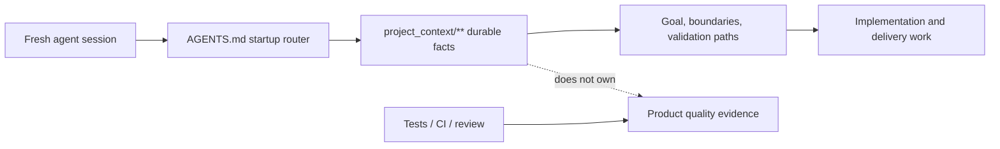

# Project Tiny Context Harness

[](https://www.npmjs.com/package/project-tiny-context-harness)
[](https://github.com/Seven128/project-tiny-context-harness/actions/workflows/package.yml)
[](https://securityscorecards.dev/viewer/?uri=github.com/Seven128/project-tiny-context-harness)
[](https://github.com/Seven128/project-tiny-context-harness/blob/main/LICENSE)
[](https://codespaces.new/Seven128/project-tiny-context-harness)

Translations: [Chinese (Simplified)](https://github.com/Seven128/project-tiny-context-harness/blob/main/README.zh-CN.md)

Project Tiny Context Harness is repo-native project memory for AI coding agents, plus a narrow delivery harness for trustworthy long-task completion. The product principle is: keep the memory, drop the ceremony. It adds durable project memory behind `AGENTS.md` without becoming an agent scheduler or Git orchestrator.

Public launch surfaces are English-first; localized documents are secondary entry points.

Best for:

- repositories where coding agents repeatedly rediscover project intent;
- teams using multiple agents or frequent fresh chats;
- maintainers who want durable Context and explicit long-task evidence.

Not for:

- replacing project tests, review, CI or human acceptance;
- autonomous Tiny Context execution;
- codebase semantic indexing or external docs retrieval.

Concrete shift:

```text
Before: ask a fresh agent to read the repo and tell you what matters.
After: ask it to read AGENTS.md and project_context/** first, then summarize goal, non-goals, architecture boundaries and validation paths before proposing code.
```

What gets added:




The demo shows the core loop: initialize `AGENTS.md` and `project_context/**`, run `validate-context`, then ask a fresh agent to recover intent before proposing code. Use the npm install path below, or inspect the no-install previews first.

Install:

```sh
npm install -D project-tiny-context-harness@latest
npx --yes --package project-tiny-context-harness@latest ty-context init
```

No-install preview:

- Read the [fresh-agent recovery walkthrough](https://github.com/Seven128/project-tiny-context-harness/blob/main/docs/examples/fresh-agent-recovery.md).
- Inspect the [Minimal Context sample guide](https://github.com/Seven128/project-tiny-context-harness/blob/main/docs/examples/minimal-context-sample.md).
- Browse the tiny generated repository at [examples/minimal-context-sample/](https://github.com/Seven128/project-tiny-context-harness/tree/main/examples/minimal-context-sample).

## Why It Exists

`project_context/**` preserves small durable facts across sessions. Both implementation routes share one risk-proportional Architecture Deliberation with applicable-quality routing before implementation, Goal-owned boundary-preserving implementation guardrails, and one current-candidate Engineering Quality Conformance that includes Architecture Conformance. The default model-led route applies at any complexity, reads graph-relevant Context, supplements that route with one bounded Context search before `Context Delta`, uses project-native current-candidate evidence and reports its verification boundary. When machine completion authority, recoverability or auditability is explicitly required, `long-task-delivery-v2` adds one complete Contract authority, fail-closed Source ownership, Control/applicability closure, semantic Counterfactuals, an unconditional one-time host model-change checkpoint after Authority Lock, scoped progress and a protected-input-recompiled Live Final Gate.

Tiny Context does not invoke or switch models, create agent sessions, branches or worktrees, merge, push, create PRs, deploy, or replace project tests and human acceptance.

## Capability Model

| Capability | When and how to use it | What it owns |
|---|---|---|
| **Minimal Context** | Installed by default. Every delivery route reads and updates `project_context/**` as needed. | Durable goals, ownership, architecture/interface/state boundaries and repeatable verification/deployment facts; never a test-pass claim. |
| **Workflow Contract** | Prompt-level default after `init`, for implementation work of any complexity unless Long-Task is explicitly selected or already bound. There is no Skill command or `delivery-contract.yaml`. | Model-led Context discovery, risk-proportional requirement/architecture judgment, one `Context Delta`, Goal-owned implementation, current project checks, failure repair, evidence-bounded Contract Conformance and Context drift; no exact Fact ledger, validator result, Receipt, persisted state or machine completion. |
| **Long-Task Workflow** | Enable the profile once, then explicitly select `long-task-workflow`, or resume a valid binding, when machine completion authority, recoverability or auditability is required. Task size alone does not activate it. | One Source-bound Delivery Contract, Authority Lock, recoverable scoped progress, protected revision, exact declared-obligation evidence and a current-snapshot Live Final Gate. |

Every delivery uses Minimal Context. The default Workflow Contract applies unless Long-Task is explicitly selected or validly bound. Complexity determines execution and verification depth; required completion authority and recoverability determine the route; Long-Task-internal risk determines proof strength. Long-Task uses `long-task-workflow` as its sole execution and completion carrier, and its Final Gate carries Engineering Quality/Architecture Conformance instead of duplicating default Contract Conformance. `design-system-authoring` and `design-resource-authoring` are independent optional upstream Skills, not Long-Task stages. Their selected outputs may feed either route.

| Task shape | Model-led, evidence-bounded handoff is sufficient | Machine-traceable complete closure is required |
|---|---|---|
| Local or small | Default Workflow Contract | Explicit Long-Task is available |
| Cross-module or complex | Default Workflow Contract remains valid | Explicit Long-Task |

Skill names here are host-neutral. In Codex, explicitly select one with `$skill-name` (for example `$long-task-workflow`) or use `/skills`; other hosts use their own Skill selector.

## Install And Initialize

```powershell
npx --yes project-tiny-context-harness ty-context init
# Existing repository:
npx --yes project-tiny-context-harness ty-context init --adopt

npx --yes project-tiny-context-harness ty-context validate-context
npx --yes project-tiny-context-harness ty-context doctor
```

Default profiles are `core-portable` and `workflow-default`; the base managed set includes explicitly selected `design-system-authoring` and `design-resource-authoring`. Explicitly enable long-task support:

```powershell
ty-context enable long-task
```

Enabling Long-Task additionally installs `long-task-workflow`, package-owned lifecycle Hooks and, only when the resolved harness root is exactly `.codex`, one optional project-scoped Codex custom agent named `long_task_implementation`. Its canonical package-owned profile currently uses `gpt-5.6-luna`, `model_reasoning_effort = "max"` and disabled child-agent tools; that canonical TOML is the only machine-readable model/effort source. The fixed, stateless profile is usable only for bounded rolling implementation/repair after the first-Authority-Lock terminal-turn checkpoint. A supported Codex host must explicitly select exact `long_task_implementation`; generic/built-in workers, task names, prompt imitation and model-only choices are not the profile. If exact selection is unavailable, or the host rejects the required `[agents].enabled = false` leaf boundary, do not remove that boundary or spawn a generic substitute: execute in the parent. Static installation alone proves neither discovery nor use. The profile is not a Skill, runtime, model router, scheduler, Authority or proof carrier; absence, invalidity or a preserved same-path user file does not change acceptance.

When sync first installs or updates Tiny Context entries in `.codex/hooks.json`, it reports: `Codex Hook review required: open /hooks and trust the current Tiny Context project Hook before relying on PreToolUse, SubagentStart, SessionStart or Stop behavior. Tiny Context cannot observe or persist Codex Hook trust.` Review the current project Hook in `/hooks`; trust is host/user-owned and changes can require review again. Installation is not evidence of trust or active enforcement, and trust-bypass flags are not the normal path.

## Recommended Usage

Start from either a concise product request or a detailed initial proposal authored elsewhere, including Web GPT. That input does not require design authoring or Long-Task; choose the execution route independently.

### Design-First Machine-Assurance Workflow

Use this route when an implementation delivery both genuinely needs new style-bearing design resources and requires Long-Task's machine-assurance/recovery/audit boundary. It is not a prerequisite for every Long-Task:

1. Run `ty-context enable long-task` once.
2. If Design Authority is absent and the scope is style-bearing, explicitly select `$design-system-authoring` to generate, select and adopt the canonical `DESIGN.md`, token source and provider binding. Skip it when Design Authority is already configured.
3. Prepare a writable project-native initial proposal at a concrete path such as `docs/initial-proposal.md`. It may come from the user, an external service or an explicitly requested applicable proposal capability; `design-resource-authoring` does not author it, and no standalone intermediary authoring stage is required.
4. Select `$design-resource-authoring` with that path plus the exact development scope and targets. Keep its reconciled proposal, validated residual `design-resource-handoff-v1`, and selected immutable canonical resources, manifest and dependencies.
5. Select `$long-task-workflow` with the exact paths to all of those inputs. It authors the Source-bound Contract Draft. The first Compile/Authority Lock always ends the current turn before implementation and says `After handling the model change, send [continue].`; earlier model wording cannot skip this boundary and Harness cannot observe whether the host model changed. After the user resumes, the parent evaluates delegation suitability and delegates independent bounded work only when the host explicitly selects exact `long_task_implementation`; otherwise it executes in the parent without a generic substitute. The parent still owns authority, architecture, Context, integration, current-candidate checks and formal verification.

```text
$design-system-authoring Generate, select and adopt the project design system for this style-bearing scope. Skip this request when DESIGN.md is already configured.

Prepare a writable project-native initial proposal at docs/initial-proposal.md for <delivery scope>.

$design-resource-authoring Use docs/initial-proposal.md for <exact development scope and targets>. Return the reconciled proposal path, validated design-resource-handoff-v1 path, and selected immutable canonical resource, manifest and dependency paths.

$long-task-workflow Use docs/initial-proposal.md, <handoff.md>, and the selected canonical resources, manifest and dependencies as Source for one complete implementation delivery.
```

These paths are illustrative. Candidate images or editable explorations alone do not authorize fidelity; implementation uses the selected immutable canonical resources and their validated handoff.

Other valid routes remain available:

- **Default model-led delivery, no new design resources:** give the request directly to the current coding Goal; the default Workflow Contract applies automatically at any complexity.
- **Machine-assurance/recoverable delivery, no new design resources:** explicitly select `long-task-workflow` with the request or proposal. It authors the Source-bound Contract Draft; design authoring is not a prerequisite.
- **Delivery that needs new design resources:** follow the sequence above, then send the revised proposal plus selected immutable resources and the validated handoff to either the default Workflow Contract or `long-task-workflow`, based on recovery and completion-authority needs.
- **Design-resource-only request:** stop after `design-resource-authoring`; do not create a Long-Task Contract unless implementation delivery was also selected.

The design-system Skill is normally used at cold start but never auto-runs. Only style-bearing resource work is gated; low-fidelity structure, IA/flow and semantics-only state studies remain available. A pre-existing planning or proposal document remains ordinary Source, not a recommended intermediate service.

## Positioning

| Adjacent tool type | Use it for | Harness stance |
|---|---|---|
| Spec-first kits | Turning a feature idea into structured specs and plans. | Complementary; Harness keeps durable repo facts beyond one feature spec. |
| BMAD-style workflows and full Tiny Context processes | Role/process ceremony for selected work. | Lighter automatic route; explicit machine assurance stays opt-in. |
| Task Master-style planners | Backlog decomposition and task state. | Complementary; Harness does not own backlog state. |
| Context7/Serena-style retrieval | External docs, symbols or repository retrieval. | Complementary; Harness owns local intended boundaries. |

## Try It In 60 Seconds

```sh
mkdir project-tiny-context-harness-demo
cd project-tiny-context-harness-demo
git init
npm init -y
npm install -D project-tiny-context-harness@latest
npx --yes --package project-tiny-context-harness@latest ty-context init
make validate-context
```

Expected result:

```text
AGENTS.md
project_context/
  context.toml
  global.md
  architecture.md
  areas/main.md
  areas/main/verification.md
```

Fresh-agent test prompt:

```text
Read AGENTS.md and project_context/** first. Summarize the project goal, non-goals, architecture boundaries, validation entry points and next safe action before proposing code changes.
```

### Source checkout preview:

Open <https://codespaces.new/Seven128/project-tiny-context-harness>, or run locally:

```sh
git clone https://github.com/Seven128/project-tiny-context-harness.git
cd project-tiny-context-harness
npm ci
npm run smoke:quickstart
npm run preview:pack
cd /path/to/your/test-repo
npm install -D /path/to/project-tiny-context-harness/tmp/ty-context/source-preview/package/project-tiny-context-harness-0.8.14.tgz
npx --no-install ty-context init --adopt
make validate-context
```

Use this tarball path for source-preview testing, private review or package development. For normal installs, use `project-tiny-context-harness@latest` from npm. If it fails, open a [Source preview report](https://github.com/Seven128/project-tiny-context-harness/issues/new?template=source_preview_report.yml).

## Minimal Context And Default Workflow

The default read path is `project_context/global.md`, `project_context/architecture.md`, `project_context/context.toml`, the default area root, then minimum graph-relevant role Context.

Only near-universal recovery facts should use `read_policy = "default"`; specialized detail should be task-triggered `on-demand`. `ty-context doctor` reports the deterministic default Context footprint, soft-budget overages, byte-identical default files and `DESIGN.md` authority status as advisory maintenance signals, not a new gate. Genuine near-universal recovery facts take precedence over the byte heuristic and must not be omitted, obscured or misclassified merely to fit it.

### Bounded Context discovery

Before deciding `Context Delta`, the Agent combines two low-state routes:

1. collect area, role, trigger and graph candidates from `context.toml`;
2. run one bounded text search over `project_context/**` with a small set of high-signal task terms, including explicit area/module names and relevant API/schema/state/security/verification/deployment language;
3. merge the candidates and read only semantically relevant files.

The bounded search supplements rather than replaces Agent semantic judgment. It creates no vector or persistent index, cache, registry, search state or second authority. It can still miss unrelated synonyms or indirect dependencies, so every implementation delivery still performs Architecture Deliberation and final Conformance.

### Sparse Context workspaces and monorepo repositories

Monorepos may keep Context centralized while sparsely mirroring only implementation workspaces that own durable non-code facts under `project_context/workspaces/<workspace-id>/**`. Each represented Context workspace maps exactly one repository-relative code root through existing `[[areas]].root` and `context` and may contain several workspace-local Area/role owners. Package-manager workspaces with no durable Context need no empty directory; cross-workspace/repository/shared Areas stay under top-level `project_context/areas/**`. Package-manager/build files remain the complete code-workspace inventory. Single-workspace and non-monorepo projects keep the existing layout and validation path.

Prefer a small top-level repository-common default Area in a monorepo; keep workspace-local Context `on-demand` unless it is genuinely near-universal. The default set plus manifest/search candidates is an expandable working set, not read isolation, a maximum or a requirement to read the entire target workspace. Read any additional Area/shared Context, root `DESIGN.md` or code needed for an indirect dependency. Root `DESIGN.md` remains the current shared project Design Authority; Context workspace placement does not create independent design systems.

Resolve task-local intended workspace(s) from explicit user/product/path/repository facts. If materially different siblings remain ambiguous, ask one concise target question before product edits; intentional multi-workspace work enumerates every target and supporting/shared scope. After implementation, use a repository-owned changed-path/target-scope verifier on exact task-attributable paths when available, or review the final diff against durable owners during Conformance. Tiny Context adds no `[[workspaces]]` schema, automatic topology scan, forced migration, full-graph default, persistent target state, registry, generic path/import/runtime scanner or duplicate Long-Task scope classifier.

The default model-led route at any complexity:

1. resolve minimum relevant Context through manifest routing plus bounded Context search;
2. widen the Context working set when shared or indirect dependencies require it, and disambiguate a genuinely unclear sibling product target before product edits;
3. identify material requirements, conditions, owners, failure boundaries and acceptance entries at risk-proportional depth without an exact Fact/Obligation ledger;
4. surface one concise, repository-bound Architecture Deliberation with triggered quality attributes or a concrete preservation basis;
5. decide `Context Delta: none|required` and update durable facts before code when required;
6. use the platform's internal plan and implement under Goal-owned boundary-preserving quality guardrails;
7. run current-candidate project verification, including an available changed-path/target-scope check; localize and repair failures, then rerun checks affected by later changes;
8. perform evidence-bounded Contract Conformance, including Engineering Quality Conformance and its Architecture Conformance subset, then the separate Context drift check;
9. hand off `Implemented`, `Verified`, `Unverified`, `Blocked / decision required` and Context status separately.

The default workflow has no required plan artifact, target declaration, matrix, verdict, evidence ledger, persistent retrieval index or second plan. Missing, stale, unreadable or conflicting controlling Source, unsupported observation or stale/failed evidence blocks an unqualified claim for the affected scope. Duration, file count and complexity never auto-enable Long-Task.

Plan Validator commands no longer exist; existing plan, matrix or verdict files remain ordinary user files.

### Engineering Quality And Modularity Guidance

Shared Engineering Quality extends the architecture obligation without adding a workflow. Every implementation delivery visibly completes `Architecture Deliberation` before its first implementation edit. Risk changes depth, not occurrence. A small change names the concrete owner/current extension point, confirms durable boundaries and applicable quality attributes remain preserved, and explains why it adds or worsens no debt. Material work additionally covers the unique source of truth, dependency and interface/state/resource-lifecycle boundaries, selected and rejected alternatives, one plausible future change and its extension point, touched technical debt, forbidden shortcuts, project-owned executable checks and triggered failure/load/threat scenarios. Correctness/invariants and maintainability/changeability always receive at least preservation; reliability/resource lifecycle, concurrency/consistency, performance/capacity/cost, security/privacy/safety, compatibility/migration/rollout and operability/observability/testability activate only when material. `Architecture Context Hit`, `Decision Rationale Hit: existing|required|none` and `Modularity Check: none|required|exception` remain internal routing questions; no Task Contract or fixed `plan.md` is required.

When foundational machinery, a mature protocol/security boundary, a dependency/shared abstraction or a nearby extension point makes sourcing material, the deliberation adds a risk-triggered Build / Reuse / Buy judgment. It records an allowed solution set, prohibited failure modes and required rationale/evidence rather than one mandatory library or abstraction. Existing owners, standard capabilities, installed dependencies, mature compatible libraries, bounded self-implementation and intentional non-abstraction may all be valid; duplicate owner rules, extension-point bypass, unjustified heavy dependencies, incomplete security reinvention, license/platform incompatibility, forced abstraction and a second source of truth are not. This adds no mandatory open-source/DRY rule, generic score, stage or Gate.

Implementation order, methods and feedback cadence remain Goal-owned. The thin discipline is to reuse the owning service/facade/adapter and one source of truth, make the smallest complete change, preserve explicit failure/resource semantics and add abstraction only for a stable concept or evidenced change axis. Exact product/technical predicates remain owned by Semantic Facts and selected UI/UX values by selected-design closure.

After implementation and project verification, `Engineering Quality Conformance` includes `Architecture Conformance` and checks the current candidate for scope/path escape, owner/dependency violations, owner bypass, duplicate truth, undeclared boundary/lifecycle change, silent failure, applicable resource/concurrency/security/compatibility/operability defects, unsupported performance claims, missing declared checks and new or worsened debt. A performance claim requires workload, metric, baseline or budget, environment, comparator/tolerance and a project-owned benchmark/probe; static shape is not runtime proof. Any candidate or controlling-input change invalidates the result. Default work embeds this closure in Contract Conformance; Long-Task maps every material independently falsifiable invariant into existing Source-backed obligations/constraints/forbidden shortcuts, owners/paths/Bindings, executable Checks and separate Assertions where functional behavior could pass independently. Final Gate is the sole Long-Task carrier and proves only that declared project-check-bound set—not overall code quality. The two carriers never both run for one candidate.

Contract Conformance asks whether current Source and Context reached implementation and verification; the separately named Context drift check asks whether implementation or a new decision made durable Context stale. New or worsened debt blocks handoff unless the project has an explicit bounded exception with owner, rationale, tracking and a removal condition. Unrelated legacy debt does not automatically expand task scope, but debt touched, relied on or worsened by the change cannot remain hidden.

The visible checkpoint proves only that the reviewable deliberation occurred; it does not expose private chain-of-thought, guarantee the best design or anticipate every unknowable future request. Store stable reasons, rejected alternatives or tradeoffs only in the smallest durable Context surface. The obligation creates no quality plan, stage, matrix, second Authority, Contract field/aspect/Claim/risk type, Gate, state or Receipt. Harness routes repository-native type/compiler/lint/AST/dependency/contract/behavior/benchmark/probe checks rather than becoming a language-generic architecture, quality or performance analyzer.

`ty-context check-modularity` is a capability-aware portable risk signal. All selected handwritten source/config formats receive physical-line analysis; JS/TS-family files additionally receive lexical per-function statement/branch, export, state-transition and responsibility heuristics; Python receives a dedicated lexical per-function statement/branch heuristic; every other included format, including Vue without an SFC parser, is line-only. Output names `analysis=js-ts-heuristic|python-heuristic|line-only`; unsupported metrics are `null` internally and `n/a` in CLI output, never zero, and cannot affect risk or regression. This is not complete static analysis, architecture proof or runtime-performance evidence. `validate-code-modularity` and `validate-harness` enforce the supported signals separately from `validate-context`.

#### Modularity Policy

Newly generated Harness configs default to `strict_except_generated`. Generated/build files remain excluded; `strict_except_generated` rejects configured `modularity.waivers`. Projects with bounded legacy exceptions may opt into `scoped_waivers`, whose entries require `path`, `category`, `owner`, `introduced_at`, `reason`, `tracking_issue` and `expiry_condition`. An explicit `ty-context upgrade` removes only waivers that existed solely for unsupported metrics from the retired cross-language JS heuristic and whose targets have no current supported risk; ordinary `sync` never performs that migration, and every other stale or invalid waiver remains fail-closed.

### Product Surface Contract

`context_surface_contract` compiles durable screen/page/CLI responsibility using existing `contract`, area/subdomain and verification roles. `product-surface-contract.md` owns cross-surface/main-versus-drilldown responsibility; optional on-demand `screen-contract.md` goes deeper for one screen's entry/exit/shared state, information hierarchy, semantic regions, navigation/variants, material controls and target/verification references. This workflow must not add a new Context role or claim product-quality proof, and local style fixes do not require a Screen Contract.

For material UI, **UI Authority Closure** reconciles each stable surface/control/target key as covered by existing Context, requiring a Context update, task-local, explicitly out of scope or genuinely decision-required. Design Source Projection sends durable cross-surface and Screen/Control/state meaning to existing Product Surface or Screen/interaction Context, durable visual-system/token/motion-policy/rationale meaning to `DESIGN.md`, exact composition/value/condition/asset facts to versioned targets, repeatable proof routes to verification Context and delivery-local coverage/provenance/blockers to task or Contract Source. Conflicts fail closed; current code, timestamps, YAML or implementation screenshots do not silently win.

### Non-UI Semantic Completeness

Both development paths preserve all expressed, logically entailed, explicitly delegated or evidence-backed non-UI authority. This covers product and business meaning as well as technical, backend and architecture meaning; current code cannot silently redefine it. Default work understands material requirements and conditions at risk-proportional depth and reports its evidence boundary, while Long-Task turns the complete declared scope into exact machine obligations.

Long-Task Source authoring inventories every material request fragment, attachment, controlling Context unit, canonical specification, external constraint, repository-preservation source and delegated instruction. Its standard catalog is a mandatory floor: goals/scope/glossary; actors/roles/tenants/entitlements; business rules/calculations; entities/fields/relations; commands/queries/workflows/state/time; validation/output/error/API/protocol/event/job; persistence/cache/search/transactions/consistency/concurrency/idempotency; faults/retry/degradation/recovery/backup; configuration/flags/secrets; compatibility/migration/rollout; performance/capacity/cost/reliability/SLO; security/privacy/safety/compliance; observability/deployment/operations; integrations/notification/file/media/localization/commercial; hardware; AI/ML; architecture ownership/boundaries/debt. Domain-specific families, properties, condition axes and proof methods extend this floor.

In Long-Task, every applicable subject, typed relation and static/dynamic population receives a stable identity. Applicable actor/role/tenant/version/environment/state/input/boundary/locale/time/concurrency/dependency/failure/migration/rollout/threat/custom conditions are first-class atomic values and exact combinations. Every atomic property is specified or carries an exact basis-backed N/A/exclusion; unresolved, unavailable, conflicting or unreadable meaning blocks. Aggregate strings such as `all-states`, default paths, representative/pairwise samples and ungrounded N/A cannot stand for atomic cells.

One Long-Task semantic Fact binds `Outcome × subject/relation/population × exact condition × atomic property × typed expected predicate`, together with owner, Source locator/digest, provenance, quantifier, observation boundary and sensitivity. Fact identity is separate from proof obligation: every Fact expands to all required methods and the furthest independently failing boundary, with frozen comparator/parameters/tolerance/mask, Oracle capability/identity, environment and protected-value policy. Exact values remain in Source or owning Context; downstream carriers retain identities and comparison authority rather than becoming a second semantic value source.

Default work creates no Expected Fact Universe, stable Fact/Obligation keys, exact set equality, complete Cartesian expansion, frozen Oracle graph or per-Fact result ledger. It identifies material requirements, conditions, owners, failure boundaries and acceptance entries; runs attributable checks after the last relevant change; repairs failures; and reports `Implemented`, `Verified`, `Unverified` and `Blocked / decision required` separately. Explicit Long-Task persists one Source `semantic-fact-manifest-v1`, requires `Expected = Source Indexed = Contract Indexed Facts`, maps every machine obligation to one single-Fact Assertion and typed `semantic_fact` result (or to a named External Confirmation), and enforces exact expectation/result equality in its existing Final Gate. Missing, extra, duplicate, unresolved, unmapped, unimplemented, unexecuted, stale, failed, proxy-only, reused or indistinguishable Long-Task rows block machine acceptance.

This mechanism cannot discover intent the user never expressed or prove an arbitrary Inspector/Oracle semantically sound. It may complete only necessary derivations and explicitly delegated defensible choices; real product, legal, security, commercial, safety or externally owned decisions remain blocking. Durable meaning still goes to its existing Context owner, code remains current implementation truth, and no second plan, registry, Authority, Gate or prescribed implementation sequence is introduced.

### Visual Delivery Guidance

Both development paths preserve selected design Source authority within its declared scope and conditions, but they do not share a formal proof level. Formal handoff preflight still proves complete machine-readable input; default work then opens affected targets/conditions, routes them to production owners and current-candidate project checks, and reports conditions not established. Long-Task additionally provides exact per-Fact/Rule machine closure. Neither route infers unexpressed behavior or proves that the user supplied every desired requirement. Open Design can produce implementation-rich HTML/CSS/JS, specifications, tokens and assets, but capability is not a per-run guarantee: for a selected Web/App implementation handoff, `design-resource-authoring` must explicitly commission and completely retrieve one machine-readable canonical entry plus its exact dependency closure, freeze every file with a digest and expose stable typed locators. Before `ready`, it exercises every declared verification method on those immutable bytes and blocks unresolved conflicts among code, specs, tokens and assets. That is source QA, not production acceptance. PNG may be a visual baseline, never the sole implementation source.

The provider-neutral handoff is a residual semantic and binding layer, not a textual copy of CSS, another value authority or another complete Fact index. Before formal Web/App generation, `design-resource-authoring` derives an Expected Fact Universe from scope, adopted Design Authority and a frozen Inspector/Census obligation. The atomic unit is an applicable `subject × selected target × condition combination × variation combination × property` Fact Cell. Subjects include surfaces, regions, overlays, component families/instances, controls, every anatomy part/slot/primitive, text, icons, media, assets and relations. Conditions are first-class across 33 standard condition axes (platform/runtime/device/viewport/density/safe area/window/fold/display/color/localization/content/data/text scale/input/assistive and accessibility preferences/system UI/IME/permission/capability/connectivity/lifecycle); variation is first-class across five variation axes: `variant`, `state`, `interaction_phase`, `presence_phase` and `instance_case`. Properties use 217 standard atomic keys across geometry, layout, scroll, typography, color, decoration, content, icon, media, interaction/navigation, motion/feedback, responsive, accessibility, asset, system and relation families, plus explicitly defined custom properties.

The generated canonical implementation source remains the sole owner of exact values. Its dependency closure contains a `design-resource-observable-fact-manifest-v1` with stable subject/property/Fact IDs, typed locators, located-value digests, units/rounding/pixel-snapping rules, token/effective-value lineage, dynamic population/relations/assets, required proof methods, comparator parameters/tolerance/mask, Oracle identity/capability and render environment. A frozen Inspector enumerates the complete resource/node/declaration/token/asset/relation/custom-property/variant/state/interaction/dynamic-population Census; complete-generation counts and digests prove that no sampling or truncation occurred. Each applicable Fact Cell is either covered by one atomic Fact or carries an explicit blocking/non-applicable disposition with Source/basis/rationale. Aggregate labels such as “all states” cannot stand for atomic values, and a default page/shared style cannot be used to infer another applicable combination.

Ready handoff requires exact set equality: `Expected Fact Universe = Canonical Resource Facts = Handoff Indexed Facts`, together with complete material-with-facts or honestly supporting-only resource closure. The canonical per-target manifest is the sole complete Fact/Census/proof index. New authoring keeps the shipped `design-resource-handoff-v1` marker and adds `representation: manifest_backed`; YAML carries only residual Source/scope/resource/target/closure/coverage/proposal binding, and preflight hydrates the same complete V1 object from the frozen manifest. Older embedded V1 remains read-compatible. UI symbolic V2 is explicit opt-in; V1 remains the default. An opted-in target uses `design-resource-handoff-v2`, `representation: symbolic_rules_v2` and `design-resource-observable-rule-manifest-v2`; constant located expected values and mutually exclusive canonical regions preserve exact point meaning. Applicability either keeps legacy exact remainder rows or uses package-owned property profiles, frozen Inspector custom-property closure and explicit unique instance exceptions, while every logical subject-property point retains one disposition. Fact Rule, required-method semantic obligation and set-valued non-interference certificate identities remain separate. `ready` is emitted only after unresolved dispositions and blockers are absent, V1 proof policies pass, and an `exact_target`'s full-target layout and pixel region unions each cover the complete reachable domain. Omitted axes require both Source-side and production-side proof through frozen closed-world static dependency closure, restricted-IR exact equivalence or finite complete-domain exhaustive equivalence; dynamic/reflected/unfrozen/external or sampled dependencies block. Preflight resolves immutable resources and exact locators, recomputes canonical DAG/region/certificate identity and rejects missing, overlapping, gapped, unresolved, unsupported, stale or value-conflicting input. Exploration remains schema-free.

Every non-interference method requires a digest-identified frozen executable Oracle with the exact `symbolic_noninterference.<side>.<method>` capability. On the Source side, the complete Inspector input set contains exactly one canonical, non-executable `design-resource-symbolic-source-ir-v1` resource for each admitted scope. The package binds that IR to the current target, certificate and Rule scope, reparses its current bytes and derives the dependency DAG, canonical predicate or complete finite-domain evaluation itself. Submitted graph nodes, Rule roots, side/axis-erased predicates, evaluation claims and passed verdicts are only Oracle-output caches; preflight requires `current recomputation = artifact bytes = proof binding/cache`, and the artifact is not part of the semantic input closure. Static non-interference therefore cannot be accepted from an axis list or manufactured from Rule references. JavaScript, CSS cascade or implicit DOM semantics, executable templates, dynamic loading/fetch/import, reflection, computed access, unfrozen extensions and external runtime/device dependencies block until a package-owned complete extractor exists. The production side retains its conservative package-parsed static HTML plus inert JSON subset. Both sides bind Oracle implementation closure/version/capability, environment, every input path and declared/current digest, current Source-manifest or production-target snapshot, exact Rule/certificate scope, omitted axes, derived method result, artifact path/digest and attributable failure witness. Source and production proof digests enter certificate identity and the existing current Final-Gate certificate expectation/result; extraction outside the admitted representations remains an explicit TCB boundary.

Capacity changes representation, never the information universe. Before draft generation DSA freezes the explicit manifest path set, target/scope identities, file SHA-256 and exact collection counts/identity digests, then authors one small manifest-backed target file and calls `ty-context design-resource bundle` with an actual UTF-8 ceiling. The descriptor does not repeat manifest-owned axes/conditions/subjects/variations/properties/lineage/Fact Cells/Facts/evidence/proofs/Oracles/environments/assets/blockers. Bundle rejects embedded/full-array or multi-target drafts, over-budget descriptors, missing/extra/duplicate targets and any manifest/preflight drift; validates one target at a time from one resource snapshot; and atomically publishes the complete set through a same-volume command-owned temporary directory. It never overwrites, post-hoc splits or rewrites a target. V1 admission uses stat plus a bounded prefix capacity header before full parse/hydration and never truncates or expands then deduplicates. If truthful data exceeds V1 capacity, diagnostics may recommend an explicit V2 target but do not switch it automatically.

V1/V2 equivalence is pointwise over the full `subject/relation × target × reachable condition/variation × applicable atomic property × population/quantifier` universe and includes disposition, located expected semantics and complete proof-obligation denotation; physical V1 ground-row identity is not required. One manifest compilation session shares axis partitions, predicate/Boolean memoization and DAG hash-consing; tuple/profile/Rule indexes avoid per-point full-array scans. Set-valued certificates carry exact Rule and omitted-axis sets without physical Rule × axis edges, and canonical work remains independent of theoretical ground cardinality. The deterministic package fixture covers 639 subjects, 217 properties, 53 axes and 5,245 variations while preserving all 138,663 logical subject-property dispositions without 137,385 N/A rows. One Contract may mix V1 and V2 targets under the existing sole current-snapshot Final Gate. Purpose-fulfillment efficiency non-degradation is a package mechanism-change admission property, not an AcceptedDeliveryTerminal condition. Non-UI symbolic admission remains out of scope; machine-observer and verifier/runner trust-boundary closure is mandatory rather than deferred Provider/P0 work.

Those inputs remain Source. The default Workflow opens affected exact targets or constraints and their declared conditions, routes them through production owners and cold-start journeys, runs applicable project-native visual, interaction, accessibility or runtime checks on the final candidate and reports every condition those checks did not establish. It does not rebuild the complete UI Fact Cell universe or per-Fact-by-method production result ledger. Long-Task projects the exact expected universe into existing Claims/Assertions/Checks/Bindings: every method/condition cell carries exact `fact_refs` and one `fact_expectations` row per Fact/proof obligation. A current `fact_results` row may close that cell only when a package-admitted observer supplies its Actual and Harness comparison; otherwise the cell remains a blocking External Confirmation and Final Gate fabricates no result. The current slice does not admit UI layout/pixel/accessibility/motion, browser/native/device, protected or tolerance/mask observations. These carriers are mutually exclusive. Generation success, screenshots, hashes, Census and handoff preflight prove input completeness or integrity only, never production conformance.

The default Workflow performs UI Authority Closure and a conditional Design Authority Check before a material product, design, implementation or acceptance decision. It traverses affected stable keys to exactly one canonical adoption record, then actively opens every selected `exact-target` or `constraint`; a reference-index or handoff-index mention alone is not consumption. `DESIGN.md` canonically records project/system/component-family targets, while the owning Screen Contract records one-screen/interaction-specific targets. The canonical record owns interpretation, selection basis, readable immutable locator/digest, declared condition coverage and editable upstream owner/locator/update route; other layers keep only the stable key, canonical owner/anchor and local applicability. Missing, unreadable, stale or conflicting resources fail closed. Updates create a new immutable version instead of overwriting the adopted baseline. An unconfigured starter, candidate, style-only prose or inspiration does not authorize invented production layout, and a configured project visual system does not claim every page is implementation-ready. Explicit project design-system adoption routes to `design-system-authoring`; standalone resource generation routes to `design-resource-authoring`. Implementation with sufficient authority, local style fixes and throwaway prototypes remain lightweight.

For selected implementation handoff files, DSA first publishes the exact target set with `ty-context design-resource bundle`; both development paths rerun `ty-context design-resource preflight <handoff.md>` on every published file. Incomplete acquisition, missing or undeclared dependencies or targets, duplicate targets, unsafe paths, stale manifest/file digests, fictional locators, non-frozen or incomplete Census, sampled/truncated generation, aggregate axis values, mismatched Expected/Canonical/Handoff Fact sets, missing required methods, invalid comparator/Oracle/environment binding, unresolved design-system lineage, uncovered applicable cells, absent exact-target layout/pixel facts, unsupported evidence and unresolved meaning all fail closed. Each workflow must still open the resources and prove the production implementation on the real entry.

For material work, `context_uiux_design` applies the projection above and keeps risk-proportional coverage reasoning task-local. `context_development_engineer` traces every affected selected target and declared condition through stable surface/control keys to the production route/component owner, cold-start real-user journey and applicable rendered/interactive checks. A first useful runnable production slice is a recommended real-entry feedback point when early localization is worth the cost, never an implementation gate; the final candidate always reruns the affected cold-start journey. Source-required combinations cannot be silently pruned, but default work reports conditions it did not establish instead of claiming exact machine closure. Resource hashes, manifests and counts prove integrity only; an implementation screenshot cannot become its own target or implementation-conformance proof.

An explicit Long-Task is the strong authority carrier of the same shared obligation. It resolves missing/conflicting UI authority before Compile, then closes all 22 canonical fields of every real Product Control through `field_coverage`; that semantic Control projection is independent of, and never caps, the finer design Fact universe. Selected targets freeze the canonical manifest identity/digest and project every atomic Fact/required-method pair into a `fact_expectations` row with subject/target/condition/variation/property identity, expected located-value digest, comparator/parameters/tolerance/mask, Oracle identity/capabilities, environment and sensitivity. Only a package-admitted observer may supply the matching `fact_results` Actual/comparison row. In the current slice, project `design_conformance`, `design_method` and `fact_results` records are diagnostic; affected UI/design obligations remain blocking External Confirmations rather than machine proof. Product `surface_bindings`, Control Claims/relations and root-entry journeys continue to carry product semantics, while existing Claim, Assertion, Check, Stage, Binding, revision and Final Gate mechanisms remain the sole Long-Task lifecycle and closure. Every blocker preserves exact Source-item/method/capability lineage and cannot be dismissed in-band; scope removal requires revised Source/Contract authority.

Combined design-and-implementation work may author candidates in ordinary Outcomes/Stages, but a candidate or planned target cannot authorize fidelity implementation. Selection must become real marked Context-reachable Source plus the owning Context/`DESIGN.md` reference and, after Authority Lock, an adopted Authority Revision. Browser visual ACs may use `ui_browser` for diagnostic localization, but current machine closure remains External Confirmation; a browser proxy, detached route or deep link cannot prove a native/root journey that can fail independently. Resource integrity and `visual_render` cannot satisfy selected-target implementation conformance. Frozen baselines are verifier inputs, generated actual renders/diffs are current artifacts, and subjective approval remains external. No `uiux_delivery` block, visual Claim type, resource registry, risk level, lifecycle state, Gate, required design directory, per-Control screenshot matrix or universal pixel threshold is added.

`ty-context doctor` keeps its compatible `missing | unconfigured | configured` project-level status and adds advisory Design Authority Index, token-source and classified-reference signals. It explicitly does not infer surface implementation readiness; that requires the owning Screen/Control meaning, selected target/constraints and project-owned verification.

Static guidance tests prove distribution, projection and canonical ownership, not Agent performance. The optional delivery-mechanism benchmark provides a fixed fresh-agent UI/UX Context/target-recovery task with routing gold and a hidden production oracle; only independent paired runs may support effectiveness or ROI conclusions.

### Explicit Design System Authoring

Use `design-system-authoring` only on an explicit request to initialize, generate, select, adopt, replace or repair the project design system/style. It discovers live Open Design MCP resources/tools and feature-detects lifecycle methods; because Open Design 0.15.1 exposes design systems as MCP resources but no creation tool, the documented compatibility path uses the same installed daemon's official generation/revision/accept API. Candidates require explicit human or explicitly delegated selection before adoption into canonical project `DESIGN.md`, one authored token source/direction and only owning Context. Adopted targets record immutable identity/digest plus editable upstream owner/locator/update route; updates create a new immutable version instead of replacing the baseline. Provider ID/revision/digest and `get_project.designSystemId` are synchronization provenance, not another authority.

### Optional Design Resource Authoring

Use `design-resource-authoring` only for an explicit request to generate, iterate or prepare standalone design resources, prepare resources for a named development scope, or use Open Design. It accepts raw notes or an initial proposal, product/technical plans, a visual brief, screenshots, existing resources or another pre-existing planning document. No standalone intermediary authoring document is either prerequisite or recommended middle stage.

The Skill makes the explicit output or development content its hard ceiling; a local slice includes only necessary surrounding context. For an implementation handoff it accounts for material UI/UX meaning through relevant surfaces/flows/regions/components/controls and applicable visual/content, state, interaction/feedback/motion, responsive/platform/input, accessibility and asset conditions, then subtracts only explicit selected-source coverage. It discovers current Open Design capabilities and assigns every considered resource a reasoned `selected`, `optional`, `not-needed`, `unavailable` or `decision-required` disposition.

Formal generation, a major design revision and critical regeneration use the highest eligible live model and that model's highest supported reasoning effort. Eligibility first preserves required tools, visual/context capability, authentication and data boundaries; provider capability ordering or documented replacement evidence establishes rank. The Skill never guesses from price, model name, release date or list order. An unrankable choice fails closed as `highest_performance_unverified`; an uncontrollable or unobservable provider result is reported with the same qualification and is never described as a confirmed highest-tier run. This policy creates no model registry, scheduler or persistent routing state.

For formal Web/App implementation output, “complete” defaults to the finest applicable observable Fact granularity described above. The Skill builds the Expected Fact Universe and frozen Inspector/Census obligation before commissioning generation, passes that obligation and the adopted design-system identity into Open Design, and requires the returned canonical source/manifest to express every applicable cell. It does not defer missing anatomy-part, state, responsive/platform/text-scale, motion, accessibility or asset design decisions to downstream implementation.

High-fidelity/branded output, visual direction, typography/color/density, component visual treatment and production-style prototypes are style-bearing. If Design Authority is unconfigured or lacks one authored token source/direction, the Skill stops before project/run creation and tells the user to explicitly select `design-system-authoring`; it never auto-initializes. Low-fidelity structure, IA/flow and semantics-only state studies remain non-fidelity. Style-bearing Open Design projects pass the adopted ID through `create_project.designSystem` and verify `get_project.designSystemId`.

It commissions only the smallest sufficient artifact/file set through structured MCP with bounded fallback; this minimizes packaging, never information granularity. One canonical HTML/CSS/JS prototype plus manifest, tokens/assets and an inspectable state/component workbench may carry thousands of atomic Facts. Repeated controls may map to one component family and only unique/complex uncovered controls need dedicated studies. Static/default views do not imply unseen behavior. No prototype, low/high-fidelity pair, component board, provider-native input, one-file-per-control rule, artifact count or directory is mandatory, and Tiny Context copies no provider prompt/template or catalogue. Designs carry user-visible interaction semantics, not sole ownership of business/data/permission/algorithmic rules.

For implementation Web/App output, the Skill requires the complete canonical entry/dependency set and addressable declared facts described above. Figma remains useful when an existing design team needs native Components/Variables/Variants, shared libraries, Dev Mode or Code Connect; Penpot when open/self-hosted multi-user design infrastructure is itself required; OpenPencil as a local static-layout sidecar while its prototype/motion model remains incomplete. Default conversion from complete Open Design source to another representation is not required because it adds synchronization and operating cost without closing a new enforcement gap.

Exploration returns a visible scoped candidate after minimal sanity review and requires no handoff schema. After explicit or delegated final selection for implementation, the Skill performs one consolidated idempotent proposal reconciliation and writes one provider-neutral marked Markdown Source per target. V1 manifest-backed authoring remains the default; only an explicit per-target symbolic opt-in emits the strict V2 Rule manifest/handoff. Shared preflight normalizes the declared representation and cannot call incomplete, unaddressable, unresolved, unsupported or stale input ready. There is no fixed directory, provider pack or one-file-per-control rule. The adapter is ordinary Source, not Design Authority or acceptance. Outside the one explicitly authorized proposal writeback target, the Skill never edits caller-owned planning/proposal Source, Context, `DESIGN.md`, production code or a Delivery Contract.

Material DRA revision loops replay from a raw-digest-bound Base plus complete ordered Delta semantics. Deterministic accepted authority additionally requires a strict `ty-dra-authority-v1` projection inside the same digest-covered marked Source Item: explicit choices bind exact target/kind/origin/meaning digest, while delegation binds only its exact choice scope and never becomes a non-visual meaning Source. Every semantic target has at most one active accepted Delta owner; rejected, unresolved and superseded Deltas form an exact leakage universe. One v3 audit-expectations catalog freezes changed/unchanged/resource-decision/blast-radius/leakage rows plus selected-resource conditions, and current audit rows must be set-equal without duplicate identities. Exact-patch-v2 binds every active non-preserve `Delta × target` once to its Proposal text span and semantic digests; every such binding has exactly one `proposal-written` or structured, repository-readable `resource-owned-exact-visual` owner. A real cross-interruption need may explicitly `create` one ignored, task-local, non-authoritative checkpoint; `update` replaces it only through caller-supplied checkpoint digest CAS, while `inspect` and `preview` rederive current state. `apply` uses pre/post raw-byte CAS and reread reconciliation, reporting applied, idempotent, blocked or external-resource revalidation pending—not handoff readiness. `remove` fully deletes only after inventory proves the directory contains the digest-matched helper checkpoint; otherwise it returns `partial` and preserves unowned content. A simple preview creates no checkpoint, persisted bytes, pause, Provider run, formal handoff, Proposal write or helper transaction. The checkpoint and reconciliation are upstream recovery/diagnostic data, never Design Authority, Long-Task Source/Evidence or completion proof.

Actual generation remains with configured Open Design/Product Design, Figma, image-generation, prototype or human systems. Their outputs enter the default Workflow or Long-Task as ordinary external Source. Candidates and inspiration authorize no fidelity. An adopted exact target/constraint becomes Context-reachable Source: owning Context/`DESIGN.md` maps its stable key to declared conditions, a stable immutable identity/digest and an editable upstream owner/locator/update route. `context_uiux_design` performs downstream UI Authority Closure; implementation renders and diffs remain evidence rather than self-authorizing targets.

Maintainers may set `TY_CONTEXT_OPEN_DESIGN_MCP_COMMAND` plus optional `TY_CONTEXT_OPEN_DESIGN_MCP_ARGS_JSON` and run `npm run smoke:open-design` for an opt-in, read-only discovery smoke. Normal tests use a local mock MCP and do not depend on Open Design or nondeterministic output.

### Retired Standalone Authoring Compatibility

Retired standalone authoring pointers are no longer installed or package-managed. Upgrade removes only byte-exact former package content; modified same-name content is preserved for manual review, and ordinary sync does not maintain a deletion registry. `long-task-workflow` opens the non-authoritative Contract Draft immediately and converges mixed-input inventory/synthesis, stable-key/Product Control-level meaning, preference/research/delegation traceability, Source markers/provenance, acceptance/risk completeness and Contract mapping in one loop. This semantic Control projection does not cap the separate complete-observable-design-fact inventory for selected resources. Existing planning/proposal documents remain ordinary Source; no standalone or internal Source-authoring stage, handoff, schema, gate, state or second plan is created.

## Single-Goal Rolling Delivery

The explicit Long-Task Workflow uses one currently selected platform-native execution Goal, one user-selected repository and verification/convergence workspace, one complete `long-task-delivery-v2` Contract and one Final Gate. Harness does not persist a Goal identifier: compaction may continue inside that Goal, while a later Goal/session restores semantic state rather than the prior physical Turn. Outcomes are independently decidable acceptance units; Delivery Set orchestration and top-level Contract splitting inside one selected delivery are retired.

Its proof claim is conditional: complete and accurate Source at the declared observable granularity, meaning-preserving projection and complete applicability expansion make `AcceptedDeliveryTerminal`—exactly a fresh `machine_accepted` result with no pending External Confirmation—imply that no declared machine-observable drift remains only when every machine obligation has frozen Expected authority, package-admitted current Actual, Harness-computed comparison/verdict, attributable static-production or direct-process observation, causal Counterfactual evidence and current Final-Gate snapshot proof. `machine_accepted_external_pending` proves only the admitted machine scope. Harness cannot discover undeclared requirements or prove arbitrary physical/external observation sound.

Compile derives an internal `CompiledObservationAuthority` for every machine Claim or Fact × required-method obligation; it is not a new Contract Authority, state or registry. `package_static_json_exact` reads plain exact implementation/configuration content only from a UTF-8 JSON production carrier that exists in the pre-run snapshot, retains its no-follow identity/digest after the runner, matches the Binding and is not Source/Context/Contract/expected/evidence/report/status/verifier output; prepare-all mutation observation plus pre/post identity/hash rejects transient/persistent swaps, and the adapter proves no runtime consumption. `package_process_json_exact` supports only a Source-backed `runtime_family: process`, `role: product` target and a direct root `project_binary` whose target and complete argv match that authority. Each required target has one canonical Source technical-obligation target covering key, role, family, root, complete argv and capabilities. Compile derives one declaration-stable runtime closure containing the exact Source-backed root, exact Claim/Counterfactual production carriers and only finite argv values that match a production Binding by exact path or pattern. Each argv member remains the exact child-visible token; the closed grammar examines an independent token or explicit `--name=value` without splitting spaces, stripping quotes or rewriting backslashes. Raw token and derived locator remain distinct. Quote-bearing, POSIX/UNC absolute, drive-prefixed, slash/backslash-platform-ambiguous, scheme-shaped colon prefixes outside the exact lowercase decimal `node:<number>` allowlist and unsupported compound forms fail closed unless explicitly routed to the external boundary. Cwd resolution precedes repository containment, so in-repository parent traversal is valid while a true escape is not. Glob-owned, extensionless and space-containing files remain valid; unmatched safe values and the exact lowercase decimal `node:<number>` and digits-only `<hours>:<minutes>` colon scalars are allowed but not copied. Compile neither broadly role-scans nor copies all `input_paths`; role separation covers actual closure members. Global Checks use internal scoped Binding records `{ outcome_key, local_key, binding_ref, binding }` with `<outcome>.<binding>`, preserving logical refs while deduplicating identical physical paths without changing authored Contract Bindings or adding a registry. Exact planned closure members may be absent through Compile but must materialize at Final Gate. The closure excludes Source/Context/Contract/canonical expected, verification inputs, expected outputs/artifacts, evidence/status/report/comparison/Receipt/Long-Task workdir and historical session/evidence. Harness copies only that closure into an OS-temporary snapshot, binds its identity into host attestation and forwards unchanged argv. Compatible Cross-Check and implicit-preserved Facts share one bounded `ty-context-product-observation-v1` stdout envelope while retaining independent result identities. An unsupported embedded dependency or Claim requires External Confirmation. Project results remain v3; no v4, shell/URI/dependency parser or general UI/native observer is introduced.

Project-submitted v3 actual/value digest, comparison, `passed`, verdict and capability records are compatibility diagnostics only and never own Actual or completion. Current package derivation covers exact/presence plus host `target_runtime`; `interaction_trace`, `state_delta`, `design_conformance` and every capability without package derivation require blocking External Confirmation. Custom/`named_external_tcb` Oracle, wrapper, browser/native/device, layout/pixel/accessibility/motion, protected, tolerance/mask and custom-locator observation are likewise unsupported. Machine Counterfactuals require package-admitted baseline/mutated observations with the same compiled closure identity, a mutation target in its production-carrier set, exact affected/preserved/allowed-fan-out accounting, equal obligation universes and host-derived process liveness; absence of admitted observation never skips validation. Migration never silently changes the observer choice, and target/closure TCB changes invalidate prior Active Authority, Progress, Evidence and Receipt acceptance.

Unsupported scope uses the existing External Confirmation owner rather than a dummy verifier. Exact `impact_claims` may cover ordinary/global and Semantic Fact Claims, while each Semantic Fact proof keeps its explicit `confirmation_ref`. An external-only Outcome sets `success_path_required: false`; a Stage Gate may omit its machine Check only when a `blocks_target: true` confirmation impacts that gate's result Claim. Missing result lineage, a non-blocking confirmation or a machine success path without a real success Check fails Preflight/Compile. A valid external-only route terminates as `blocked_external`, never machine accepted.

This direct-process path is bounded containment, not an absolute hostile-code sandbox. Its TCB includes the host OS/filesystem/process APIs, Node runtime, snapshot copy and no-follow/digest checks, stdout decoder, timeout, process-tree inspection and cleanup. Frozen subtraction controls require the existing watcher/pre-post and containment/cleanup responsibilities; no additional edge mechanism is claimed. It does not claim to prevent a malicious executable from escaping the copied closure, using ambient filesystem/network resources or evading every OS process mechanism; use an external sandbox or External Confirmation when that adversary boundary matters.

Raw/revised proposals, selected design resources and mixed attachments enter one Source-bound Contract Draft loop immediately. Complete input coverage, stable keys, Product Control-level meaning, selected-resource design facts, acceptance/risk, direct/derived/delegated/evidence-backed provenance, Source ownership and Contract mapping converge together. Every non-empty line in declared Markdown Source belongs to one Material `ty-source-item`, one validated `design-resource-handoff-v1` or `design-resource-handoff-v2` formal block, or a closed-grammar background block containing only text-free anchors/horizontal rules or fixed-field `ty-source-provenance` comments. Text-bearing headings, free-form provenance, arbitrary background prose and unclassified text fail closed unless classified as Material. At least one marked technical obligation carries `aspect=architecture` and maps to an independently provable architecture obligation. Unknown decision-changing preferences still trigger one targeted clarification before Preflight/Compile can succeed; defensible recommendations are written into real Source rather than hidden in YAML, while high-risk actions remain external confirmations. A pre-existing planning document's structure never blocks authoring.

Before the first successful formal Compile, `delivery-contract.yaml` is one non-authoritative Contract Draft. `long-task-workflow` opens it at entry and revises the same Draft across Source refinement, repository/Context reads, mapping and Preflight repairs; a complete Contract need not fit one response. Source completeness is a convergence condition for Preflight/Compile, not a prior phase. There is no standalone Contract Draft Skill or Authoring State.

The Long-Task Skill keeps objective/boundary/activity routing in its main file and loads one-level Source-bound Draft/Contract-mapping, evidence-design and authority-lifecycle references as applicable. Draft input repair and Contract mapping are concurrent activities, not serial phases. This is instruction packaging only, not a second authority. It performs the shared Architecture Deliberation and applicable-quality routing during Draft authoring. Declared independently falsifiable architecture or engineering-quality invariants use existing Source-backed obligations/constraints/forbidden shortcuts, owner/path/Binding boundaries, project-owned executable Checks and separate Assertions when functional behavior could pass independently. Final Gate is the sole Long-Task Engineering Quality/Architecture Conformance carrier and proves only that declared project-check-bound set.

A Draft Outcome is simply an Outcome before Authority Lock. Outcomes decompose independently observable, decidable and target-verifiable results to project acceptance/verification readiness, localize failures, resume findings and invalidate stale results. `depends_on` means acceptance and intermediate-proof readiness, not implementation permission, and the Rolling Frontier is a temporary advisory projection. The current Goal chooses implementation order and may optionally use one or multiple platform-native agents/subagents; Harness creates no delegation runtime, scheduler, state or proof, agent reports are non-authoritative, and all accepted output converges into the selected verification workspace. An Outcome is not a Worker, scheduler task, queue or parallel unit. Outcome decomposes diagnosis and proof ownership, not completion authority, so one complete current-snapshot Final Gate remains mandatory.

When a declared result can pass on a proxy surface while failing in its target runtime, the earliest owning Outcome carries either an admitted direct-process root Check or blocking External Confirmation. A project payload, report, screenshot, binary, log, historical run, new session id or proxy cannot be runtime authority. Applicability and all Claim/proof cells remain independently attributable; project capability records are diagnostic, and only currently admitted exact/presence and host `target_runtime` results can satisfy their matching all-of cells. Every unsupported capability remains external. Every behavioral machine Assertion has a same-Check Counterfactual whose admitted affected Facts change, preserved Facts/liveness do not, other changes are explicit fan-out and obligation universes are equal. A Binding/path is not reachability proof: static mutation proves only that structure; runtime reachability requires Harness mutation → direct product-root execution → package-observed Actual change. Evidence/status/report/Receipt/verifier outputs cannot be production carriers. Existing minimal invalidation-envelope, targeted-feedback and current Final-Gate rules remain; no generic reachability scanner, implementation Gate, scheduler or state is added.

Direct-process Compile uses one declaration-stable closure of the exact Source-backed root, exact production carriers and finite argv values that match a production Binding by exact path or pattern. Every argv member stays the exact child-visible token. The closed grammar examines an independent token or explicit `--name=value`, never splits whitespace, unwraps quotes or rewrites backslashes, and keeps the raw token separate from its cwd-resolved repository locator. Quote-bearing, POSIX/UNC absolute, drive-prefixed, platform-ambiguous, scheme-shaped colon prefixes outside the exact lowercase decimal `node:<number>` allowlist and unsupported compound forms fail closed unless explicitly routed to the external boundary. Cwd-contained parent traversal, glob-owned, extensionless and space-containing paths remain valid; unmatched safe values and the exact lowercase decimal `node:<number>` and digits-only `<hours>:<minutes>` colon scalars are allowed without copying. Compile neither broadly role-scans nor copies all `input_paths`; role separation covers actual closure members. Global Checks use internal scoped Binding records `{ outcome_key, local_key, binding_ref, binding }` with `<outcome>.<binding>`, preserving logical refs while deduplicating identical physical paths without changing authored Contract Bindings or adding a registry. Exact planned closure members may be absent during Preflight/Compile but must exist at Final Gate. Compatible Cross-Check Facts reuse one Raw Execution/stdout envelope while keeping independent exact results.

Global and Outcome applicability profiles bind the exact target, journey role, atomic dimensions, Given condition/input/state refs and ordered When refs. Every Claim-bearing Assertion remains local to one matching profile and every actually applicable proof-surface cell remains mandatory.

Long-Task Anti-Degradation Assurance protects current causal-chain truth, cross-version interception strength and the adjacent `F = Implementation Freedom Boundary`. Current-implementation Context must match the indexed code/runtime, which must still realize the two necessary meaning-capture and fail-closed final-proof responsibilities under the explicit theorem boundary. `F` is an efficiency/anti-process-bloat invariant, not a third responsibility or theorem premise: within Source/Contract, architecture, safety, forbidden-shortcut and irreversible/external-action boundaries, implementation order, methods, feedback cadence and optional one-agent or multi-agent/subagent execution remain Goal-owned. Harness adds no development phase/method Gate, per-edit mandate, agent scheduler/state or delegation proof. Weakening the protected purpose, key logic, either responsibility, theorem boundary or `F` requires an explicit project-owner design-purpose decision and replacement proof. A new development-stage constraint must also close a distinct path that final proof or a lighter project-owned check cannot cover and demonstrate positive net ROI—specifically evidenced high total-cost ROI and high efficiency—after the hard safety and proof constraints. High means a significant stable margin, not a global/local optimum. Once validity, relative non-degradation, must-allow behavior, structural-cost limits and applicable measured total-cost thresholds close, construction stops unless a new real counterexample, repeated material cost hot spot or evidence of significant additional net benefit appears. Existing Context, indexes, tests, critical sentinels, routing and parity gates carry this assurance without another Authority, Gate or state; they cannot infer omitted requirements or guarantee immutability against deliberate fully authorized joint weakening.

Mechanism/release claims progress only through designed, implemented, known-counterexample protection, and high-quality realization within an explicit TCB. This observer revision remains Level 3. R9/R10 each preserve unused non-closure must-allow, non-closure-read runtime-isolation rejection and explicit bound-closure role-conflict Compile rejection as three independent proofs. The raw-argv incident is instead owned by its focused regression, complete current-candidate lifecycle matrix and independent audit; the historical ROI workload does not prove it and adds no `CASE_ID`. A complete committed attack candidate plus owner diagnostic proves the Compile boundary; a legal-neighbor Authority followed by freshness rejection on that same candidate separately proves Final-Gate non-reuse. `active_task_missing`, dirty-candidate rejection and a fresh Compile rejection are not substitutes. The current machine report owns the exact attack/control population without another registry. Level 4 keeps the unchanged complete total-cost ROI theorem, independent capability-audit requirement and separate explicit project-owner promotion. No surrogate tokenizer, prose, test count, fresh-Agent pair, observed lifecycle win or sanitized fixture can promote it.

The repository-owned eight-Fact A/B/C benchmark records each fixture's committed candidate identity and requires it to remain clean and unchanged. Real-process v4 always collects all five A/B/C repeat orders. One package materializer alone performs detached checkout, install, build, source-parity verification and script-disabled pack and binds exact commit/tree/lockfile/runtime. Workload/collection owns only raw and `observed_lifecycle_*` facts; aggregate/attestation status is `not_evaluated`; the formal-v2 packet maps paths only. After validating the actual manifest-v2 run set, the existing verifier creates the immutable artifact index and alone derives evidence admission, normalization, exclusive event ownership, `total_roi_supported`, `total_roi_positive` and formal status. Packet-authored bytes, roles, digests, verification flags, normalized values, monetary incident totals or event IDs are rejected. The verifier binds exact A/B/C materialized-package, benchmark implementation, acquisition runtime/TCB, scenario, collector, precollection, retention and redaction identities. The delivery-specific policy uses 1 NCU=CNY 1, CNY 200/50 hourly active/wait proxies, a ten-delivery cycle, five-pair median projection for repeatable costs, once-per-cycle maintenance/recovery, once-only introduction/adoption/migration and one controlled-incident benefit median. Provider/compute/storage derive from prelocked invoice/official-price sources and incident benefit from raw time/usage. Benefit must be at least 1.25 times positive incremental cost; at least 4/5 paired nets must be positive and sample CV at most 20%. Missing evidence remains unsupported. Formal v1, real-process v1-v3 and manifest v1 require recollection; machine measurement, independent audit and explicit project-owner promotion remain separate.

Formal collection prelocks one fixed eleven-scenario catalog as the sole source/zero-policy owner; collectors declare capabilities only and sources are only `required|forbidden`. Human time comes from a runner interaction recorder, compute from the complete Job-contained process tree, State from an exact runner payload/ledger plus prefrozen retention, and Provider usage from invocation-bound Provider correlation. A module-private-branded acquisition runtime constructs those owners and rejects missing sources, sampling/default-zero proxies, ordinary-spawn fallback and stream overflow. Every event binds a unique raw output and the scenario gold comparison remains verifier-owned.

The catalog derives 86 executions and 586 formal artifacts. Formal capacity is 650 files/364.625 MiB and complete run-set capacity is 4,379 files/974.3125 MiB. The Evidence Candidate freezes every code/schema/Context/test/package-version/protocol byte. Its Promotion Commit must be the direct child, add only four fixed package-/TCB-external governance records and preserve materialized-package, benchmark and runtime/TCB identities. Real collection is `external_pending` until authorized original/sanitized incident provenance, invocation-bound Provider/price evidence and a State-retention Source exist; synthetic fixtures cannot promote Level 3.

The mechanism's own Final-Gate Oracle consumes fixed-test-ID machine reports and compares complete wrong-candidate and correct-control workflow statuses. Runtime capability requires `wrong candidate != machine_accepted` and `correct candidate == machine_accepted` through the real lifecycle; command exit plus token/string presence proves documentation consistency only. A separate ROI verifier never contributes to a safety Fact verdict.

Workflow mechanism admission is lexicographic: Safety/Coverage → Semantic Granularity → Proof Strength/TCB plus non-bypassable Authority/fail-closed/current-final-snapshot proof → Structural Closure Cost Non-Degradation → Total-cost ROI. Its objective is **Fine-Grained Semantic Purpose-Fulfillment Efficiency**: fully attain the declared fine-grained semantic/proof effect with evidenced high efficiency and high total-cost ROI while removing cost unrelated to independent semantic units, necessary proof, trust boundaries or adapters. Logical Fact/obligation granularity may be finer than persistence; unrelated Cartesian axes, derivable repetition and copied shared metadata are not valid long-term cost drivers. Cost never compensates for weaker granularity, proof or drift detection. High means a significant stable margin over the complete verified cost set, not exhaustive comparison or an optimum claim; it permits consideration rather than automatic adoption and remains subject to the sufficiency stop rule above.

The package-owned non-UI Compact Carrier uses shared catalogs, selectors, Fact sets, proof templates, projections and explicit exceptions without adding an Authority, state or Gate. Materialization feeds the existing validators and sole Final Gate. Fact and obligation exact sets remain independent; typed results bind stable `obligation_key + obligation_revision_digest` before projection to stable `fact_key + fact_revision_digest`. Fact revisions include normalized meaning plus explicitly linked current input revisions, while obligation revisions include normalized proof meaning plus the current Fact revision. Bounded arrays and `Map` indexes may materialize measured sets, never the theoretical ground universe. Expanded input remains compatibility-readable, but one adopted Source or Contract persists exactly one representation and migration removes the equivalent mechanical expansion.

### One-time execution-model checkpoint

The first successful Compile creates Authority Lock and returns:

```json
{
  "execution_model_checkpoint": {
    "required": true,
    "phase": "post_authority_lock_pre_implementation",
    "action": "change_model_in_host_then_continue",
    "resume_token": "continue",
    "turn_boundary": "end_current_turn",
    "blocked_until_resume": ["product_implementation", "file_edits", "build", "test_execution"],
    "model_change_owner": "host_or_user",
    "model_change_observable_by_harness": false,
    "generic_continue_satisfies": true,
    "message": "After handling the model change, send [continue]."
  }
}
```

This is an unconditional terminal-turn boundary. The Agent performs no product implementation, file edit, build or test after that result, says `After handling the model change, send [continue].` and ends the turn. Earlier model wording never skips the boundary; a later ordinary `continue` resumes execution, while Harness neither observes nor verifies whether the host model changed. Later Compile revisions return `{ "required": false }` and do not repeat it.

Harness cannot switch the host-selected model. It creates no checkpoint file, acknowledgement state, model route, model-tier scheduler or automatic model switch. The checkpoint is a one-time host affordance enabled by locked Authority and Final Gate protection; it is not acceptance evidence. Once resumed, the parent judges Delegation Suitability and proactively uses the fixed worker for independent bounded work whose benefit exceeds coordination cost; multiple disjoint instances are allowed, while the parent retains every authority, integration and formal-verification responsibility.

Post-lock revisions separate authority change from user decision while retaining exact identity, old-Authority continuity, compare-and-swap adoption, evidence invalidation and the complete Final Gate. Formally monotonic strengthening; raw Source/Context snapshot changes with unchanged locked Claims/targets/proof obligations; operational Runner/input/environment repair; repository-bound scope expansion; risk strengthening; and equivalent Counterfactual coverage with the same carrier, mutation and Check and no lost Claim/assertion-failure coverage auto-adopt. Product/Source Claim/target/external-confirmation changes, lost scenario/Claim/Evidence Capability/failure interception, forbidden or owner-Context removal, runner type/effect changes, verifier-kernel changes and unknown reasons are preview-only and require the exact revision identity; risk downgrade is rejected. `diagnose-revision` remains side-effect-free and can exercise eligible scope candidates, so withdrawn/replaced candidates coalesce in the same `delivery-contract.yaml` and never ask. The final pending decision begins with a plain-language Authority Revision introduction and separates `user_decision_reasons` from mechanically bounded changes. Present it first. An explicit current-task instruction that exactly covers every listed decision reason may be mechanically relayed without a second question; generic continue, blanket approval, recommendation or Agent inference does not count. Exact identity, previous-Authority continuity, evidence invalidation and the complete Final Gate apply to every adoption, which reports `delivery_completed_by_this_event: false`, returns to rolling implementation or repair and never means delivery completion.

```text
ty-context long-task init <workdir>
ty-context long-task preflight <workdir>
ty-context long-task compile <workdir>
ty-context long-task compile <workdir> --revise
ty-context long-task diagnose-revision <workdir> [--outcome <key>] [--check <key>]
ty-context long-task approve-authority-revision <workdir> --revision <sha>
ty-context long-task explain <workdir>
ty-context long-task verify <workdir> [--outcome <key>] [--check <key>] [--explain]
ty-context long-task status <workdir>
ty-context long-task resume <workdir>
ty-context long-task doctor <workdir>
ty-context long-task final-gate <workdir>
ty-context long-task stop-check <workdir> [--message <text>]
ty-context long-task close <workdir>
ty-context long-task abandon <workdir> [--force-corrupt-state]
```

Compact authoring omits only deterministic defaults and normalizes identically to the expanded form; full Context remains explicit and mandatory. `preflight` is a read-only aggregated closed-grammar Source/background and architecture obligation, REQ/CTRL field-and-relation closure, OBL/AC, atomic applicability, Population universe, target and blocker capability, per-method design record/primary-observation artifact, supported direct-literal verifier dependency, narrow semantic witness and repository check. Before first Authority Lock, Preflight and direct Compile both classify every HEAD-relative changed path as protected, expected change, allowed support, forbidden or unclassified; forbidden and unclassified paths block, so Compile cannot bypass Preflight. During first enable, only exact current package-asset files for configured managed destinations plus exact config/hook files are temporarily protected; managed directory roots and broad `.codex/**` are never exempt. Compile then generates Global plus Outcome Result/Requirement/Control-field/Control-relation/Non-completing/Technical Claims at exact applicability, rejects uncovered cells and makes the first successful formal Compile the Authority Lock. Every Compile result includes a lifecycle event, `delivery_completed_by_this_event: false`, `native_goal_effect: none` and a next action. The first Compile result emits the unconditional `execution_model_checkpoint.required: true` terminal-turn contract; later Compile revisions emit `required: false`. Every later authority change still compares with active authority regardless of progress, Receipt/cache deletion or implementation restoration. Source/full Context/Product/Acceptance/Global/verifier content, resolved runners and recursively frozen verification inputs are frozen in the common-dir Active Authority V3 record; no acknowledgement or model route is persisted.

`diagnose-revision` performs a side-effect-free candidate Compile and only exercises existing active Check identities whose runner/verifier authority is unchanged. Its output explicitly denies acceptance, Progress and pending-state writes. `compile --revise` auto-adopts mechanically bounded revisions; for a user-decision revision it emits `authority_revision_pending`, the exact decision id, deterministic material summary, `user_decision_reasons` and the self-contained human `decision_brief` before failing closed. Approving a different or stale id is rejected. Adoption emits `authority_revision_adopted` and returns to rolling execution rather than completion.

Targeted verify rechecks active task/revision/compiled/worktree identity and applies the same workspace categories against the immutable baseline before writing scoped Progress. `verify --explain` groups selected Main Raw Executions, lists applicable Counterfactual calls and declared retry bounds, but runs nothing and writes no Progress. Counterfactual Findings first enter the owning Check Result, invalidate an otherwise passed Check, clear Claim Proofs and remain visible in status/resume; Global Checks reuse the same Progress type without a Global Outcome state. Final Gate first rejects stale accepted inputs, then recompiles and hashes Contract/fragments, Source, full Controlling Context, verifier/runner, recursively frozen local dependencies, verification inputs and workdir inputs before and after all Checks; any protected-input or Active Authority race fails closed. Stop/close clear only the accepted identity through CAS. Commit, migration, clear and abandon share one active-state lock. `abandon --force-corrupt-state` is reserved for corrupt continuity or stale lock cleanup and preserves Contract, Source, Context and Git content.

`status` and read-only `resume` report the current fresh Final Receipt as `final_workflow_status` (or `null` after drift) plus the active Contract's complete `external_confirmations`. Their Frontier/next-action output is advisory verification/repair guidance; legacy `ready_for_implementation` is only a compatibility alias and never gates implementation order. `progress_passing` is targeted repair evidence rather than “Outcome complete”; `progress_stale` is a freshness fact rather than a current pass or immediate rerun command, and `final_workflow_status: null` means unfinished. Every accepted Stop emits one non-blocking terminal-scope `systemMessage`; external-pending results also name every confirmation. Final/Stop/close report `acceptance_scope: declared_machine_authority` and `native_goal_effect: none`; close also reports `closed_scope: machine_authority`. Before platform-native Goal completion, the Agent performs a veto-only Goal/user-to-Source conformance review that cannot create proof. `status: closed` means only that machine Authority was cleared, not that the native Goal or external delivery completed.

New authoring uses inline Outcomes. Existing `outcome_files` remains physical compatibility only and creates no semantic or completion boundary. A Long Task requires real Source, and every declared Source file contains at least one Material Item. Every Material Source Item is wrapped in the original Markdown with a non-rendering, uniquely keyed `ty-source-item:start/end` marker; at least one technical obligation has `aspect=architecture`. Other non-empty lines may occur only in the validated handoff or a closed-grammar Markdown-structure/provenance background block. Arbitrary background prose and unclassified, nested, overlapping, unclosed or empty sections fail closed. `control` is a first-class kind, marker keys and `source_claim` keys are set-equal, and statements are text-exact after limited whitespace normalization. Every non-decision Source item owns one same-kind, same-text canonical target and duplicate ownership fails. Outcome Source Acceptance maps to criterion-identical `<outcome>.<check>.<assertion>` with an independently Source-backed non-Result Claim; Global Source Acceptance maps to criterion-identical `GLOBAL.<check>.<assertion>`, proves no Outcome Claim and needs an independently Source-backed Global Claim. Typed dispositions keep Requirements, Controls, Acceptance, Results, Fact/Affected-Outcome Risk, Non-goals, External Confirmations and Decisions distinct; `out_of_scope` is retired. Complete syntactic ownership cannot prove that the user expressed every real requirement or that marked Source is factually accurate; those remain explicit upstream premises.

After Authority Lock, semantic/Product Claim/Acceptance/verifier-kernel changes and proof weakening require an exact user decision. Mechanically bounded implementation repairs and raw snapshot changes that preserve locked meaning auto-revise but still invalidate affected evidence. Pure package root/version relocation auto-revises; schema/hook byte changes do not. Contract and Check execution field policies prevent new fields from bypassing authority or raw-execution identity. Every path-bearing field uses one canonical grammar: Windows separators and one leading `./` normalize, while internal `.`/`..`, controls, absolute/drive/UNC paths and unsupported glob syntax fail closed.

Supported runners: `package_script`, `project_binary`, `node_oracle`, `playwright_test`. Package scripts require a recoverable static Node entry for formal acceptance.

Supported proof surfaces: `ui_browser`, `runtime_behavior`, `api_contract`, `data_state`, `security_boundary`, `population_coverage`, `implementation_structure`.

After a blocker-driven semantic or proof revision, only affected weak-observability or high-risk behavioral Claims receive a causal-boundary review. Evidence must reach the furthest independently failing declared boundary; when carrier existence can diverge from the claimed capability, use a capability-disrupting Counterfactual. This adds no product taxonomy, universal runtime suite, mutation type or persistent review state.

## Workflow Route And Long-Task Evidence

Workflow selection is not a risk level. The default model-led route remains available at any complexity. Explicitly select Long-Task when stable machine obligations, current-snapshot machine completion authority, cross-session recovery or auditability are required; task duration, file count and complexity never activate it automatically. Long-Task may reduce routine process supervision but does not eliminate user-reserved decisions or External Confirmation and is not necessarily faster or cheaper than default work.

Inside an active Long-Task, the existing `risk.requested_level: auto | standard | strict` proof floor remains unchanged. `auto` computes the floor, `standard` requests standard proof and `strict` raises proof on affected public API/schema, persistent data, migration, security/permission, irreversible, full-population or weak-observability critical-path Outcomes; multi-repository delivery remains rejected. Users may raise risk to strict. Explicit `standard` below the computed floor fails. Strict negative, counterfactual, population, security, environment and rollback/recovery proof remains compiler-enforced as applicable. Scope escape returns a `scope_escape` Finding for revision and recompilation in the same Goal.

Agent prose, command exit, handwritten state, historical pass and project payload cannot create accepted. Runner kind still selects `playwright_json_v1` or `structured_json_v2`, but decoding is not observation authority. Every machine obligation must compile to pre-run-frozen static JSON exact or Harness-direct process JSON exact; unsupported browser/native/device/layout/pixel/accessibility/motion/protected/tolerance/mask/custom/wrapper proof remains blocking External Confirmation. Project actual/pass/verdict/capability rows are diagnostics and must agree when present. V1 ground, V2 symbolic, non-UI, static and process exact use one Harness evaluator; actual mismatch fails and result identity is recomputed. Every behavioral machine Assertion requires package-observed same-Check sensitivity with explicit affected/preserved/fan-out sets, equal obligation universes and host-derived liveness. Findings and Explain trace Source → Claim/applicability → compiled observer authority → package Actual → Harness comparison → current Final Gate.

## Upgrade And Compatibility

```powershell
ty-context upgrade
ty-context sync
```

Version 0.6.0 retires V1 and the repo-local Hook. Development-period V2 Active Authority, Progress and Receipts are not migrated; doctor reports `manual_required`, and the operator upgrades the Contract before forming a new Authority Lock. Current observer identity, Compile policy and TCB changes likewise invalidate older authority/evidence. Custom machine Oracles, unsupported methods/families, wrappers and undeclared process argv dependencies are never silently converted to package observation or External Confirmation; the operator explicitly re-authors them from Source. Exact planned root/argv/carrier paths may remain absent until Final Gate, but patterns cannot substitute for that exact declaration. Relevant diagnostics include `machine_observer_not_admitted`, `unsupported_observer_requires_external_confirmation`, `custom_oracle_machine_completion_forbidden`, `static_observation_not_in_pre_run_snapshot`, `static_observation_changed_by_runner`, `process_observer_direct_root_required`, `process_observer_root_invocation_required`, `process_observer_root_argv_mismatch`, `process_root_production_binding_required`, `process_runtime_carrier_exact_path_required`, `process_runtime_input_missing`, `process_observation_input_changed_by_runner`, `legacy_target_runtime_non_authoritative`, `counterfactual_admitted_observation_required`, `counterfactual_runtime_reachability_unproven` and `project_submitted_verdict_disagrees_with_harness`. Invalid JSON, marker/record mismatch or stale lock is never guessed from damaged record paths; doctor reports the explicit contained cleanup command `ty-context long-task abandon <workdir> --force-corrupt-state`.

Version 0.6.0 keeps the `long-task-delivery-v2` name and physical `outcome_files` parser form while defining the first public V2 semantics; development-period Drafts receive explicit migration diagnostics. Its former optional Source Plan helper and the additive execution-model checkpoint added no Schema, CLI, Preflight, Validator, Receipt, Authority or persisted model-routing state. Current releases send inputs directly into the Source-bound Contract Draft loop and keep the old entry only as a pointer. Preflight and direct Compile share one activation-safety validator.

After updating the package, run `ty-context upgrade`. Use `ty-context upgrade --check` first when you need a read-only plan.

Release metadata declares one update mode: `sync-only`, `upgrade-required` or `manual-required`. Upgrade plans report steps as `safe_pending`, `manual_required` or `blocked`. A `sync-only` release may use `sync`; `sync` does not run migrations. An `upgrade-required` release must run upgrade, while `manual-required` includes an explicit operator step.

## Verification

```powershell
npm run format:check
npm run typecheck --workspace project-tiny-context-harness
npm run build --workspace project-tiny-context-harness
npm run test:affected:list
npm run test:affected
npm run test:long-task:trust
npm run test:long-task-performance --workspace project-tiny-context-harness
npm test
npm run smoke:quickstart
npm run preview:pack
npm run launch:check
node packages/ty-context/dist/cli.js package check-source
make validate-harness
```

`test:affected` is the edit/fix loop. In inferred local discovery it reports and omits only untracked `.work_products/**`; tracked and explicit paths still route fail safe. `test:long-task:trust` is the frozen-candidate high-impact boundary gate used by pull-request CI. Reviewed Trust/focused/hotspot budgets prevent silent feedback-tier growth, while complete discovery remains exhaustive. `npm test` is the complete release regression retained on `main` and publish; do not rerun it after every small repair. Controlled Ubuntu CI uses generous per-suite catastrophic time ceilings, but local timing stays diagnostic. Explicit delivery-contract and complete Long-Task gates remain available as package workspace scripts.

The modularity gate is the capability-aware `ty-context check-modularity`. Scoped waivers require `owner`, `introduced_at`, `reason`, `tracking_issue` and `expiry_condition`; unsupported metrics never appear as passing zeroes.

The synchronized local preview tarball is named `project-tiny-context-harness-0.8.14.tgz`.

## Community And Further Reading

Feedback from real repositories is especially useful. Open an [adoption report](https://github.com/Seven128/project-tiny-context-harness/issues/new?template=adoption_report.yml) with the recovery problem and what remained unclear.

Early feedback and starter issues:

- Report a [Context recovery gap](https://github.com/Seven128/project-tiny-context-harness/issues/new?template=context_gap.yml) through `context_gap.yml`.
- Share results in the pinned [adoption reports issue](https://github.com/Seven128/project-tiny-context-harness/issues/4).
- Pick a starter issue: [demo](https://github.com/Seven128/project-tiny-context-harness/issues/5), [sample walkthrough](https://github.com/Seven128/project-tiny-context-harness/issues/6), [benchmark rerun](https://github.com/Seven128/project-tiny-context-harness/issues/7) or [launch FAQ](https://github.com/Seven128/project-tiny-context-harness/issues/8).
- Keep claims narrow: recovery evidence is useful; benchmark speedup claims need fresh Minimal Context benchmark runs.

Read the [roadmap](https://github.com/Seven128/project-tiny-context-harness/blob/main/docs/roadmap.md), [Benchmarking And Evidence](https://github.com/Seven128/project-tiny-context-harness/blob/main/docs/benchmarking.md), [comparison guide](https://github.com/Seven128/project-tiny-context-harness/blob/main/docs/comparison.md), [adoption guide](https://github.com/Seven128/project-tiny-context-harness/blob/main/docs/adopt-existing-repo.md), [agent surface recipes](https://github.com/Seven128/project-tiny-context-harness/blob/main/docs/agent-surface-recipes.md) and [FAQ](https://github.com/Seven128/project-tiny-context-harness/blob/main/docs/faq.md).

For concrete examples, see the [fresh-agent recovery walkthrough](https://github.com/Seven128/project-tiny-context-harness/blob/main/docs/examples/fresh-agent-recovery.md), [Minimal Context sample guide](https://github.com/Seven128/project-tiny-context-harness/blob/main/docs/examples/minimal-context-sample.md) and [browseable sample repository](https://github.com/Seven128/project-tiny-context-harness/tree/main/examples/minimal-context-sample). The longer argument is [Fresh coding-agent sessions need project memory, not more ceremony](https://github.com/Seven128/project-tiny-context-harness/blob/main/docs/articles/fresh-agent-project-memory.md).

## Honest Limits

Tiny Context does not create or restore a platform Goal, prove that every requirement was declared, guarantee bounded keyword search finds every synonym or indirect dependency, switch the host-selected model, provide a parallel mutation/delegation runtime, observe platform tokens/model calls, or own Git/PR/CI/deployment/human product confirmation. The default Workflow provides model-led, evidence-bounded conformance, not exact declared-scope zero-drift proof or machine completion authority; unverified and externally pending scope must remain explicit. A platform Goal may use opaque implementation delegation, but Harness does not persist or accept it as evidence. The installed package verifier and Git metadata are trusted; external platforms own network isolation, and deliberate same-user/admin tampering remains outside the local threat model.

## License

MIT
